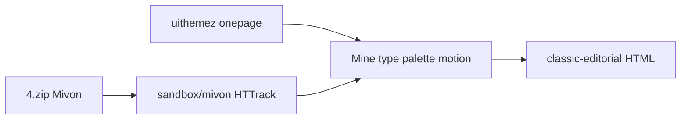

# Classic Editorial (Mivon) — guest-site rebuild plan

> **Status:** Plan · 2026-07-21  
> **Live ref:** [Mivon · onepage creative agency](https://uithemez.com/i/mivon_html/onepage-creative-agency.html)  
> **Zip source:** `/Users/xcalider/Downloads/4.zip` (= Mivon)  
> **Already extracted:** `sandbox/templates-intake/mivon/` (HTTrack mirror — no need to re-unzip unless verifying freshness)  
> **Evenzi mood:** **Classic Editorial** (lineup #3) — ivory/champagne + serif, magazine scroll  
> **Related:** [guest-website-templates-build-plan.md](guest-website-templates-build-plan.md) · Sapphire stays separate (aviation)

---

## Zip map (all four)

| Zip | Theme | Live / domain | Evenzi mood | Sandbox path |
|---|---|---|---|---|
| **4.zip** | **Mivon** | uithemez.com · onepage-creative-agency | **Classic Editorial** ← this plan | `sandbox/templates-intake/mivon/` |
| 5.zip | Azurio | mixdesign · dark WebGL | Midnight Elegant (already built) | `…/azurio/` |
| 6.zip | Xfolio | wowtheme7 · CV/portfolio | Minimal Modern (later) | `…/xfolio/` |
| 7.zip | Cunnet | aqlova · creative | Blush Romantic (later) | `…/cunnet/` |

**This pass uses 4.zip / Mivon only.** 5–7 stay inventory for later templates; do not merge Azurio into this page.

---

## What we’re building

**Not** a copy of the agency demo.  
**Yes** a wedding guest site at:

`designs/pages/website/guest-site/classic-editorial/`

…that **mines** Mivon’s look + scroll feel and rebuilds the Evenzi **10-section spine** (same content as Sapphire/ME: Brindo & Sreelekshmy, Kochi, 26 Jan 2027).



### Mine from Mivon

| Lift | From |
|---|---|
| Editorial / magazine rhythm | Large serif headlines, hairline rules, numbered works |
| Scroll energy | GSAP ScrollTrigger (+ optional Lenis); **no** shipping jQuery/Bootstrap/ScrollSmoother stack wholesale |
| Section pacing | About → capabilities → portfolio → team → testimonials → approach |
| Readable CSS | `assets/css/style.css` (~188K) — mine tokens/layout patterns, don’t paste |

### Strip / do not ship

- Agency copy, Manchester branding, “Kantha / Matts Studios” portfolio
- CDN / jQuery plugin soup / Bootstrap grid as runtime dependency
- Custom cursor / heavy preloader unless reduced-motion safe and justified
- ThemeForest markup as-is (licensing gate — rebuild sufficiently original)

### Evenzi wedding mapping (Mivon section → guest spine)

| Mivon vibe | Guest section |
|---|---|
| Hero / about studio | Hero + countdown + unlock |
| Capabilities / services | Announcement + Story (magazine drop-cap / pull-quote — Kasavu-adjacent editorial) |
| Portfolio works grid | Schedule as editorial index / numbered days (not boarding passes) |
| Team | Wedding party |
| Testimonials | Q&A or story quotes |
| Approach steps | Venue & travel as “getting there” steps |
| Blog | Gallery |
| CTA / footer | RSVP + Evenzi footer |
| (Intro video) | Optional — only if founder wants; default **no** intro video (Sapphire owns aviation intro) |

---

## Stack (match ME / Sapphire design-first)

- Path: `designs/pages/website/guest-site/classic-editorial/`
- Files: `index.html` · `classic-editorial.css` (`--ce-*` tokens) · `classic-editorial.js`
- Motion: Lenis + GSAP ScrollTrigger (+ SplitText if useful) — **no Three.js**
- Fonts: vendored serif (Cormorant / Playfair if we vendor later) + Poppins
- Preview: `npm run design` → `/pages/website/guest-site/classic-editorial/`
- Lab clone later (same pattern as `sapphire-lab`) if we want section-by-section upgrades

### Token direction (Classic Editorial)

Ivory / champagne page, dark ink, soft gold hairlines — contrast to Sapphire navy + ME midnight.

Draft:

```
--ce-bg:     #F7F3EB;
--ce-ink:    #1C1917;
--ce-muted:  #78716C;
--ce-accent: #8B7355;
--ce-rule:   rgba(28,25,23,0.15);
```

Tune against Mivon’s live/demo after a visual pass.

---

## Phases

| Phase | What | Gate |
|---|---|---|
| **0** | Confirm sandbox `mivon/` matches 4.zip (spot-check `onepage-creative-agency.html` + `style.css`); optional fresh unzip if missing files | Cursor |
| **1** | Build-doc + token sheet + section map (this plan → `_build-doc.md`) | Claude / Cursor |
| **2** | HTML skeleton + hero + unlock (magazine hero, not boarding pass) | Cursor |
| **3** | Story + Schedule (editorial) + rest of spine | Cursor |
| **4** | Motion (Lenis/GSAP) + reduced-motion | Cursor |
| **5** | Figma capture into Template file + motion brief row | Cursor |
| **6** | Catalog `components.html` + Antigravity smoke | QA |

---

## Relationship to Sapphire / ME

| Template | Role | Status |
|---|---|---|
| Midnight Elegant | Dark immersive flagship | Built |
| Sapphire | Royal aviation / boarding pass | Built + lab |
| **Classic Editorial** | **Mivon magazine** | **This plan** |
| Minimal Modern / Blush | 6.zip / 7.zip | Later |

Do **not** restyle Sapphire with Mivon — different moods.

---

## Out of scope

- Running Mivon’s jQuery demo inside Evenzi
- Purchasing/licensing decision (still gated for production ship)
- Building Xfolio/Cunnet in the same pass
- React port

---

## Immediate next (on approve)

1. Spot-check `sandbox/…/mivon_html/onepage-creative-agency.html` vs live URL  
2. Write `_build-doc.md` under `classic-editorial/`  
3. Scaffold hero + unlock (HTML-first)  
4. Capture Mivon ref screenshots / Figma mood board (optional parallel)
