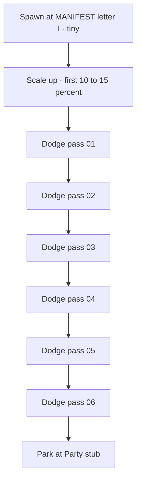

# Manifest paper-plane dodge — sandbox bake

> **Status:** Final path locked · guide UI removed · fluid ST scrub · 2026-07-22  
> **Live:** `sapphire-mivon/` `#sp-mf-track` (`#schedule` → `#party`)  
> **Path:** founder JSON final — Eye(49.3,2.3) → … → Park(77.8,82.8); planeSize 10 · nose 25 · zoomUntil 2  
> **Motion:** ScrollTrigger `scrub: 0.85` only (no parallel rAF); trail capped; guide path hidden  
> **Authoring:** drag beads removed from live mivon (sandbox bake remains for retunes)

---

## Founder locks

| # | Decision |
|---|----------|
| Start | Center on the letter **I** in the pinned **MANIFEST** watermark (approx. visual mid of the word) |
| Path | **Landmark waypoints** — fixed L/R dodge past each pass card (video-game feel, not live collision) |
| Cards | **6** celebration passes (same as live Manifest; count will not change) |
| End | Park at a **Party** stub (sandbox stand-in for `#party`) |
| Drive | **Pinned stage** — path + cards stay fixed; scroll only advances the plane (`t ∈ [0,1]`, reverse on scroll-up) |
| Trail | Navy **snake** dotted trail |
| Zoom | Plane starts **tiny** at the I, scales up in the first ~10–15% of progress, then holds cruise size until park |
| Scope this pass | **Done** — sandbox bake + mivon port |
| Reduced motion | Plane jumps to park (or static mid-path); no snake thrash |
| Layout ref | Founder sketch 2026-07-22: MANIFEST top · weave path · 6 L/R blocks · plane only moves |

---

## Idea (one sentence)

While the guest scrolls Manifest, a paper plane “flies out” of the **I** in MANIFEST, weaves left/right around the six boarding-pass cards like a dodge run, leaves a dotted gold trail, and parks at Party.

---

## Sandbox layout (stub of mivon)

Pinned composition `#mf-stage` inside `#demo-manifest-flight` (matches founder sketch):

1. **Title** — `MANIFEST` at top of the stage (not a scrolling hero).
2. **Six stub cards** — staggered L/R inside the stage; **do not scroll** while the section is pinned.
3. **Path layer** — absolute SVG over the stage (`pointer-events: none`): guide curve + trail + plane. Guide stays put with the cards.
4. **Park stub** — bottom of stage.
5. **Scroll** — ScrollTrigger **pins** `#mf-stage` and scrubs plane `t` only. Uncheck “Scroll flies plane” to edit with Preview t.

### Waypoint grammar (desktop)

Alternating clearances past card centers (percent of **stage** — tune with drag beads):

| Index | Role | Approx. X | Notes |
|------:|------|-----------|--------|
| 0 | Eye (I) | ~48% (I in MANIFEST) | Scale ~0.25 → cruise |
| 1 | Past card 01 | left gutter | Outside card left edge |
| 2 | Past card 02 | right gutter | Outside card right edge |
| 3–6 | Same L/R pattern | alternate | One waypoint per card |
| 7 | Party park | center or party title | Scale slight settle optional |

Path = smooth SVG cubic / Catmull-Rom through waypoints (same approach as M4 landmarks). Mobile: same order, tighter X (smaller gutters), thinner trail.

---

## Motion rules

| Phase | Progress | Behavior |
|-------|----------|----------|
| Spawn / zoom | 0 → ~0.12 | Plane at eye; scale 0.25 → 1; trail starts sparse |
| Dodge run | ~0.12 → ~0.88 | Follow polyline; nose to tangent; snake trail; z behind cards early, front mid-run if needed for readability (toggle class like M4) |
| Approach park | ~0.88 → 1 | Ease into park; trail finishes; plane stays |

Scroll-up reverses `t` and trims trail (existing `createFlight` behavior).

---

## Tech

| Piece | Approach |
|-------|----------|
| Scroll | GSAP ScrollTrigger **pin** `#mf-stage` + scrub (default on). Path/cards fixed; plane only moves. |
| Plane | Inline craft in SVG (`currentColor` navy `#1a2f55`) |
| Trail | Snake segments along authored curve |
| Path | 8 stage-% waypoints → cubic SVG path |
| Authoring | **Opt 1 — drag beads** on `#mf-edit-overlay` (Eye · 01–06 · Park) → **Copy JSON** |
| Storage | `localStorage` key `evenzi-sb-mf-flight-cfg-v7` |
| Locked path | Founder bake — Eye(49.2,4.7) → 01–06 weave → Park(63.3,98); planeSize 10 · nose 25 · zoomUntil 2 · flipY off |
| Mivon | `#sp-mf-flight` on `#schedule` + **drag beads editor** (`#sp-mf-edit` / `#sp-mf-panel`); ST scrub; Copy JSON |

### Authoring fallback order (founder)

| Order | Mode | When |
|------:|------|------|
| 1 | Drag beads + Copy JSON | **Active** — try first |
| 2 | Live DOM gutters from card boxes + small nudges | If #1 can't land a clean dodge |
| 3 | Freehand draw path | Last resort |

**Out of scope this bake:** auto pathfinding, physics, mivon port, changing real card layout.

---

## Files (after sign-off)

| File | Change |
|------|--------|
| [`sapphire-sandbox.html`](../pages/website/guest-site/sapphire-lab/sapphire-sandbox.html) | New `#demo-manifest-flight` + TOC link |
| [`sapphire-sandbox.css`](../pages/website/guest-site/sapphire-lab/sapphire-sandbox.css) | Manifest stub + floater layer styles |
| [`sapphire-sandbox.js`](../pages/website/guest-site/sapphire-lab/sapphire-sandbox.js) | `initManifestFlight()` — waypoints + zoom + ST scrub |
| This plan | Status → Built when accepted |

---

## Acceptance

- [x] Scroll through demo: plane emerges from **I**, scales up, dodges all **6** cards, parks at Party  
- [x] Gold snake trail; reverse scrub works  
- [x] Cards never move; plane aims at gutters (live landmark waypoints)  
- [x] `prefers-reduced-motion`: plane at park; no thrashing trail  
- [x] Mobile: cards center; gutters still apply  
- [x] `pointer-events: none` on floater 

---

## After sandbox OK

**Done (2026-07-22):** Ported to mivon — `#sp-mf-track` wraps `#schedule` + `#party`, `initManifestFlight()` in `sapphire-bridge.js`, styles in `sapphire-overlay.css`. Path locked (founder JSON hardcoded). Drag beads / guide path removed from live mivon (sandbox keeps editor). Scroll: ST-only scrub `0.85`, trail capped. Stack-title pin left as-is.
