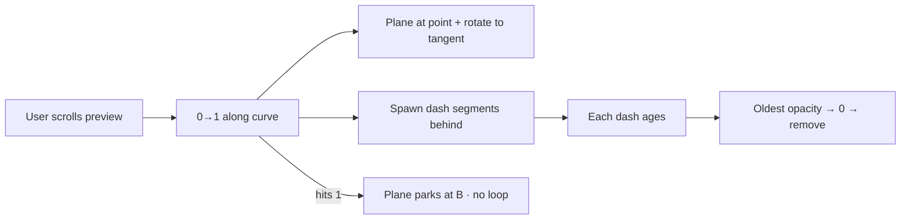

# Paper plane preview — scroll + snake trail

> **Status:** Plan · awaiting sign-off · 2026-07-21  
> **Page:** `designs/pages/website/guest-site/sapphire-lab/paper-plane-preview.html`  
> **Asset:** `media/paper-plane.svg` (plane only — trail is drawn in page CSS/JS)  
> **Scope:** Preview sandbox only. Not wired into Sapphire guest sections yet.

---

## Decisions (founder)

| # | Choice |
|---|--------|
| Where | `paper-plane-preview` only |
| Drive | **Scroll-scrubbed** — plane position tied to scroll progress |
| Path | **Simple curve** (one gentle arc A → B) |
| Trail | **Snake** — dashes spawn behind the plane; oldest fade out first |
| Color | **Gold** (`--sp-gold` / `#C9A24E`) on navy |
| Timing feel | **~8s equivalent** — curve length + fade window tuned so a full scroll through the stage reads like an ~8s flight if scrubbed smoothly |
| Loop | **Once, then stop** — at scroll end plane stays at B; trail finishes fading; no reset loop |
| Reduced motion | **Agent decision** (below) |

### Reduced motion (decided)

If `prefers-reduced-motion: reduce`:

- No continuous dash animation / no opacity thrash  
- Plane jumps to end of path (or sits at progress-matched position without rotation tween)  
- Trail either omitted or drawn as a static dashed curve at final progress  
- Still usable, zero motion sickness

---

## Behavior

1. Tall preview page (enough scroll room to scrub ~8s feel).  
2. Fixed or sticky stage (navy) with a **simple quadratic/cubic curve** from lower-left-ish (A) to upper-right-ish (B).  
3. Scroll progress maps to `t ∈ [0,1]` along the path (Lenis optional; native scroll fine for preview).  
4. Plane (`currentColor` gold) follows point-at-`t`, rotated to path tangent (nose +X in SVG).  
5. **Snake trail:** as `t` increases, append short dash segments along the path behind the plane. Each segment has a birth time / age; after a lifetime (~1.2–2s wall-clock *or* scroll-distance window — prefer **time-based fade** so pauses don’t freeze a forever-tail) opacity falls and the node is removed.  
6. When `t === 1`: plane stops; remaining dashes keep aging out until trail is empty.  
7. Scrolling back: either (a) reverse plane + don’t re-spawn, or (b) clamp so once completed stays done. **Default: clamp once complete** (matches “once then stop”). If user scrolls up before finish, allow scrub reverse *until* first completion.

---

## UI elements → files

| Element | Treatment |
|---------|-----------|
| Stage / navy panel | Page-specific in preview HTML + small CSS block → extract to `paper-plane-preview.css` |
| Paper plane | **Reuse** `media/paper-plane.svg` inline (currentColor) |
| Curve path | Page-specific SVG `<path>` (invisible or faint guide — default **invisible**, trail only) |
| Dash segments | Page-specific SVG strokes or canvas; prefer **SVG** for simplicity |
| Scroll logic | `paper-plane-preview.js` — no shell dependency |

**No shell chrome** on this preview. **No** edit to Sapphire guest `index.html` this pass.

---

## Acceptance

- [ ] Scroll moves plane along a simple curve A→B  
- [ ] Gold dashed trail appears behind; dashes fade oldest-first (snake)  
- [ ] Completing scroll once parks plane; no auto-loop  
- [ ] Reduced-motion: static/minimal path, no thrashing trail  
- [ ] No console errors; `node --check` on JS  
- [ ] Works at 360px and desktop; no horizontal overflow  

---

## Out of scope

- Sapphire / ME guest site integration  
- Loop-the-loop path  
- GSAP MotionPathPlugin requirement (vanilla path math OK; GSAP allowed if already on page — prefer vanilla for this sandbox)

---

## Built

Shipped 2026-07-21 on preview sandbox:

- `sapphire-lab/paper-plane-preview.html` + `.css` + `.js`
- **Bake-off M1–M4:** Vanilla · GSAP ST · Lenis+ST · Landmark hops (mixed z)
- Shared snake trail helper in preview JS
- Kit plan: [`guest-site-sapphire-floaters-kit.md`](guest-site-sapphire-floaters-kit.md)
- Preview: http://localhost:4000/pages/website/guest-site/sapphire-lab/sapphire-sandbox.html

**Deferred:** Sapphire lab integration until method + start-gate chosen
