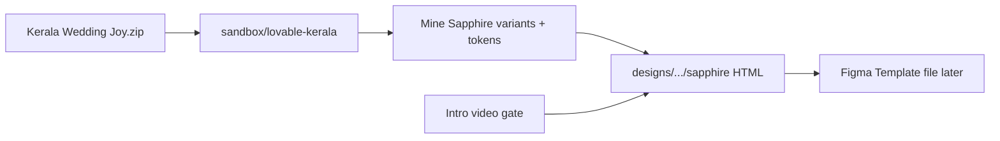

# Guest-site · Sapphire (Royal Aviation) — separate template plan

> **Status:** Lineup locked **A · 6th template** · Phase 2–3 hero+full spine shipped (2026-07-21) — polish via sapphire-lab next  
> **Started:** 2026-07-21 · **Related:** [guest-website-templates-build-plan.md](guest-website-templates-build-plan.md) · Lovable extract · Midnight Elegant (sibling, not merge)

## Built (2026-07-21)

- `designs/pages/website/guest-site/sapphire/` — intro video, boarding-pass hero, unlock, full spine (story/manifest/venue/party/gallery/Q&A/RSVP/footer), Lenis+GSAP light motion
- `sapphire-lab/` — clone for section upgrades ([lab plan](guest-site-sapphire-lab-upgrade.md))
- Figma Template capture: SP full scroll unlocked
- Catalog W6b in `components.html`
- **Deferred:** section-by-section polish in lab; Antigravity pass; promote lab → stable

---

## Verdict on the zip / Claude extract

**Already extracted.** Your Downloads zip matches what's in the sandbox:

| Item | Location |
|---|---|
| Zip | `/Users/xcalider/Downloads/Kerala Wedding Joy.zip` (~184 KB) |
| Extract | `sandbox/templates-intake/lovable-kerala/` (Jul 15) |
| Sapphire route | `src/routes/sapphire.tsx` → `themeKey="sapphire"` |
| Sapphire-specific UI | `HeroSapphire`, `StorySapphire`, `ScheduleSapphire` in `heroes/` / `stories/` / `schedules/` |
| Tokens | `src/data/themes.ts` → sapphire = navy `#112250` / gold `#C9A24E` / cream ticket / Inter + Playfair |

So Claude **did** keep the Lovable project. No need to re-unzip unless you want a fresh overwrite check.

**What Sapphire already has in Lovable (matches your screenshot):**

- Aviation grid navy hero
- Boarding-pass ticket (Groom | perforation | Bride)
- `FLIGHT BS-2027 · GATE 26` / `BOARDING · 26 JAN 2027`
- `DEPARTURE IN` countdown + gold **CHECK IN** unlock CTA
- Schedule as real boarding-pass cards + barcodes
- Shared spine components: Announcement, Gallery, Q&A, RSVP, Footer, UnlockSheet
- Also present in extract (newer than early build-plan notes): `VenueSection.tsx`, `WeddingParty.tsx`

**Themes in extract (4):** Kasavu · **Sapphire** · Emerald · Teal & Ember — each with distinct hero/story/schedule layouts.

---

## Product decision (locked intent)

| Decision | Choice |
|---|---|
| Treat as | **Separate guest-site template** — do **not** fold into Midnight Elegant |
| Why Sapphire | Matches travel / boarding motif + the new intro video gate better than ME's WebGL-luxe |
| Source | Mine Lovable React → rebuild as HTML/CSS/JS under `designs/` (Evenzi design-first path) |
| Keep ME | Yes — ME stays flagship immersive Azurio; Sapphire is aviation-royal sibling |

### Lineup — LOCKED A (2026-07-21)

Sixth mood: **Royal Aviation / Sapphire** at `designs/pages/website/guest-site/sapphire/`.

Existing five unchanged: Bold Festive · Midnight Elegant · Classic Editorial · Minimal Modern · Blush Romantic. Lovable Kasavu stays the Bold Festive / React-blueprint reference; Sapphire is its own guest-site.

---

## Build approach (HTML-first, like ME)

### Path & stack

- **Path:** `designs/pages/website/guest-site/sapphire/`
- **Files:** `index.html` · `sapphire.css` (`--sp-*` tokens) · `sapphire.js`
- **Motion:** GSAP + ScrollTrigger + Lenis (lighter than ME — **no Three.js** unless you ask; boarding-pass UI carries the identity)
- **Intro:** Reuse ME intro pattern — click-to-play → on ended → hero (same `media/intro.mp4` or a Sapphire-specific cut later)
- **Content:** Same Kerala demo (Brindo & Sreelekshmy) from `weddingData` / prompt
- **No host chrome** — standalone guest site

### Section spine (Evenzi 10)

| # | Section | Sapphire treatment |
|---|---|---|
| 0 | Intro video | Click play → hero |
| 1 | Hero | Boarding-pass ticket + countdown + CHECK IN |
| 2 | Unlock | Sheet (phone/password/skip) — aviation copy |
| 3 | Announcement | Flight-status ribbon |
| 4 | Story | StorySapphire layout |
| 5 | Schedule | Boarding-pass event cards + barcode |
| 6 | Venue & Travel | Port/extend Lovable Venue; keep flight-path metaphor |
| 7 | Wedding Party | Port Lovable WeddingParty |
| 8 | Gallery | Shared gallery, sapphire tokens |
| 9 | Q&A | Shared accordion |
| 10 | RSVP + Footer | CHECK-IN / gate language |

### Tokens (from Lovable sapphire)

| Role | Value |
|---|---|
| Primary navy | `#112250` / dark `#081428` |
| Gold | `#C9A24E` / soft `#E7CE94` |
| Ticket cream | `#F5F0E9` |
| Ink | `#0B1A33` |
| Muted | `#6B7A93` |
| Display / serif | Inter · Playfair Display |

### Mine vs copy

- **Mine:** layout, boarding-pass motif, palette, mono flight chrome, schedule card structure
- **Rebuild:** clean HTML (no TanStack/Vite/shadcn runtime); vendored fonts; Evenzi a11y / reduced-motion / no CDN rules
- **Do not** ship Lovable `node_modules` or run the TanStack app in production path

### Figma (after HTML prototype)

- Capture Sapphire into [Template](https://www.figma.com/design/uCeHd1JWmdSrVaqIBSr0Pn/Template) (or Evenzi file) as a **new Capture + Motion brief** strip — same Figma-first motion habit as ME
- Starter 3-page limit: keep Sapphire frames on **Motion Boards** or Capture page until Pro

---

## Phases

| Phase | What | Gate |
|---|---|---|
| **0** | Confirm extract = zip (done); lock lineup **A** | Founder ✅ 2026-07-21 |
| **1** | Build-doc for Cursor | Claude ✅ |
| **2** | HTML scaffold + tokens + hero boarding pass + intro gate | Cursor ✅ (hero pass) |
| **3** | Remaining sections + unlock/RSVP mocks | Cursor — next |
| **4** | Motion (Lenis/GSAP, boarding-pass reveals) + reduced-motion | Cursor (partial in Phase 2) |
| **5** | Catalog note in `components.html` + Antigravity smoke | Catalog ✅ · QA pending |
| **6** | Figma capture + motion keyframe strip | Cursor + founder |

---

## Out of scope this track

- Merging Sapphire into Midnight Elegant
- Building Kasavu / Emerald / Teal in the same pass (unless you expand)
- React/`app/e/[slug]` port (Phase 4 of master plan — later)
- Re-running Lovable

---

## Immediate next (when you approve)

1. You pick lineup **A / B / C**
2. Cursor writes `_build-doc.md` + builds `guest-site/sapphire/` hero + intro first (match screenshot)
3. Rest of spine + motion in follow-on passes
