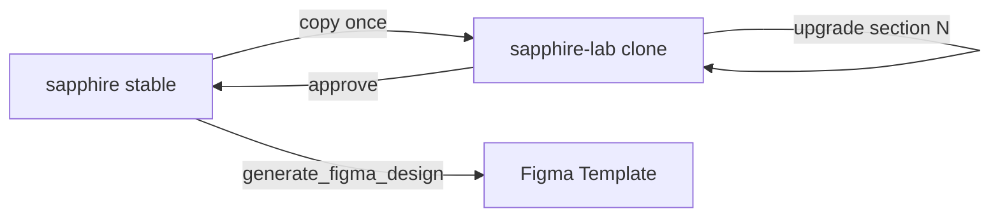

# Sapphire — clone, section upgrades, Figma

> **Status:** Plan locked for execution · 2026-07-21  
> **Stable source:** `designs/pages/website/guest-site/sapphire/` (do not break while upgrading)  
> **Working clone:** `designs/pages/website/guest-site/sapphire-lab/`  
> **Figma:** [Template](https://www.figma.com/design/uCeHd1JWmdSrVaqIBSr0Pn/Template) · `uCeHd1JWmdSrVaqIBSr0Pn`

---

## Goal

1. **Freeze** the current full Sapphire page as the reference.
2. **Clone** it into `sapphire-lab/` and upgrade **one section at a time** there.
3. When a section is approved in lab → **port back** into `sapphire/` (or promote lab → sapphire when the whole pass is done).
4. **Capture** the live page into Figma as the design source of truth for motion/layout notes.

---

## Clone convention

| Path | Role |
|---|---|
| `guest-site/sapphire/` | **Stable** — shipping preview, Figma capture source |
| `guest-site/sapphire-lab/` | **Lab** — upgrades only; mirror file names (`index.html`, `sapphire.css` → `sapphire-lab.css`, `sapphire.js` → `sapphire-lab.js`, shared `media/` or copy intro) |

Lab body: `data-template="sapphire-lab"`. Prefix classes stay `sp-*` so porting CSS diffs is easy (or use `spl-*` if we need zero risk of cascade bleed — **default: keep `sp-*`** in lab for easy merge).

Preview:
- Stable: http://localhost:4000/pages/website/guest-site/sapphire/
- Lab: http://localhost:4000/pages/website/guest-site/sapphire-lab/

---

## Upgrade order (one section per pass)

Pull each piece into lab, improve, founder reviews, then next.

| # | Section | Upgrade focus (defaults — adjust per pass) |
|---|---|---|
| 0 | **Scaffold** | Clone files + wire lab URLs; no visual change |
| 1 | **Intro** | Poster frame, play UX, reduced-motion, optional first-frame still |
| 2 | **Hero / boarding pass** | Ticket typography, mobile stack polish, CHECK IN motion |
| 3 | **Unlock sheet** | Aviation copy, focus trap, sheet animation |
| 4 | **Story / flight log** | Layout density, photo crop, milestone rail |
| 5 | **Departure Manifest** | Pass cards match Lovable screenshot fidelity; barcode/stub polish |
| 6 | **Venue & travel** | Map treatment, hotel cards |
| 7 | **Wedding party** | Tabs/desktop parity, photo frames |
| 8 | **Gallery** | Masonry + lightbox (no `[hidden]`/`display` bug) |
| 9 | **Q&A + RSVP** | Accordion + form polish |
| 10 | **Footer + sticky CTA** | Final chrome |
| 11 | **Motion pass** | Lenis/GSAP section reveals tuned as a whole |
| 12 | **Promote** | Diff lab → sapphire; catalog + plan update |

**Rule:** never edit two section groups in one pass without founder OK.

---

## Figma

| Step | Action |
|---|---|
| A | Capture stable Sapphire (unlocked full page if possible — or hero + tall scroll) into Template file |
| B | Rename frames: `SP · Capture …` |
| C | On **Motion Boards** (3-page Starter limit): add **06 Sapphire · Motion** brief strip under ME / other themes |
| D | Later: re-capture lab after big upgrades |

Capture URL: local `http://localhost:4000/pages/website/guest-site/sapphire/` via `generate_figma_design` + capture script (same as ME).

---

## Out of scope until promote

- React / `app/e/[slug]`
- Changing Midnight Elegant
- Deleting stable sapphire

---

## Execution order

1. Clone → `sapphire-lab/`
2. Capture stable → Figma
3. Start upgrade **#1 Intro** (or founder picks another first)
