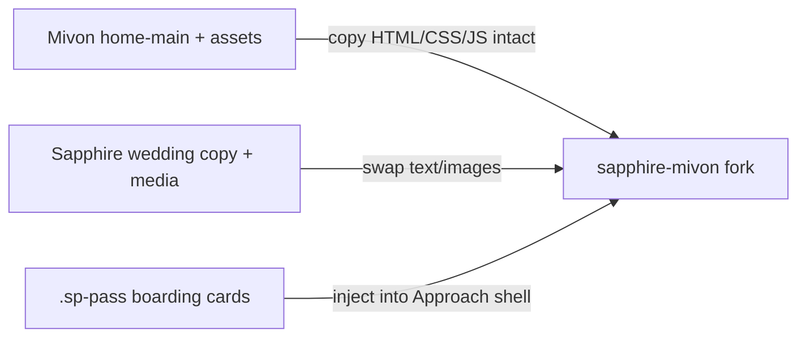

# Sapphire × Mivon (home-main) — merge plan

> **Status:** Built · v0 lab prototype · 2026-07-22  
> **Live ref:** [Mivon · home-main](https://uithemez.com/i/mivon_html/home-main.html)  
> **Source fork:** `sandbox/templates-intake/mivon/uithemez.com/i/mivon_html/` (HTTrack of 4.zip)  
> **Sapphire content ref:** `designs/pages/website/guest-site/sapphire-lab/`  
> **Related:** [sapphire-lab-upgrade.md](guest-site-sapphire-lab-upgrade.md) · [classic-editorial-mivon.md](guest-site-classic-editorial-mivon.md)

---

## Method (LOCKED — founder 2026-07-22)

**Invert the old approach.** Do **not** rebuild Mivon feel from scratch on Lenis/Sapphire CSS.

| Old (superseded) | New (this plan) |
|---|---|
| Mine look → rewrite in Evenzi stack | **Fork Mivon codebase** as the runtime |
| Drop jQuery / Bootstrap / ScrollSmoother | **Keep** Mivon CSS + plugins + JS as default |
| Invent new `spm-*` classes | **Keep Mivon class names** so `scripts.js` / `data-ui-animate` / Swiper / GSAP keep working |
| Sapphire page + Mivon skins | **Mivon page + Sapphire wedding content / boarding-pass chrome** |



**Rule of thumb:** if Mivon’s JS hooks a class or `data-*` attribute, **do not rename it**. Change only inner content and add a thin overlay stylesheet for Sapphire pass chrome / tokens.

---

## Goal

Ship a **lab hybrid** at:

`designs/pages/website/guest-site/sapphire-mivon/`

…that is a working fork of Mivon `home-main.html` (same `assets/`, same stack) with Brindo & Sreelekshmy / Kochi / 26 Jan 2027 content, Sapphire intro + boarding-pass hero grafted in, and **Departure Manifest** built inside Mivon’s Approach (`section.features`) shell using `.sp-pass` cards.

Parallel tracks stay:

| Path | Role |
|---|---|
| `sapphire/` | Stable shipping preview |
| `sapphire-lab/` | Section upgrades (Evenzi stack) |
| **`sapphire-mivon/`** | **Mivon-runtime hybrid (this plan)** |

---

## Founder decisions

| Decision | Choice |
|---|---|
| Runtime | **Mivon first** — CSS/animate/JS from template |
| Hero | Keep Sapphire intro + boarding pass; sit on / above Mivon page |
| Theme | Light + dark switch (use Mivon’s existing toggle if present; else add) |
| Manifest | **Composite** — Approach shell + portfolio-grid card layer + `.sp-pass` content · bg word **MANIFEST** |
| Scope | Lab / design prototype — licensing gate still blocks production SaaS ship |

---

## Stack we keep (do not strip)

From `sandbox/…/mivon_html/`:

| Layer | Files |
|---|---|
| CSS | `assets/css/plugins.css` · `style.css` · `base.css` |
| JS core | jQuery · `plugins.js` · GSAP · ScrollTrigger · ScrollSmoother · `smoother-script.js` · `scripts.js` |
| Motion hooks | `data-ui-animate` · `data-delay` · `data-direction` · Swiper wrappers · `.hr-container` pin scrub |
| Body | `body.home-main` |

**Add only:**

- `sapphire-overlay.css` — boarding-pass (`.sp-pass`) + Sapphire intro/hero tokens; minimal overrides  
- `sapphire-bridge.js` — unlock sheet, countdown, intro video, Demo A jet (if used); **does not replace** Mivon `scripts.js`

---

## Content remap (Mivon section → wedding)

| Mivon block | Keep structure / classes | Swap content to |
|---|---|---|
| Loader / cursor / progress | Keep as-is (lab OK) | Optional later: soften copy |
| Hero | Keep layout + pills + circular ring | Couple headline, Kochi / 26 Jan pills, aviation CTA |
| Portfolio carousel | Keep Swiper/GSAP panel classes | 6 ceremony images or schedule teasers |
| About + Services | **`home-main`** About + `serv-style4` capabilities grid | Story copy + 3 route milestones · `#story` · no Services label / See Pricing |
| Marquee | **`home-main`** `main-marq` | Announce flight tags · `#sp-announce` |
| Team + numbers | Keep | Wedding party + fun stats |
| **Departure Manifest** | **Composite § below** — `home-main` Approach + `portfolio-grid` card FX | 6× `.sp-pass` boarding passes · bg **MANIFEST** |
| Testimonials | Keep Swiper | Family quotes |
| **Q&A** | **`page-faqs.html`** → `faq-style1` + `accordion-style2` | Sapphire wedding FAQ copy (7 items from lab) |
| Awards marquee | Keep | Milestone dates |
| **Gallery** | **`home-modern-agency.html`** → `portfolio-style1` | 9 wedding photos · `#gallery` · Mivon lightbox via `.popimg` |
| Footer CTA | Keep | RSVP |

### Locked: Departure Manifest = Approach + portfolio-grid + boarding passes

> **Founder pick · 2026-07-22** — Layer [portfolio-grid.html](https://uithemez.com/i/mivon_html/portfolio-grid.html) card animation/effects **on top of** [home-main Approach](https://uithemez.com/i/mivon_html/home-main.html). Rename bg word **approach → manifest**. Card **content** = Sapphire `.sp-pass`.

#### Three layers (bottom → top)

| Layer | Source | What we keep |
|---|---|---|
| **1 · Shell** | `home-main` → `section.features` | Giant pinned bg type `MANIFEST` (`.sec-head.stack-title h2`) · staggered Bootstrap cols · `offset-lg-*` zig-zag |
| **2 · Card FX** | `portfolio-grid.html` → `section.portfolio-style2` | Rounded `.fit-img.border-radius-30px` · hover tag/overlay · `data-speed` / `data-lag` parallax · `mt-80px` stagger |
| **3 · Content** | `sapphire-lab` | `.sp-pass` boarding pass (main + stub + barcode) inside each card shell |

#### Composite section markup (target)

```html
<!-- Both section classes so Mivon CSS + JS hooks fire -->
<section class="features portfolio-style2 p-0" id="schedule" data-section="schedule">
  <div class="container">
    <!-- LAYER 1: Approach bg word (pinned scroll) -->
    <div class="sec-head text-align-center stack-title text-uppercase md-hide">
      <h2>manifest</h2>
    </div>

    <!-- intro copy above cards -->
    <div class="sec-head mb-80px">
      <span class="butn-bord-sm mb-15px">Departure manifest</span>
      <h2 class="fs-60">Six flights. <br> One celebration.</h2>
    </div>

    <!-- LAYER 1 grid + LAYER 2 row class from portfolio-grid -->
    <div class="row gallery lg-marg">
      <div class="col-lg-5 col-md-6 items"
           data-ui-animate data-delay="0.4" data-direction="up">
        <!-- LAYER 2 wrapper + optional stackCard for pin-scale -->
        <div class="item stackCard mt-60px mb-60px">
          <!-- LAYER 3: boarding pass (replaces portfolio image) -->
          <article class="sp-pass fit-img border-radius-30px o-hidden h-500px">
            <div class="sp-pass-main">…</div>
            <div class="sp-pass-stub">…</div>
          </article>
        </div>
      </div>
      <!-- 5 more passes — alternate offset-lg-* from Approach -->
    </div>
  </div>
</section>
```

#### Mivon JS that must stay wired

| Hook | File | Effect |
|---|---|---|
| `.features .stack-title` | `scripts.js` ~L617 | **Pins** giant MANIFEST text while cards scroll |
| `[data-ui-animate]` | `scripts.js` ~L680 | Springer reveal — cards slide/fade in on scroll |
| `.stackCard` | `scripts.js` ~L641 | Optional scale-down stack as you scroll through passes |
| `data-speed` / `data-lag` | ScrollSmoother | Image/parallax lag inside card (if pass has hero photo strip) |
| `.portfolio-style2 .item:hover` | `style.css` ~L9753 | Tag/chip hover reveal on pass |

**Do not rename** these classes. Add modifiers only: `item item--pass`, `sp-pass sp-pass--manifest`.

#### Visual (from founder ref)

```
        M A N I F E S T          ← pinned bg type (Approach)
   ┌─────────────────┬──┐
   │ Pass 01 · Ring  │▓▓│     ← dark card shell (Approach .item bg)
   └─────────────────┴──┘       + rounded 30px (portfolio-grid)
              ┌─────────────────┬──┐
              │ Pass 02 Mehendi │▓▓│  ← light card (bg-light)
              └─────────────────┴──┘
   …4 more, alternating stagger + mt-80px…
```

Alternate `.item` / `.item.bg-light` from Approach for dark/light rhythm. Inner `.sp-pass` supplies stub, notches, barcode.

#### Six events (content unchanged)

Nischayam → Mehendi → Sangeet → Muhurtham → Nuptial Mass → Reception — same fields as `sapphire-lab/index.html` `#schedule`.

#### Build notes

- Widen cols (`col-lg-5` / `col-lg-6`) so boarding passes fit; **keep** `offset-lg-*` stagger from Approach.  
- Port `.sp-pass` styles into `sapphire-overlay.css`; do **not** edit `assets/css/style.css`.  
- If `.stackCard` pin feels heavy on mobile, gate in existing Mivon breakpoint (`width > 991`) — already in `scripts.js`.  
- Optional: ceremony photo as `.fit-img` bg strip above pass meta (portfolio-grid parallax on that img only).

---

### Locked: Q&A = page-faqs.html accordion

> **Founder pick · 2026-07-22** — Use [page-faqs.html](https://uithemez.com/i/mivon_html/page-faqs.html) FAQ section for Sapphire **Q&A**. Keep Mivon accordion shell + JS; swap wedding questions/answers from `sapphire-lab`.

#### What we keep from Mivon

| Piece | Classes / hooks |
|---|---|
| Section shell | `section.faq-style1` |
| Accordion wrapper | `.accordion-style2` · `#accordionExample` |
| Items | `.accordion-item` · `.accordion-header` · `.accordion-button` · `.accordion-collapse` · `.accordion-body` |
| Active state | `.accordion-item.active` (toggled by `scripts.js` click handler) |
| Arrow icon | `.arrow` + `assets/imgs/arrow-crv.svg` (rotates 90° on expand) |
| Bootstrap collapse | `data-bs-toggle="collapse"` · `data-bs-target` · `data-bs-parent` |
| Decor | `.shape-top-left` + `mshap3.png` with `data-speed` parallax (optional — chrome 3D blob) |
| WOW reveal | `.wow.fadeInUp.slow` on accordion (optional) |

#### Section header (Sapphire copy)

| Mivon | Wedding remap |
|---|---|
| `butn-bord-sm` → FAQS | `Pre-flight briefing` or `Guest FAQ` |
| `h1.fs-80` → Ask & Question. | **Ask before you board.** or **Pre-flight Q&A** |

Skip the full `pg-hero` hero image band unless founder wants it — accordion block alone is enough inside combined page.

#### Content swap (from sapphire-lab `#qa`)

Replace Mivon agency questions with these 7 items (same answers):

1. What should I wear?  
2. Are kids invited?  
3. Is there parking?  
4. Veg or non-veg?  
5. Two ceremonies — do I attend both?  
6. When should I RSVP by?  
7. Getting there & staying?

#### Target markup (one item)

```html
<section class="faq-style1" id="qa" data-section="qa">
  <div class="container position-relative">
    <div class="row justify-content-center">
      <div class="col-lg-9">
        <div class="accordion-style2">
          <div class="accordion wow fadeInUp slow" id="accordionExample">
            <div class="accordion-item active mb-20px">
              <div class="accordion-header" id="heading1">
                <div class="accordion-button d-flex" data-bs-toggle="collapse"
                     data-bs-target="#collapse1" aria-expanded="true">
                  <h6>What should I wear?</h6>
                  <div class="ml-auto arrow">
                    
                  </div>
                </div>
              </div>
              <div id="collapse1" class="accordion-collapse collapse show">
                <div class="accordion-body">
                  <p>Each function has a dress-code chip on the itinerary…</p>
                </div>
              </div>
            </div>
            <!-- 6 more -->
          </div>
        </div>
      </div>
    </div>
    <div class="shape-top-left w-300px opacity-5" data-speed="0.7" data-lag="0">
      
    </div>
  </div>
</section>
```

#### JS that must stay wired

| Hook | Effect |
|---|---|
| Bootstrap collapse | Expand/collapse panels |
| `$(".accordion").on("click", ".accordion-item")` in `scripts.js` | Adds `.active` class → bg highlight + bold h6 |
| `.accordion-style2 .accordion-button:not(.collapsed) .arrow` | Arrow rotate 90° |

**Do not** use Sapphire lab `.sp-acc` — drop-in replace with Mivon accordion DOM so existing CSS/JS fires.

#### Light / dark

`faq-style1` styles are dark-first (white borders, invert arrow). `body.light` overrides exist in `style.css` ~L11179 — works with theme toggle.

#### Build order

Phase 2 or 3 — after Manifest composite. Low risk; copy-paste section from `page-faqs.html` into forked `index.html`, swap 7 Q&As.

---

### Locked: Gallery = home-modern-agency portfolio-style1

> **Founder pick · 2026-07-22** — Use [home-modern-agency.html](https://uithemez.com/i/mivon_html/home-modern-agency.html) **OUR PROJECTS** grid (`portfolio-style1`) for Sapphire **A Few Of Our Favourites**. Replaces Mivon `blog-style2` carousel at page bottom.

#### What we keep from Mivon

| Piece | Classes / hooks |
|---|---|
| Section shell | `section.portfolio-style1` · `bg-light` · `border-radius-15px` |
| Header | `.sec-head.bord` · `butn-bord-sm` label + `fs-60` title |
| Asymmetric grid | `col-lg-7` + `col-lg-5` · `col-lg-12` · `col-lg-4` + `col-lg-8` · `col-lg-6` ×2 · repeat for 9 items |
| Card shell | `.item` · `.img.fit-img` · `.tags` pills · `h6` overlay title |
| Motion | `[data-ui-animate]` · `data-delay` · `data-speed` / `data-lag` on imgs |
| Lightbox | `.popup-img` row · `.popimg.plink` links → `scripts.js` magnificPopup gallery |

#### Content source

9 Unsplash images from `sapphire-lab/index.html` `#gallery` — wedding moment captions + tags (Nischayam, Mehendi, Sangeet, Muhurtham, Basilica, Family, Candid, Golden hour, Reception).

#### Target markup

```html
<section class="portfolio-style1 …" id="gallery" data-section="gallery">
  <div class="container">
    <div class="sec-head bord mb-80px">
      <span class="butn-bord-sm mb-15px">Moments</span>
      <h2 class="fs-60" id="gallery-title">A Few Of Our Favourites</h2>
    </div>
    <div class="row popup-img">
      <div class="col-lg-7">
        <div class="item mb-30px" data-ui-animate data-delay="0.2">
          <a href="…full-size…" class="popimg plink"></a>
          <div class="img fit-img">
            
            <div class="tags"><a href="#0">Moments</a></div>
          </div>
          <h6>Nischayam · Evening</h6>
        </div>
      </div>
      <!-- 8 more — asymmetric cols -->
    </div>
  </div>
</section>
```

**Do not** use Sapphire lab `.sp-gallery-masonry` — keep Mivon card overlay + tag pills so `portfolio-style1` CSS fires.

---

## File layout

```
designs/pages/website/guest-site/sapphire-mivon/
├── index.html                 # forked home-main.html (wedding content)
├── sapphire-overlay.css       # .sp-pass + intro/hero only
├── sapphire-bridge.js         # Evenzi behaviors (intro, unlock, countdown)
└── assets/                    # COPY from sandbox mivon_html/assets/
    ├── css/ …                 # untouched Mivon
    ├── js/  …                 # untouched Mivon
    └── imgs/ …
```

Preview: `http://localhost:4000/pages/website/guest-site/sapphire-mivon/`

**Do not** edit the sandbox intake in place — always work on the designs copy so intake stays a clean reference.

---

## Working rules (so JS keeps firing)

1. **Preserve** section wrappers, Bootstrap grid classes, `data-ui-animate*`, Swiper DOM shape, `.hr-container .item-panel`.  
2. **Swap** text, images, links, and *inner* card markup only.  
3. Prefer **adding** a modifier class (`item item--pass`) over renaming Mivon classes.  
4. Test after each section: loader → scroll → Approach stagger → theme toggle.  
5. If an animation breaks, restore Mivon class first — don’t rewrite GSAP.  
6. Sapphire overlay CSS uses higher specificity only where pass chrome needs it; avoid rewriting `.features` layout.

---

## Phases & gates

| Phase | Deliverable | Gate |
|---|---|---|
| **0 — Fork** | Copy `home-main.html` + `assets/` → `sapphire-mivon/`; open on :4000; confirm Mivon motion works | Page loads, Approach animates |
| **1 — Manifest** | Composite section: Approach shell + portfolio-grid FX + 6× `.sp-pass`; bg **MANIFEST** | Pinned type + card hover + stagger OK |
| **2 — Copy pass** | Hero / about / services / team / testimonials → wedding copy + media | Parallel review |
| **3 — Sapphire graft** | Intro video + boarding-pass hero + unlock (bridge JS) above / into Mivon hero | Check-in still works |
| **4 — Theme** | Wire light/dark with Mivon toggle or add; persist | Mobile WhatsApp smoke |
| **5 — Port winners** | Only if desired: extract patterns back into `sapphire-lab` Evenzi stack | Explicit OK |

---

## Licensing / ship note

ThemeForest Regular License ≠ unlimited SaaS customer sites. This fork is a **design lab prototype**. Production ship still needs a licensing decision (rebuild-sufficiently-original or Extended/enterprise path). Do not treat `sapphire-mivon/` as production-ready.

---

## Out of scope (this pass)

- Rewriting Mivon onto Lenis / stripping jQuery  
- Editing stable `sapphire/`  
- React port  
- Deleting `sapphire-lab`  

---

## Immediate next (on approve)

1. Phase 0 — fork `home-main` + assets into `designs/…/sapphire-mivon/`  
2. Phase 1 — **Manifest composite** (Approach + portfolio-grid + passes)  
3. Keep pasting other Mivon sections you want prioritized  

---

## Open

- [x] Manifest layout → **Approach shell + portfolio-grid card FX + boarding passes** · bg word **MANIFEST**
- [x] Q&A → **page-faqs.html** accordion (`faq-style1` + `accordion-style2`) · Sapphire wedding copy
- [x] Wedding party → **testim-style3** (`home-digital-agency` clients testimonials) · Bride + Groom cards · `#party`
- [x] Gallery → **portfolio-style1** (`home-modern-agency` OUR PROJECTS) · 9 photos · `#gallery` · magnificPopup lightbox
- [x] Story → **About + serv-style4** (`home-main`) · flight log narrative + Route His→Hers milestones · `#story`
- [x] Announce → **main-marq** (`home-main`) · wedding flight tags · `#sp-announce`
- [ ] Default theme for guests: light vs dark  
- [ ] Keep Mivon custom cursor + heavy loader, or hide for mobile guests  
- [ ] Portfolio carousel → schedule teasers vs gallery  
- [ ] Exact placement of Sapphire boarding-pass **hero** relative to Mivon hero (above / replace / after unlock)  

---

## Built (2026-07-22)

**Lab prototype:** `designs/pages/website/guest-site/sapphire-mivon/`

| Shipped | Notes |
|---------|--------|
| Phase 0 fork | Mivon `home-main` + assets |
| Intro / hero / unlock | Sapphire boarding-pass hero + check-in sheet |
| Story | About + serv-style4 + flight log copy |
| Announce | `main-marq` wedding tags |
| Manifest | Approach pin + 6× `.sp-pass` boarding passes |
| Party | `testim-style3` couple cards |
| Gallery | `portfolio-style1` + lightbox |
| Q&A | `faq-style1` + accordion |
| RSVP | Mivon `contact-style2` / `form2` + sapphire event toggles |
| Bridge | `sapphire-bridge.js` + `sapphire-overlay.css` only (Mivon assets untouched) |
| QA remediation | P0/P1 a11y + scroll fixes; report `qa/sapphire-mivon-remediation-2026-07-22.md` |

**Deferred:** `#venue`, sticky RSVP bar, full party grid, playground floaters merge, founder visual corrections, production OG URL.
