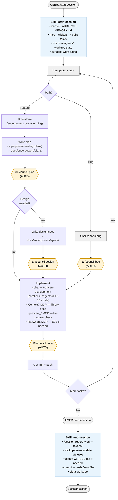
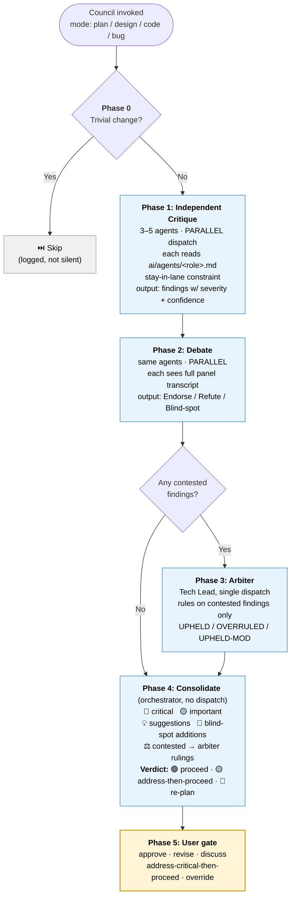
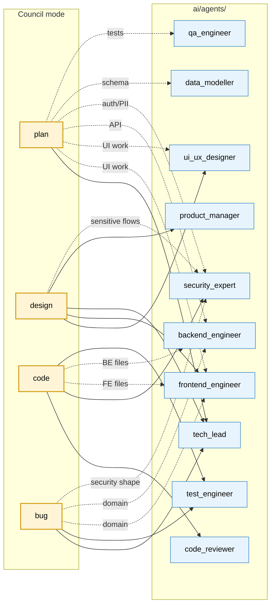
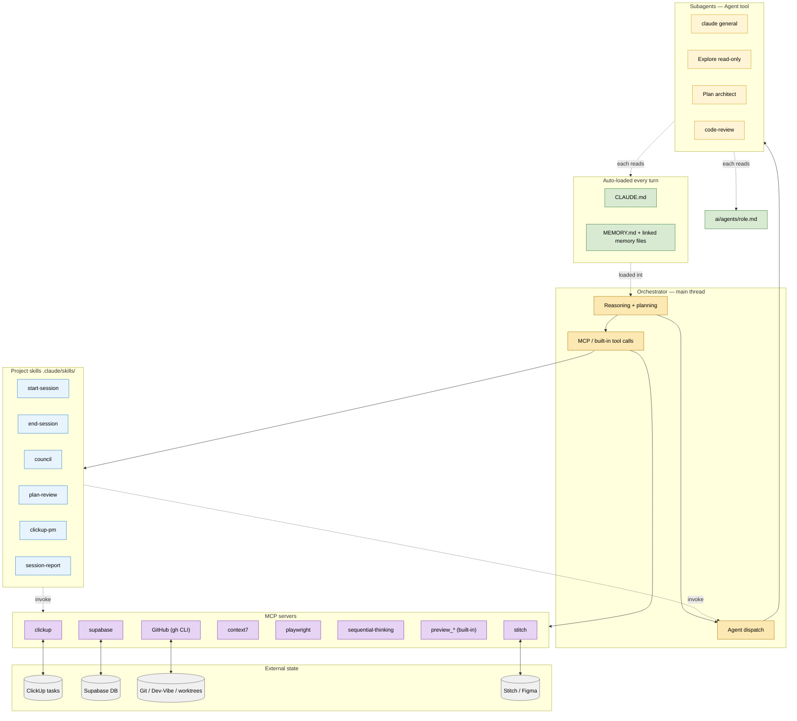
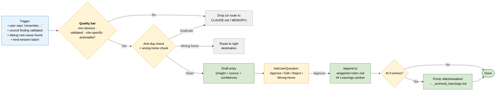
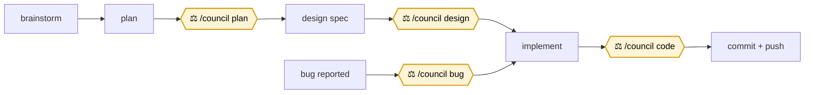

# Evenzi Session Orchestration Map

How a Claude Code session flows from `/start-session` to `/end-session`, where the council gates fire, and how subagents/skills/MCPs are wired together.

**Viewing:** GitHub renders Mermaid natively. In VS Code, install the *Markdown Preview Mermaid Support* extension. In any other markdown viewer with Mermaid support, just open this file.

---

## 1. Session lifecycle (top-level)

---

## 2. Council internals (what happens inside any council mode)

---

## 3. Roster selection (which agents the council pulls per mode)

Solid arrow = always in roster. Dotted arrow = conditional on the trigger noted on the edge.

---

## 4. Wiring (what's plugged into what)

---

## 5. Agent self-evolution loop

Agents accumulate sharpening over time, but the quality bar + user gate + hard cap of 8 keep the files lean.

## 6. The four auto-trigger gates (memorize this)

---

## Legend

| Shape / color | Meaning |
|---|---|
| 🟦 Rounded blue box | Skill (recipe in `.claude/skills/`) |
| 🟨 Yellow hexagon | Council gate (auto-invoked) |
| 🟩 Green | Auto-loaded context (CLAUDE.md, MEMORY) |
| 🟪 Purple | MCP server |
| ⚪ Grey | User action or external state |
| Solid arrow | Always runs |
| Dotted arrow | Conditional (label explains when) |

---

## Notes

- **"Orchestrator" = me, the main session thread.** Subagents don't talk peer-to-peer — they return to me, and I synthesize or feed their output into the next dispatch. The council pattern is *me running a council*, not agents holding a meeting.
- **Memory rule lives at** `~/.claude/projects/-Users-xcalider-Documents-Projects-Evenzi/memory/feedback_council_default.md` — defines when each council gate fires automatically.
- **Triviality skip is logged, not silent** — if a council is skipped, you'll see "Council skipped — trivial (criteria matched)."
- **Override anytime** with "skip the council" or "just do it" — respected and noted.
