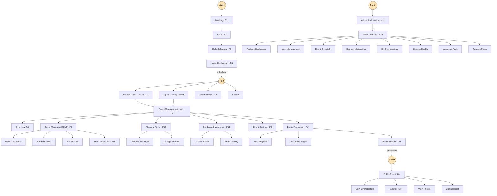

# 00b — Platform User Flow (Snowflake)

> Whole-platform user journey across all features. Evenzi core sits at center; features branch as a snowflake. Each branch has its own sub-flows. Cross-cutting layers (component library, image storage, billing, chatbot) are not nodes — they are layers every node sits on.
>
> Use this doc to:
> - Onboard new contributors (one-page understanding of "where the user goes")
> - Spec a new feature (find your branch, understand siblings)
> - Audit gaps (every visible screen should map to a node)

---

## Personas

| Persona | Auth state | Entry point | Primary goal |
|---------|-----------|-------------|--------------|
| **Visitor** | Anonymous | `/` (landing) | Decide whether to sign up |
| **Host** | Authenticated, role=host | `/home` (dashboard) | Plan + execute their event |
| **Guest** | Anonymous + magic-link or guest auth | `/e/<event-slug>` (public event site) | View invite, RSVP, see photos |
| **Admin** | Authenticated, role=admin | `/admin` | Platform ops, moderation, support |

---

## Snowflake diagram (Mermaid)



---

## Snowflake — text view (3 levels deep)

```
                        EVENZI CORE
              (Landing, Auth, Role Selection)
                            |
              +----------------------------+
              |                            |
              v                            v
        HOST DASHBOARD (F4)         ADMIN MODULE (F15)
              |                            |
   +----------+----------+         +-------+-------+----+----+
   |          |          |         |       |       |    |    |
   v          v          v         v       v       v    v    v
 Create     Open      Settings  Users   Events   CMS  Sys  Flags
 Event    Existing    (F8)                                Health
  (F3)       |
             v
       EVENT MGMT HUB (F6)  <===== central nav for ONE event
             |
   +---------+---------+----------+----------+--------+
   |         |         |          |          |        |
   v         v         v          v          v        v
 Over-    Guests    Planning    Media     Settings  Digital
 view     (F7)        (F12)     (F13)      (F9)    Presence
                                                    (F14)
                                                      |
                                                      v
                                                  PUBLIC URL
                                                      |
                                                      v
                                              +-------+-------+
                                              |               |
                                              v               v
                                          GUEST PATH      Bot widget
                                              |          (F10 Chatbot)
                                  +-----------+----------+
                                  |           |          |
                                  v           v          v
                                View       Submit     View
                                Event       RSVP     Photos
                                Site
```

---

## Cross-cutting layers (touch every node)

These don't fit in the snowflake — they are **horizontal layers** that every visible node sits on:

| Layer | Type | Where it shows up |
|-------|------|------------------|
| **F5 — Component Library** | UI primitives | Every screen uses Button, Input, Card, Modal, Toast, Sidebar, etc. |
| **I1 — Image Storage** | Backend | Cover photos (F3, F4), avatars (F8), gallery (F13), invitation cards (F16), event site assets (F14), CMS images (F15) |
| **I2 — Subscription & Billing** | Backend | Feature gates on F7 (guest count), F13 (storage tier), F14 (custom domain), F15 (admin-only seats) |
| **I3 — Modular Architecture** | Code structure | All features sit on a thin Evenzi core (auth + user + event tables); each feature is its own module |
| **I4 — Scalability** | Infra | Affects every call to Supabase, every image fetch, every page render |
| **F10 — Chatbot Widget** | UI overlay | Bottom-right widget on every authenticated page + `/help` page |

---

## Authentication zones

Color-code which paths require what:

| Zone | Auth required | Routes | Features in zone |
|------|---------------|--------|------------------|
| **Public** | None | `/`, `/e/<slug>`, `/auth/*`, `/help`, marketing pages | F11 Landing, F2 Auth (entry), F14 public event sites, F10 Chatbot widget |
| **Host** | Logged in + role=host | `/home`, `/events/*`, `/settings/*` | F3, F4, F6, F7, F8, F9, F12, F13, F14 (host editing), F16 |
| **Admin** | Logged in + role=admin | `/admin/*` | F15 |
| **Guest** | Magic link OR public OR guest-auth | `/e/<slug>/*` | Guest path inside F14 |

Middleware enforces zone per route. Already implemented in [middleware.ts](../../middleware.ts) for the Host zone; Admin + Guest zones need new middleware logic when those features land.

---

## Decision points (where users branch)

Critical user-decision moments — design needs to be unambiguous here:

| Decision | Where | Choices | Consequence |
|----------|-------|---------|-------------|
| Sign up vs Sign in | `/auth` | New / Returning | Different flow (signup → role select; signin → home directly) |
| Role | `/auth/role-selection` | Host / [Guest disabled MVP] | Locks `user_profiles.role`; Host gets dashboard, Guest path TBD |
| Event Type | `/events/create` Step 1 | Wedding / Birthday / Corporate / etc. | Drives sub-event presets, template gallery, metadata schema |
| Sub-events | `/events/create` Step 3 | Pick from preset or add custom | Affects timeline, guest groups, digital presence pages |
| Template (F14) | Inside Event Mgmt Hub | Pick from gallery | Drives event website look |
| RSVP | Public event site | Yes / No / Maybe | Updates `rsvp_responses`, surfaces in host's stats |
| Subscription tier | User Settings → Billing | Free / Pro / Premium | Feature gates open, billing starts |
| Delete event | Event Settings | Confirm / cancel | Cascading delete (sub-events, guests, photos, website) |

---

## Per-persona happy paths

### Host happy path (primary user, MVP focus)

```
1. Landing (F11) → click "Get Started"
2. Auth (F2) → Phone OTP or Google
3. Role Selection (F2) → Host
4. Home Dashboard (F4) → empty state → click "Create Event"
5. Event CRUD Wizard (F3)
     Step 1: Wedding
     Step 2: Name, date, venue
     Step 3: Pick sub-events (Mehendi, Sangeet, Ceremony, Reception)
     Step 4: Pick website template
     Step 5: Review → Confirm
6. Event Management Hub (F6) → Overview tab → see event timeline
7. Guest Mgmt (F7) → Add guests → CSV import OR add individually
8. Send invitations (F16) → WhatsApp / link
9. Track RSVPs (F7 stats)
10. Planning Tools (F12) → checklist + budget
11. Media (F13) → upload event-day photos
12. Digital Presence (F14) → publish public event website
13. Event Settings (F9) → privacy, notifications
14. Day-of-event: monitor RSVP, share gallery link
15. Post-event: archive event
```

### Guest happy path

```
1. Receive WhatsApp message OR email with link to /e/<slug>
2. (Optional) Guest authentication if event is private
3. View event details — date, venue, story, schedule
4. Submit RSVP (Yes / No / Maybe + optional dietary/notes)
5. Day-of-event: open same link → view photo gallery
6. Post-event: contribute photos (if host enables)
```

### Admin happy path

```
1. Login at /admin → admin auth check
2. Dashboard → see platform health (events count, MAU, errors)
3. User Management → search user, suspend if needed
4. Event Oversight → moderate events flagged for content
5. CMS → update Landing page content (FAQ, blog post, pricing copy)
6. System Health → check logs, error rates
7. Logs and Audit → security review
8. Feature Flags → roll out new feature to subset of users
```

---

## Sad paths / edge cases (under-specified gaps)

These are flow gaps the current feature specs don't fully address — surfaced for the gap matrix:

| Sad path | Where | Currently undefined |
|----------|-------|---------------------|
| Phone OTP fails 3+ times | F2 Auth | No retry policy / lockout |
| Google OAuth user has no role | F2 → F4 | Caught by role selection redirect, but what if user closes browser mid-flow? |
| Wizard abandoned mid-flow | F3 | No "save draft" — does state persist on refresh? |
| Event created but user deleted account | F3 → F8 | What happens to the event? Cascading delete? Soft-archive? |
| Subscription downgraded → over-limit | I2 | What happens to the 11th guest if Free tier = 10? Soft-block / hard-block / grace period? |
| Photo gallery storage exhausted | F13 + I1 | No quota enforcement — designed before billing existed |
| Guest tries to RSVP after event date | F7 + F14 | RSVP form open or closed? Configurable per host? |
| Event website public URL collision (two events same name) | F14 | Slug strategy undefined |
| Admin deletes a user's event | F15 + F3 | Notification to user? Audit log? Restore window? |
| Chatbot can't answer + escalation queue full | F10 | Fallback message? SLA? |

These need to be addressed during each feature's spec phase. Catalogued here so they aren't forgotten.

---

## Modular module boundaries (preview — full spec in 05-modular-architecture.md)

The snowflake structure maps directly to module structure. Each top-level branch from "Evenzi core" is a module:

```
@evenzi/core              ← auth, user_profiles, event base, middleware
  └── @evenzi/landing     ← F11 (its own module, marketing site)
  └── @evenzi/event-crud  ← F3 (wizard, event detail, edit/delete)
  └── @evenzi/dashboard   ← F4 (host home)
  └── @evenzi/event-hub   ← F6 (central nav inside an event)
       ├── @evenzi/guests    ← F7
       ├── @evenzi/planning  ← F12
       ├── @evenzi/media     ← F13
       ├── @evenzi/digital   ← F14
       └── @evenzi/event-settings ← F9
  └── @evenzi/user-settings ← F8
  └── @evenzi/admin         ← F15
  └── @evenzi/chatbot       ← F10 (widget + admin FAQ + tickets)
  └── @evenzi/invitations   ← F16

Cross-cutting:
  @evenzi/ui                ← F5 (Component Library)
  @evenzi/storage           ← I1 (image abstraction)
  @evenzi/billing           ← I2 (Stripe / Razorpay wrapper)
```

Each module:
- Owns its own DB tables (with a foreign key to `events` from `@evenzi/core`)
- Exposes a typed API (server actions or REST)
- Imports `@evenzi/ui` and `@evenzi/storage` (never directly to other feature modules)
- Can be developed and shipped independently

Full module contracts in [05-modular-architecture.md](./05-modular-architecture.md).

---

## How to use this flow doc

| Question | Answer |
|----------|--------|
| Where do users start? | Landing (Visitor) or `/auth` (returning user) |
| Where does feature X fit? | Find F<n> in the snowflake; trace its parent + siblings |
| Is feature X a host or guest feature? | Auth zone table |
| What other features does X touch? | "Cross-cutting layers" + module diagram |
| What's the user's next step after X? | Trace the snowflake downstream of X |
| What sad paths does X need to handle? | "Sad paths" table — find rows mentioning X |
