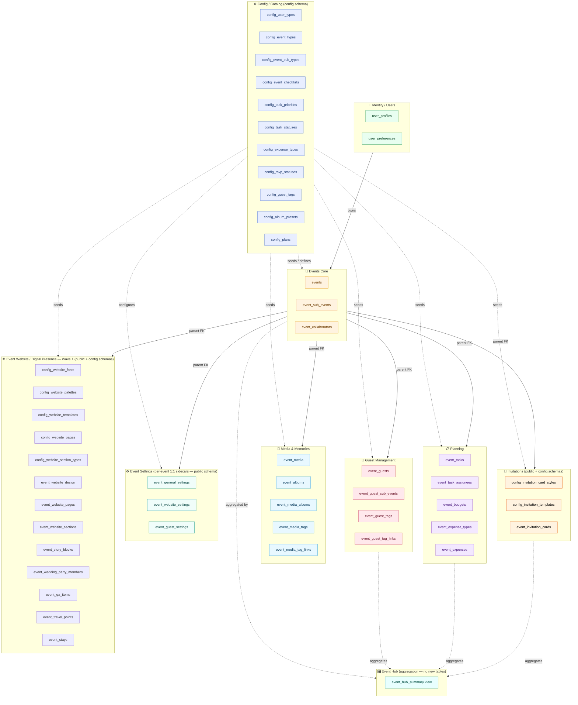
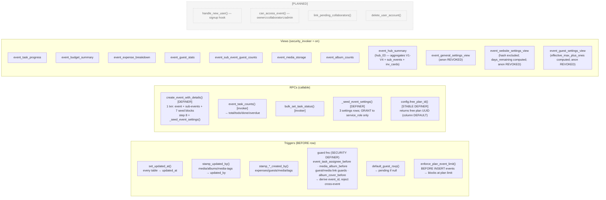
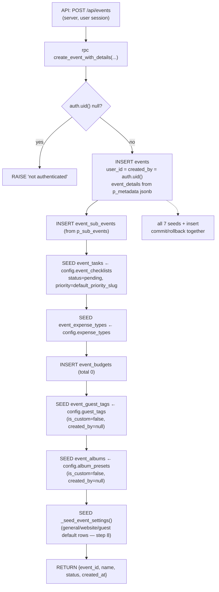
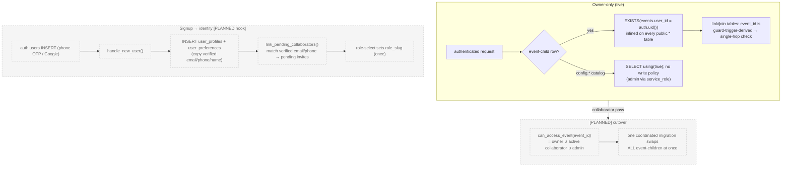
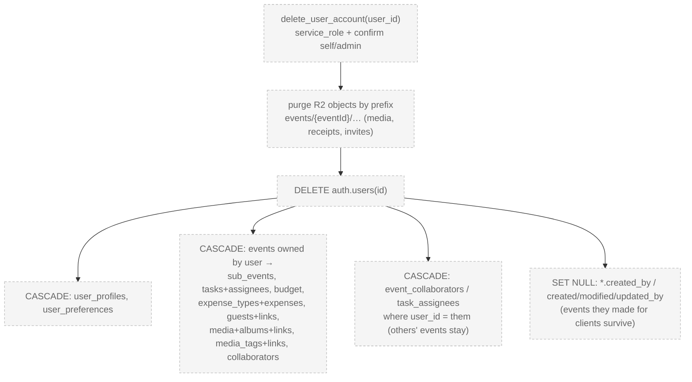

# Evenzi — Full Data Model ERD, Functions & Flows

> Visual companion to [`DATA-MODEL.md`](DATA-MODEL.md) (the canonical reference). Covers the whole live schema as of **v2026-07-30.1** — CORE + Planning + Guests + Media + Invitations + Event Hub + Event Settings + Event Website / Digital Presence Wave 1. Renders on GitHub / VS Code (Mermaid).
>
> **Known drift:** the `EVENT_WEBSITE_SETTINGS` entity block below (fields `website_enabled`/`website_slug`/`show_gallery`/etc.) predates the actual shipped shape — live columns are `website_password_enabled`/`website_password_hash`/`search_indexing_enabled`/`announcement_banner_enabled`/`announcement_banner_text`/`site_offline` (see `DATA-MODEL.md` D43/D47). Pre-existing drift, not introduced this session — flagged for a future cleanup pass, not fixed here to keep this change scoped to the new Digital Presence entities.
>
> **Schemas:** `config.*` = reference/catalog (admin-seeded, public-read) · `public.*` = live app data (owner-only RLS) · `auth.*` = Supabase-managed identity.

---

## 1. Domain Module Map

Nine modules, each owning its tables. Config seeds all child modules at event creation; Events Core is the FK anchor for every `public.*` table.



**Arrow key:** `-->` live FK dependency · `-.->` dashed = catalog→per-event **copy** at creation (not a live FK).

---

## 2. Entity-Relationship Diagram (all tables, all columns)

```mermaid
erDiagram
  %% ---------- AUTH (Supabase-managed) ----------
  AUTH_USERS {
    uuid id PK
    text email "verified"
    text phone "verified"
    jsonb raw_user_meta_data "Google name/avatar"
  }

  %% ---------- CONFIG (catalog tables — admin-seeded, public-read) ----------
  CONFIG_USER_TYPES {
    uuid id PK
    text slug UK
    text name
    text description
    int display_order
    bool enabled
    timestamptz created_at
    timestamptz updated_at
  }
  CONFIG_EVENT_TYPES {
    uuid id PK
    text slug UK
    text name
    text description
    text icon_name
    text image_url
    jsonb field_schema
    jsonb features
    int display_order
    bool enabled
    timestamptz created_at
    timestamptz updated_at
  }
  CONFIG_EVENT_SUB_TYPES {
    uuid id PK
    uuid event_type_id FK
    text slug
    text name
    text icon_name
    int display_order
    bool is_default
    bool enabled
    timestamptz created_at
    timestamptz updated_at
  }
  CONFIG_EVENT_CHECKLISTS {
    uuid id PK
    uuid event_type_id FK
    text title
    text description
    text default_priority_slug FK "slug ref → config.task_priorities"
    int display_order
    bool enabled
    timestamptz created_at
    timestamptz updated_at
  }
  CONFIG_TASK_PRIORITIES {
    uuid id PK
    text slug UK
    text name
    text description
    text icon_name
    int display_order
    bool enabled
    timestamptz created_at
    timestamptz updated_at
  }
  CONFIG_TASK_STATUSES {
    uuid id PK
    text slug UK
    text name
    text description
    text icon_name
    text category "open|done|dropped"
    int display_order
    bool enabled
    timestamptz created_at
    timestamptz updated_at
  }
  CONFIG_EXPENSE_TYPES {
    uuid id PK
    text slug UK
    text name
    text description
    text icon_name
    int display_order
    bool enabled
    timestamptz created_at
    timestamptz updated_at
  }
  CONFIG_RSVP_STATUSES {
    uuid id PK
    text slug UK
    text name
    text category "pending|attending|declined|tentative"
    int display_order
    bool enabled
    timestamptz created_at
    timestamptz updated_at
  }
  CONFIG_GUEST_TAGS {
    uuid id PK
    text slug UK
    text name
    int display_order
    bool enabled
    timestamptz created_at
    timestamptz updated_at
  }
  CONFIG_ALBUM_PRESETS {
    uuid id PK
    text slug UK
    text name
    int display_order
    bool enabled
    timestamptz created_at
    timestamptz updated_at
  }
  CONFIG_PLANS {
    uuid id PK
    text slug UK "free|premium|elite"
    text name
    int max_guests
    int max_sub_events
    int max_media_mb
    bool invitations_enabled
    bool website_enabled
    bool collaborators_enabled
    bool custom_domain_enabled
    int display_order
    bool enabled
    timestamptz created_at
    timestamptz updated_at
  }

  %% ---------- IDENTITY ----------
  USER_PROFILES {
    uuid id PK_FK "= auth.users.id (cascade)"
    text role_slug FK "→ config.user_types(slug)"
    text display_name
    text avatar_url
    text email "verified mirror"
    text phone "verified mirror"
    text auth_provider "phone|google|email"
    text location
    bool onboarding_completed
    timestamptz created_at
    timestamptz updated_at
  }
  USER_PREFERENCES {
    uuid user_id PK_FK "1:1 (cascade)"
    bool email_alerts
    bool push_notifications
    bool sms_alerts
    timestamptz created_at
    timestamptz updated_at
  }

  %% ---------- CORE ----------
  EVENTS {
    uuid id PK
    uuid user_id FK "owner (transferable, cascade)"
    uuid created_by FK "creator (set null on delete)"
    uuid event_type_id FK "restrict"
    uuid plan_id FK "tier (restrict; default = free)"
    text name
    date primary_date
    text primary_venue
    int guest_capacity
    text cover_image_url
    text description
    jsonb event_details
    text status "draft|active|completed|cancelled"
    timestamptz created_at
    timestamptz updated_at
    timestamptz deleted_at "soft delete"
  }
  EVENT_SUB_EVENTS {
    uuid id PK
    uuid event_id FK "cascade"
    uuid event_sub_type_id FK "null=custom (set null)"
    text custom_name
    date event_date
    time start_time
    time end_time
    text venue
    int guest_count
    text status "tbc|confirmed|cancelled"
    int display_order
    bool show_on_website "hub_01: website visibility toggle"
    timestamptz created_at
    timestamptz updated_at
  }
  EVENT_COLLABORATORS {
    uuid id PK
    uuid event_id FK "cascade"
    uuid user_id FK "null until accepted (cascade)"
    text invited_email
    text invited_phone
    text role
    text status "pending|active"
    timestamptz invited_at
    timestamptz accepted_at
    timestamptz created_at
    timestamptz updated_at
  }

  %% ---------- PLANNING: tasks ----------
  EVENT_TASKS {
    uuid id PK
    uuid event_id FK "cascade"
    uuid template_id FK "set null (null=host-added)"
    uuid sub_event_id FK "set null (null=whole event)"
    text title
    text description
    uuid priority_id FK "restrict"
    uuid status_id FK "restrict"
    date due_date
    int display_order
    timestamptz created_at
    timestamptz updated_at
  }
  EVENT_TASK_ASSIGNEES {
    uuid id PK
    uuid event_id FK "guard-derived from task (cascade)"
    uuid task_id FK "cascade"
    uuid user_id FK "owner or active collaborator (cascade)"
    uuid assigned_by FK "set null on delete"
    timestamptz created_at
  }

  %% ---------- PLANNING: budget ----------
  EVENT_BUDGETS {
    uuid event_id PK_FK "1:1 (cascade)"
    numeric total_amount
    text currency
    uuid modified_by FK "set null on delete"
    timestamptz created_at
    timestamptz updated_at
  }
  EVENT_EXPENSE_TYPES {
    uuid id PK
    uuid event_id FK "cascade"
    text name
    text icon_name
    bool is_custom
    text source_slug "provenance text; NOT an FK"
    bool enabled
    int display_order
    timestamptz created_at
    timestamptz updated_at
  }
  EVENT_EXPENSES {
    uuid id PK
    uuid event_id FK "cascade"
    uuid sub_event_id FK "set null (null=whole event)"
    uuid expense_type_id FK "restrict"
    text title
    text description
    text vendor_name
    numeric amount
    text receipt_key "R2 private bucket key"
    date expense_date
    uuid created_by FK "set null on delete"
    timestamptz created_at
    timestamptz updated_at
  }

  %% ---------- GUESTS ----------
  EVENT_GUESTS {
    uuid id PK
    uuid event_id FK "cascade"
    text name
    text email
    text phone
    uuid rsvp_status_id FK "restrict"
    bool invited
    int party_size
    text notes
    uuid created_by FK "set null on delete"
    int display_order
    timestamptz created_at
    timestamptz updated_at
  }
  EVENT_GUEST_SUB_EVENTS {
    uuid id PK
    uuid event_id FK "guard-derived from guest (cascade)"
    uuid guest_id FK "cascade"
    uuid sub_event_id FK "cascade"
    timestamptz created_at
  }
  EVENT_GUEST_TAGS {
    uuid id PK
    uuid event_id FK "cascade"
    text name
    bool is_custom
    text source_slug "provenance text; NOT an FK"
    uuid created_by FK "set null on delete"
    int display_order
    timestamptz created_at
    timestamptz updated_at
  }
  EVENT_GUEST_TAG_LINKS {
    uuid id PK
    uuid event_id FK "guard-derived from guest (cascade)"
    uuid guest_id FK "cascade"
    uuid tag_id FK "cascade"
    timestamptz created_at
  }

  %% ---------- MEDIA ----------
  EVENT_MEDIA {
    uuid id PK
    uuid event_id FK "cascade"
    text kind "photo|video"
    text storage_key "R2 private key"
    text thumbnail_key "R2 thumb/video poster"
    text name
    text original_filename
    text content_type
    bigint byte_size "advisory; server-stamped"
    int width
    int height
    int duration_sec "null unless kind=video"
    uuid sub_event_id FK "set null (null=whole event)"
    timestamptz taken_at "EXIF date"
    bool published "website gallery selector"
    uuid created_by FK "set null on delete"
    uuid updated_by FK "last editor; set null on delete"
    timestamptz created_at
    timestamptz updated_at
  }
  EVENT_ALBUMS {
    uuid id PK
    uuid event_id FK "cascade"
    text name
    bool is_custom
    text source_slug "provenance text; NOT an FK"
    uuid cover_media_id FK "set null on delete"
    int display_order
    uuid created_by FK "set null on delete"
    uuid updated_by FK "last editor; set null on delete"
    timestamptz created_at
    timestamptz updated_at
  }
  EVENT_MEDIA_ALBUMS {
    uuid id PK
    uuid event_id FK "guard-derived from media (cascade)"
    uuid media_id FK "cascade"
    uuid album_id FK "cascade"
    timestamptz created_at
  }
  EVENT_MEDIA_TAGS {
    uuid id PK
    uuid event_id FK "cascade"
    text name
    uuid created_by FK "set null on delete"
    uuid updated_by FK "last editor; set null on delete"
    int display_order
    timestamptz created_at
    timestamptz updated_at
  }
  EVENT_MEDIA_TAG_LINKS {
    uuid id PK
    uuid event_id FK "guard-derived from media (cascade)"
    uuid media_id FK "cascade"
    uuid tag_id FK "cascade"
    timestamptz created_at
  }

  %% ---------- INVITATIONS ----------
  CONFIG_INVITATION_CARD_STYLES {
    uuid id PK
    text slug UK
    text name
    int display_order
    bool enabled
    timestamptz created_at
    timestamptz updated_at
  }

  CONFIG_INVITATION_TEMPLATES {
    uuid id PK
    text slug UK
    text name
    uuid style_id FK
    text layout
    text preview_key
    text thumbnail_key
    text default_photo_key
    int display_order
    bool enabled
    timestamptz created_at
    timestamptz updated_at
  }

  EVENT_INVITATION_CARDS {
    uuid id PK
    uuid event_id FK
    uuid sub_event_id FK
    bool is_default
    uuid template_id FK
    bool is_custom
    text slot_eyebrow
    text slot_couple
    text slot_invite
    text slot_date
    text slot_time
    text slot_venue
    text slot_message
    text card_upload_key
    text photo_bg_key
    text share_token UK
    bool share_enabled
    text rendered_card_key
    text rendered_pdf_key
    text render_status
    uuid created_by FK
    uuid updated_by FK
    timestamptz created_at
    timestamptz updated_at
  }

  %% ---------- EVENT SETTINGS (per-event 1:1 sidecars) ----------
  EVENT_GENERAL_SETTINGS {
    uuid event_id PK_FK "1:1 sidecar (cascade)"
    uuid user_id FK "denorm for single-hop RLS (cascade)"
    text tagline
    bool tagline_visible
    bool discoverable
    timestamptz created_at
    timestamptz updated_at
  }
  EVENT_WEBSITE_SETTINGS {
    uuid event_id PK_FK "1:1 sidecar (cascade)"
    uuid user_id FK "denorm for single-hop RLS (cascade)"
    bool website_enabled
    text website_slug UK
    text website_password_hash "never projected to client"
    date website_expiry_date
    bool show_gallery
    bool show_rsvp
    bool show_program
    bool show_map
    timestamptz created_at
    timestamptz updated_at
  }
  EVENT_GUEST_SETTINGS {
    uuid event_id PK_FK "1:1 sidecar (cascade)"
    uuid user_id FK "denorm for single-hop RLS (cascade)"
    bool plus_ones_enabled
    smallint max_plus_ones_per_guest "0–10 (0 = no plus-ones)"
    bool per_sub_event_rsvp
    bool show_party_size
    bool collect_dietary
    timestamptz created_at
    timestamptz updated_at
  }

  %% ---------- EVENT WEBSITE / DIGITAL PRESENCE — WAVE 1 ----------
  %% Wave 2 (public site, guest_tokens, anon RLS) not migrated yet — not drawn here.
  CONFIG_WEBSITE_PAGES {
    uuid id PK
    text slug UK "home, story, schedule, venue-travel, wedding-party, gallery, qa, rsvp, registry, video"
    text tier "public | private"
    bool is_removable "false on home, rsvp"
  }
  CONFIG_WEBSITE_SECTION_TYPES {
    uuid id PK
    text slug UK "11 types: heading, photo, photogrid, schedule, person, hotel, qa, divider, map, countdown, video"
    jsonb field_schema
  }
  CONFIG_WEBSITE_TEMPLATES {
    uuid id PK
    text slug UK
    uuid default_palette_id FK "empty catalog until lineup locks"
    uuid default_font_id FK
  }
  EVENT_WEBSITE_DESIGN {
    uuid event_id PK_FK "1:1 sidecar (cascade)"
    uuid template_id FK "nullable — catalog starts empty"
    uuid palette_id FK
    uuid heading_font_id FK
    uuid body_font_id FK
    text cover_image_key
    text og_image_key
  }
  EVENT_WEBSITE_PAGES {
    uuid id PK
    uuid event_id FK "cascade"
    uuid page_id FK "config.website_pages"
    bool is_visible
  }
  EVENT_WEBSITE_SECTIONS {
    uuid id PK
    uuid event_id FK "denormalized, guard-trigger derived from page_id"
    uuid page_id FK "cascade"
    uuid section_type_id FK
    jsonb data "backs Registry + Video pages only"
  }
  EVENT_STORY_BLOCKS {
    uuid id PK
    uuid event_id FK "cascade — direct, no guard trigger"
    text block_type "heading | photo"
  }
  EVENT_WEDDING_PARTY_MEMBERS {
    uuid id PK
    uuid event_id FK "cascade"
    text side "bride | groom"
  }
  EVENT_QA_ITEMS {
    uuid id PK
    uuid event_id FK "cascade"
    text question
    text answer
  }
  EVENT_TRAVEL_POINTS {
    uuid id PK
    uuid event_id FK "cascade"
    text kind "airport | railway | bus"
  }
  EVENT_STAYS {
    uuid id PK
    uuid event_id FK "cascade"
    text name
  }

  %% ---------- EVENT HUB (aggregation view — read-only) ----------
  %% Note: event_hub_summary aggregates from events, event_guest_stats, event_task_progress,
  %%       event_budget_summary, event_sub_events, and event_invitation_cards.
  %%       Only the EVENTS anchor relationship is drawn to keep the ERD readable.
  EVENT_HUB_SUMMARY {
    uuid event_id PK "view — read-only"
    text event_name
    date primary_date
    text primary_venue
    int guest_total "from event_guest_stats"
    numeric task_percent "from event_task_progress"
    int task_done
    int task_total
    numeric budget_total "from event_budget_summary"
    numeric budget_spent
    numeric budget_percent "NULL when no budget set"
    int sub_event_count "active only (status != cancelled)"
    text default_card_share_token "from event_invitation_cards"
  }

  %% ===== RELATIONSHIPS =====
  AUTH_USERS ||--|| USER_PROFILES : "1:1"
  AUTH_USERS ||--|| USER_PREFERENCES : "1:1"
  AUTH_USERS ||--o{ EVENTS : "owns (user_id)"
  AUTH_USERS |o--o{ EVENTS : "created (created_by)"
  AUTH_USERS |o--o{ EVENT_COLLABORATORS : "member"
  AUTH_USERS |o--o{ EVENT_TASK_ASSIGNEES : "assignee"

  CONFIG_USER_TYPES ||--o{ USER_PROFILES : "role_slug"
  CONFIG_EVENT_TYPES ||--o{ CONFIG_EVENT_SUB_TYPES : "defines"
  CONFIG_EVENT_TYPES ||--o{ CONFIG_EVENT_CHECKLISTS : "defines"
  CONFIG_EVENT_TYPES ||--o{ EVENTS : "categorizes"
  CONFIG_TASK_PRIORITIES ||--o{ CONFIG_EVENT_CHECKLISTS : "default_priority_slug"
  CONFIG_TASK_PRIORITIES ||--o{ EVENT_TASKS : "priority_id"
  CONFIG_TASK_STATUSES ||--o{ EVENT_TASKS : "status_id"
  CONFIG_RSVP_STATUSES ||--o{ EVENT_GUESTS : "rsvp_status_id"
  CONFIG_EVENT_CHECKLISTS |o--o{ EVENT_TASKS : "seeds (set null)"
  CONFIG_EVENT_SUB_TYPES |o--o{ EVENT_SUB_EVENTS : "seeds (set null)"
  CONFIG_EXPENSE_TYPES ..> EVENT_EXPENSE_TYPES : "seeds (copy)"
  CONFIG_GUEST_TAGS ..> EVENT_GUEST_TAGS : "seeds (copy)"
  CONFIG_ALBUM_PRESETS ..> EVENT_ALBUMS : "seeds (copy)"
  CONFIG_PLANS ||--o{ EVENTS : "plan_id"

  EVENTS ||--o{ EVENT_SUB_EVENTS : "has"
  EVENTS ||--o{ EVENT_COLLABORATORS : "has"
  EVENTS ||--o{ EVENT_TASKS : "has"
  EVENTS ||--|| EVENT_BUDGETS : "1:1"
  EVENTS ||--o{ EVENT_EXPENSE_TYPES : "has"
  EVENTS ||--o{ EVENT_EXPENSES : "has"
  EVENTS ||--o{ EVENT_GUESTS : "has"
  EVENTS ||--o{ EVENT_GUEST_TAGS : "has"
  EVENTS ||--o{ EVENT_MEDIA : "has"
  EVENTS ||--o{ EVENT_ALBUMS : "has"
  EVENTS ||--o{ EVENT_MEDIA_TAGS : "has"
  EVENTS ||--|| EVENT_WEBSITE_DESIGN : "1:1"
  EVENTS ||--o{ EVENT_WEBSITE_PAGES : "has"
  EVENTS ||--o{ EVENT_WEBSITE_SECTIONS : "has (denorm)"
  EVENTS ||--o{ EVENT_STORY_BLOCKS : "has"
  EVENTS ||--o{ EVENT_WEDDING_PARTY_MEMBERS : "has"
  EVENTS ||--o{ EVENT_QA_ITEMS : "has"
  EVENTS ||--o{ EVENT_TRAVEL_POINTS : "has"
  EVENTS ||--o{ EVENT_STAYS : "has"

  CONFIG_WEBSITE_PAGES ||--o{ EVENT_WEBSITE_PAGES : "page_id"
  EVENT_WEBSITE_PAGES ||--o{ EVENT_WEBSITE_SECTIONS : "page_id (guard-trigger derives event_id)"
  CONFIG_WEBSITE_SECTION_TYPES ||--o{ EVENT_WEBSITE_SECTIONS : "section_type_id"
  CONFIG_WEBSITE_TEMPLATES |o--o{ EVENT_WEBSITE_DESIGN : "template_id (nullable)"

  EVENT_SUB_EVENTS |o--o{ EVENT_TASKS : "tagged"
  EVENT_SUB_EVENTS |o--o{ EVENT_EXPENSES : "tagged"
  EVENT_SUB_EVENTS |o--o{ EVENT_GUEST_SUB_EVENTS : "invited-to"
  EVENT_SUB_EVENTS |o--o{ EVENT_MEDIA : "tagged"

  EVENT_TASKS ||--o{ EVENT_TASK_ASSIGNEES : "assigned"
  EVENT_EXPENSE_TYPES ||--o{ EVENT_EXPENSES : "categorizes"

  EVENT_GUESTS ||--o{ EVENT_GUEST_SUB_EVENTS : "M:N functions"
  EVENT_GUESTS ||--o{ EVENT_GUEST_TAG_LINKS : "M:N tags"
  EVENT_GUEST_TAGS ||--o{ EVENT_GUEST_TAG_LINKS : "M:N"

  EVENT_MEDIA ||--o{ EVENT_MEDIA_ALBUMS : "M:N albums"
  EVENT_ALBUMS ||--o{ EVENT_MEDIA_ALBUMS : "M:N"
  EVENT_ALBUMS |o--|| EVENT_MEDIA : "cover (set null)"
  EVENT_MEDIA ||--o{ EVENT_MEDIA_TAG_LINKS : "M:N tags"
  EVENT_MEDIA_TAGS ||--o{ EVENT_MEDIA_TAG_LINKS : "M:N"

  CONFIG_INVITATION_CARD_STYLES ||--o{ CONFIG_INVITATION_TEMPLATES : "style_id"
  CONFIG_INVITATION_TEMPLATES |o--o{ EVENT_INVITATION_CARDS : "template (set null)"
  EVENTS ||--o{ EVENT_INVITATION_CARDS : "has"
  EVENT_SUB_EVENTS |o--o{ EVENT_INVITATION_CARDS : "tagged (set null)"

  EVENTS ||--|| EVENT_GENERAL_SETTINGS : "has general settings"
  EVENTS ||--|| EVENT_WEBSITE_SETTINGS : "has website settings"
  EVENTS ||--|| EVENT_GUEST_SETTINGS : "has guest settings"

  EVENTS ||--|| EVENT_HUB_SUMMARY : "aggregated by"
```

**Legend:** `||--o{` one-to-many · `||--||` one-to-one · `|o--o{` optional (nullable FK) · `..>` dashed = catalog→per-event **copy** at event creation (not a live FK). All columns shown per entity. **Modularity rule:** every module FK points only to core (`events`, `event_sub_events`, `auth.users`) or `config.*` — never another module's tables.

---

## 3. Functions, triggers & views (the "logic" layer)



| Object | Kind | Security | Purpose |
|---|---|---|---|
| `set_updated_at` | trigger fn | — | stamp `updated_at` on every table |
| `stamp_updated_by` | trigger fn | DEFINER | stamp `updated_by` (media/albums/media-tags) on UPDATE |
| `stamp_*_created_by` | trigger fns | DEFINER | server-stamp `created_by` (never client-trusted) |
| `*_before` guards | trigger fns | DEFINER | derive `event_id` from parent + reject cross-event refs |
| `default_guest_rsvp` | trigger fn | DEFINER | default RSVP → `pending` |
| `config.free_plan_id` | fn | STABLE DEFINER, `set search_path` | returns free plan UUID; used as column DEFAULT on `events.plan_id`; REVOKE from public/anon/authenticated |
| `enforce_plan_event_limit` | trigger fn | DEFINER | BEFORE INSERT on `events` — blocks when owner's event count ≥ plan `max_events`; REVOKE from public |
| `create_event_with_details` | RPC | DEFINER | one-txn event create + 7 seed blocks (step 8 = `_seed_event_settings()`); owner from `auth.uid()` |
| `_seed_event_settings` | RPC | DEFINER, `set search_path` | seeds 3 settings sidecar rows at event creation; REVOKE from public/anon/authenticated; GRANT to service_role only |
| `event_task_counts` / `bulk_set_task_status` | RPC | invoker | toolbar counts / bulk status |
| 7 module views | view | `security_invoker` | derived numbers (progress, budget, guest stats, storage, counts) |
| `event_hub_summary` | view | `security_invoker` | hub_03 — single-query dashboard aggregate (joins 5 module views + sub_events + inv_cards) |
| `event_general_settings_view` | view | `security_invoker` | joins `events` for name/dates; `anon` REVOKED |
| `event_website_settings_view` | view | `security_invoker` | `website_password_hash` excluded; `website_days_remaining` computed (interval → string); `anon` REVOKED |
| `event_guest_settings_view` | view | `security_invoker` | `effective_max_plus_ones` computed (0 when disabled); `anon` REVOKED |
| `handle_new_user` · `can_access_event` · `link_pending_collaborators` · `delete_user_account` | fn | [PLANNED] | signup seed · access check · invite-link · account deletion |

---

## 4. Flow — event creation (`create_event_with_details`, one transaction)



---

## 5. Flow — RLS access model & signup



---

## 6. Flow — account deletion cascade (`delete_user_account` [PLANNED])



---

## Maintenance

This file is **derived** from `DATA-MODEL.md` — when the schema changes, update `DATA-MODEL.md` first (source of truth), then refresh these diagrams. Keep the entity list and relationships in sync with the live DB. Add any new table to both the Module Map (Section 1) and the full ERD (Section 2).
