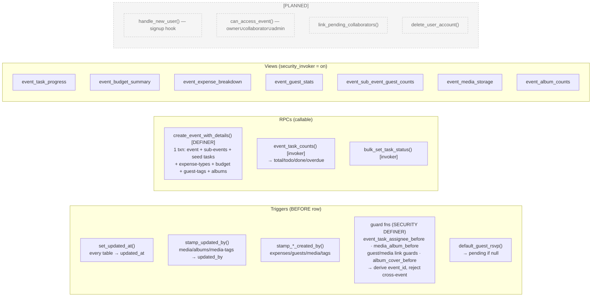
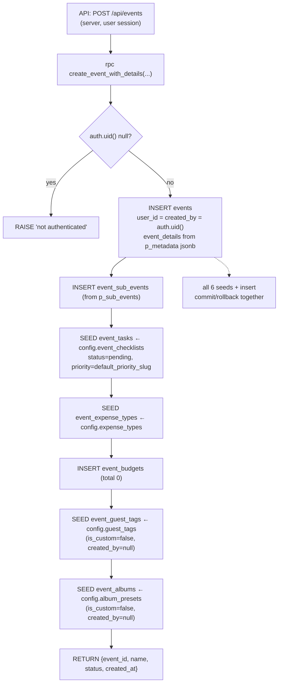
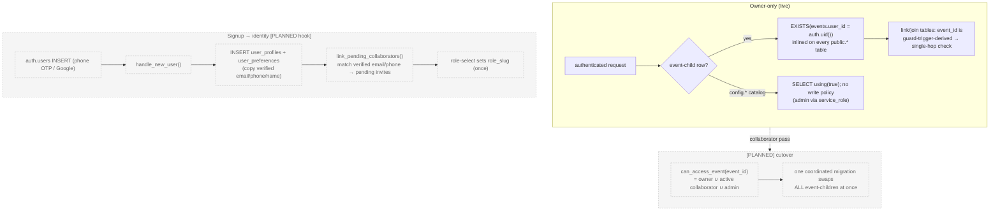
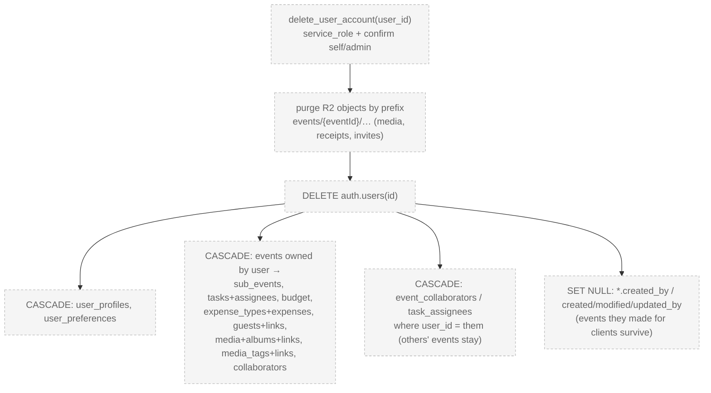

# Evenzi — Full Data Model ERD, Functions & Flows

> Visual companion to [`DATA-MODEL.md`](DATA-MODEL.md) (the canonical reference). Covers the whole live schema as of **v2026-06-16.3** — CORE + Planning + Guests + Media. Renders on GitHub / VS Code (Mermaid). A draw.io-editable version sits beside this file: [`evenzi-erd.drawio`](evenzi-erd.drawio).
>
> **Schemas:** `config.*` = reference/catalog (admin-seeded, public-read) · `public.*` = live app data (owner-only RLS) · `auth.*` = Supabase-managed identity.

---

## 1. Entity-Relationship Diagram (all tables)

```mermaid
erDiagram
  %% ---------- AUTH (Supabase) ----------
  AUTH_USERS {
    uuid id PK
    text email "verified"
    text phone "verified"
  }

  %% ---------- CONFIG (catalogs) ----------
  CONFIG_USER_TYPES        { uuid id PK  text slug UK }
  CONFIG_EVENT_TYPES       { uuid id PK  text slug UK  jsonb field_schema }
  CONFIG_EVENT_SUB_TYPES   { uuid id PK  uuid event_type_id FK  text slug }
  CONFIG_EVENT_CHECKLISTS  { uuid id PK  uuid event_type_id FK  text default_priority_slug FK }
  CONFIG_TASK_PRIORITIES   { uuid id PK  text slug UK }
  CONFIG_TASK_STATUSES     { uuid id PK  text slug UK  text category }
  CONFIG_EXPENSE_TYPES     { uuid id PK  text slug UK }
  CONFIG_RSVP_STATUSES     { uuid id PK  text slug UK  text category }
  CONFIG_GUEST_TAGS        { uuid id PK  text slug UK }
  CONFIG_ALBUM_PRESETS     { uuid id PK  text slug UK }

  %% ---------- IDENTITY ----------
  USER_PROFILES {
    uuid id PK_FK "= auth.users.id"
    text role_slug FK
    text email
    text phone
  }
  USER_PREFERENCES { uuid user_id PK_FK }

  %% ---------- CORE ----------
  EVENTS {
    uuid id PK
    uuid user_id FK "owner (transferable)"
    uuid created_by FK "creator (set null)"
    uuid event_type_id FK
    jsonb event_details
    text status
    timestamptz deleted_at
  }
  EVENT_SUB_EVENTS {
    uuid id PK
    uuid event_id FK
    uuid event_sub_type_id FK "null=custom"
    text custom_name
  }
  EVENT_COLLABORATORS {
    uuid id PK
    uuid event_id FK
    uuid user_id FK "null until accepted"
    text invited_email
    text role
    text status
  }

  %% ---------- PLANNING: tasks ----------
  EVENT_TASKS {
    uuid id PK
    uuid event_id FK
    uuid template_id FK "config.event_checklists"
    uuid sub_event_id FK
    uuid priority_id FK
    uuid status_id FK
    date due_date
  }
  EVENT_TASK_ASSIGNEES {
    uuid id PK
    uuid event_id FK "guard-derived"
    uuid task_id FK
    uuid user_id FK "owner or active collaborator"
  }

  %% ---------- PLANNING: budget ----------
  EVENT_BUDGETS {
    uuid event_id PK_FK "1:1"
    numeric total_amount
    text currency
  }
  EVENT_EXPENSE_TYPES {
    uuid id PK
    uuid event_id FK
    text name
    bool is_custom
    text source_slug "config.expense_types provenance"
  }
  EVENT_EXPENSES {
    uuid id PK
    uuid event_id FK
    uuid sub_event_id FK
    uuid expense_type_id FK
    numeric amount
    text receipt_key "R2"
  }

  %% ---------- GUESTS ----------
  EVENT_GUESTS {
    uuid id PK
    uuid event_id FK
    uuid rsvp_status_id FK
    text name
    int party_size
    bool invited
  }
  EVENT_GUEST_SUB_EVENTS {
    uuid id PK
    uuid event_id FK "guard-derived"
    uuid guest_id FK
    uuid sub_event_id FK
  }
  EVENT_GUEST_TAGS {
    uuid id PK
    uuid event_id FK
    text name
    bool is_custom
    text source_slug "config.guest_tags"
  }
  EVENT_GUEST_TAG_LINKS {
    uuid id PK
    uuid event_id FK "guard-derived"
    uuid guest_id FK
    uuid tag_id FK
  }

  %% ---------- MEDIA ----------
  EVENT_MEDIA {
    uuid id PK
    uuid event_id FK
    uuid sub_event_id FK
    text kind "photo|video"
    text storage_key "R2"
    bool published
  }
  EVENT_ALBUMS {
    uuid id PK
    uuid event_id FK
    uuid cover_media_id FK "set null"
    text name
    bool is_custom
    text source_slug "config.album_presets"
  }
  EVENT_MEDIA_ALBUMS {
    uuid id PK
    uuid event_id FK "guard-derived"
    uuid media_id FK
    uuid album_id FK
  }
  EVENT_MEDIA_TAGS {
    uuid id PK
    uuid event_id FK
    text name
  }
  EVENT_MEDIA_TAG_LINKS {
    uuid id PK
    uuid event_id FK "guard-derived"
    uuid media_id FK
    uuid tag_id FK
  }

  %% ===== RELATIONSHIPS =====
  AUTH_USERS ||--|| USER_PROFILES : "1:1"
  AUTH_USERS ||--|| USER_PREFERENCES : "1:1"
  AUTH_USERS ||--o{ EVENTS : "owns (user_id)"
  AUTH_USERS |o--o{ EVENTS : "created (created_by)"
  AUTH_USERS |o--o{ EVENT_COLLABORATORS : "member"
  AUTH_USERS |o--o{ EVENT_TASK_ASSIGNEES : "assignee"

  CONFIG_USER_TYPES ||--o{ USER_PROFILES : "role_slug"
  CONFIG_EVENT_TYPES ||--o{ CONFIG_EVENT_SUB_TYPES : "defines"
  CONFIG_EVENT_TYPES ||--o{ CONFIG_EVENT_CHECKLISTS : "defines"
  CONFIG_EVENT_TYPES ||--o{ EVENTS : "categorizes"
  CONFIG_TASK_PRIORITIES ||--o{ CONFIG_EVENT_CHECKLISTS : "default_priority_slug"
  CONFIG_TASK_PRIORITIES ||--o{ EVENT_TASKS : "priority_id"
  CONFIG_TASK_STATUSES ||--o{ EVENT_TASKS : "status_id"
  CONFIG_RSVP_STATUSES ||--o{ EVENT_GUESTS : "rsvp_status_id"
  CONFIG_EVENT_CHECKLISTS |o--o{ EVENT_TASKS : "seeds (set null)"
  CONFIG_EVENT_SUB_TYPES |o--o{ EVENT_SUB_EVENTS : "seeds (set null)"
  CONFIG_EXPENSE_TYPES ..> EVENT_EXPENSE_TYPES : "seeds (copy)"
  CONFIG_GUEST_TAGS ..> EVENT_GUEST_TAGS : "seeds (copy)"
  CONFIG_ALBUM_PRESETS ..> EVENT_ALBUMS : "seeds (copy)"

  EVENTS ||--o{ EVENT_SUB_EVENTS : "has"
  EVENTS ||--o{ EVENT_COLLABORATORS : "has"
  EVENTS ||--o{ EVENT_TASKS : "has"
  EVENTS ||--|| EVENT_BUDGETS : "1:1"
  EVENTS ||--o{ EVENT_EXPENSE_TYPES : "has"
  EVENTS ||--o{ EVENT_EXPENSES : "has"
  EVENTS ||--o{ EVENT_GUESTS : "has"
  EVENTS ||--o{ EVENT_GUEST_TAGS : "has"
  EVENTS ||--o{ EVENT_MEDIA : "has"
  EVENTS ||--o{ EVENT_ALBUMS : "has"
  EVENTS ||--o{ EVENT_MEDIA_TAGS : "has"

  EVENT_SUB_EVENTS |o--o{ EVENT_TASKS : "tagged"
  EVENT_SUB_EVENTS |o--o{ EVENT_EXPENSES : "tagged"
  EVENT_SUB_EVENTS |o--o{ EVENT_GUEST_SUB_EVENTS : "invited-to"
  EVENT_SUB_EVENTS |o--o{ EVENT_MEDIA : "tagged"

  EVENT_TASKS ||--o{ EVENT_TASK_ASSIGNEES : "assigned"
  EVENT_EXPENSE_TYPES ||--o{ EVENT_EXPENSES : "categorizes"

  EVENT_GUESTS ||--o{ EVENT_GUEST_SUB_EVENTS : "M:N functions"
  EVENT_GUESTS ||--o{ EVENT_GUEST_TAG_LINKS : "M:N tags"
  EVENT_GUEST_TAGS ||--o{ EVENT_GUEST_TAG_LINKS : "M:N"

  EVENT_MEDIA ||--o{ EVENT_MEDIA_ALBUMS : "M:N albums"
  EVENT_ALBUMS ||--o{ EVENT_MEDIA_ALBUMS : "M:N"
  EVENT_ALBUMS |o--|| EVENT_MEDIA : "cover (set null)"
  EVENT_MEDIA ||--o{ EVENT_MEDIA_TAG_LINKS : "M:N tags"
  EVENT_MEDIA_TAGS ||--o{ EVENT_MEDIA_TAG_LINKS : "M:N"
```

**Legend:** `||--o{` one-to-many · `||--||` one-to-one · `|o--o{` optional (nullable FK) · `..>` dashed = catalog→per-event **copy** at event creation (not a hard FK). Every `public.*` table also has `created_at`/`updated_at`; entity tables additionally carry `created_by` (+ `updated_by` on media/albums/media-tags). **Modularity rule:** every module FK points only to core (`events`, `event_sub_events`, `auth.users`) or `config.*` — never another module's tables.

---

## 2. Functions, triggers & views (the "logic" layer)



| Object | Kind | Security | Purpose |
|---|---|---|---|
| `set_updated_at` | trigger fn | — | stamp `updated_at` on every table |
| `stamp_updated_by` | trigger fn | DEFINER | stamp `updated_by` (media/albums/media-tags) on UPDATE |
| `stamp_*_created_by` | trigger fns | DEFINER | server-stamp `created_by` (never client-trusted) |
| `*_before` guards | trigger fns | DEFINER | derive `event_id` from parent + reject cross-event refs |
| `default_guest_rsvp` | trigger fn | DEFINER | default RSVP → `pending` |
| `create_event_with_details` | RPC | DEFINER | one-txn event create + 6 seed blocks; owner from `auth.uid()` |
| `event_task_counts` / `bulk_set_task_status` | RPC | invoker | toolbar counts / bulk status |
| 7 views | view | `security_invoker` | derived numbers (progress, budget, guest stats, storage, counts) |
| `handle_new_user` · `can_access_event` · `link_pending_collaborators` · `delete_user_account` | fn | [PLANNED] | signup seed · access check · invite-link · account deletion |

---

## 3. Flow — event creation (`create_event_with_details`, one transaction)



---

## 4. Flow — RLS access model & signup



---

## 5. Flow — account deletion cascade (`delete_user_account` [PLANNED])



---

## Maintenance

This file is **derived** from `DATA-MODEL.md` — when the schema changes, update `DATA-MODEL.md` first (source of truth), then refresh these diagrams + the `.drawio`. Keep the entity list and relationships in sync with the live DB.
