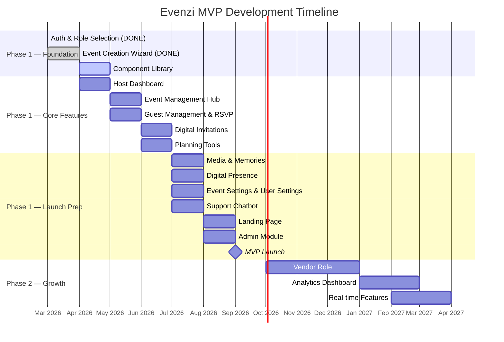

# Business Requirements Document (BRD)
## Evenzi — Event Planning SaaS Platform

**Document version:** 1.0
**Date:** April 2026
**Status:** Draft — awaiting sign-off
**Owner:** Abhijith (Founder / Product Owner)

---

## Table of Contents

1. [Executive Summary](#1-executive-summary)
2. [Business Objectives](#2-business-objectives)
3. [Problem Statement](#3-problem-statement)
4. [Market Opportunity](#4-market-opportunity)
5. [Target Users & Personas](#5-target-users--personas)
6. [Product Scope](#6-product-scope)
7. [Functional Requirements by Module](#7-functional-requirements-by-module)
8. [Non-Functional Requirements](#8-non-functional-requirements)
9. [Revenue Model](#9-revenue-model)
10. [Success Metrics / KPIs](#10-success-metrics--kpis)
11. [Assumptions & Constraints](#11-assumptions--constraints)
12. [Dependencies & Risks](#12-dependencies--risks)
13. [Timeline Overview](#13-timeline-overview)
14. [Approval & Sign-off](#14-approval--sign-off)

---

## 1. Executive Summary

### Problem
Indian event hosts — primarily wedding planners, couples, and families — have no purpose-built digital platform to manage their events end-to-end. They rely on WhatsApp groups for invitations and RSVPs, Excel spreadsheets for guest lists and budgets, and fragmented verbal coordination for logistics. The result is a high-stress, error-prone planning experience that does not match the scale or importance of the occasions being planned.

### Solution
Evenzi is a subscription-based SaaS platform that gives event hosts a single, structured workspace to create their event, manage guests, send digital invitations, track RSVPs, manage budget and checklists, share photos, and publish a public event website. It is designed specifically for the Indian market — WhatsApp-first, India-scale guest lists, and Indian event conventions.

### Scope
The MVP (Phase 1) covers the complete Host-side workflow across 14 modules. It is a Host-only release — the Guest experience is limited to RSVP pages and invitation viewing, and the Vendor role is deferred to Phase 2.

### Goals
- Deliver a functional, end-to-end event management experience for Indian event hosts
- Reach public launch by Q3 2026 with a production-ready MVP
- Validate product-market fit and subscription willingness-to-pay with early adopters
- Build the technical foundation (auth, data model, component library) that Phase 2 will extend

---

## 2. Business Objectives

The following objectives define success for the MVP phase. Metrics are estimates based on a small early-adopter cohort and will be revised as real data becomes available.

### Launch Objectives (Month 1 post-launch)

| Objective | Target | Rationale |
|-----------|--------|-----------|
| Events created | ≥ 100 | Validates that the wizard flow works and hosts find value quickly |
| Guest records added | ≥ 5,000 | Validates that hosts are using the guest management module meaningfully |
| RSVPs tracked via platform | ≥ 500 | Validates end-to-end flow from invitation to RSVP |
| Paid conversions (free-to-paid) | ≥ 10% of active hosts | Establishes baseline willingness-to-pay |
| Support chatbot FAQ deflection | ≥ 70% of chatbot sessions resolve without human escalation | Validates chatbot spec's deflection goal |

### Product Quality Objectives

| Objective | Target |
|-----------|--------|
| Vercel deployment error resolved | Before MVP launch |
| Core flow completion rate (create event → add guests → send invitations) | ≥ 80% of hosts who start the wizard complete all steps |
| Page load time (mobile, 4G India) | < 3 seconds for all primary screens |
| Accessibility | WCAG AA compliance on all primary screens |

### Business Health Objectives (3 months post-launch)

| Objective | Target |
|-----------|--------|
| Monthly active hosts | ≥ 200 |
| Net Promoter Score (NPS) | ≥ 40 |
| Churn rate (paid) | < 15% monthly |
| Support ticket volume | < 5% of active users per month (indication of product quality) |

---

## 3. Problem Statement

### Who feels the pain

The primary pain is felt by **event hosts** — the people responsible for coordinating a large social event. In India, this is typically:

- A bride or groom planning their own wedding
- A parent coordinating a child's wedding on behalf of the family
- A family member designated as the "coordinator" for multi-day celebrations
- A professional or semi-professional event planner managing multiple events

These people are often not technical, are managing the planning alongside full-time jobs or family responsibilities, and are under significant social and financial pressure to get the event right.

### The specific pains

**1. Guest list chaos.**
Indian weddings routinely have 200–2,000 guests. Managing this in a WhatsApp group or Excel sheet is fragile. Guests are added, removed, and reshuffled across family branches. RSVPs come through different channels (calls, messages, in-person confirmations) and are never centralised. Hosts often do not have an accurate headcount until days before the event.

**2. Invitation coordination is manual and untracked.**
Physical cards are expensive, slow, and provide no delivery confirmation. WhatsApp invitations are sent manually, one contact at a time, with no tracking of who received, read, or responded. There is no way to send a structured digital invitation at scale with RSVP tracking.

**3. Budget management is opaque.**
Hosts track budgets in spreadsheets that are rarely updated in real time. Vendor payments, advance deposits, and last-minute expenses pile up. Most hosts have no accurate view of total spend until after the event — often discovering they overspent by a significant margin.

**4. Information is scattered across platforms.**
Event details live in WhatsApp, venue information is in email, vendor contacts are in someone's phone, the guest list is in a shared Google Sheet, and the budget is in Excel. There is no single place where a host can see the complete picture of their event.

**5. No structured planning support.**
Most hosts do not know what to plan and when. Indian weddings involve dozens of vendors, multiple functions (mehendi, sangeet, ceremony, reception), and hundreds of tasks. Without a structured checklist, critical tasks get forgotten.

### The gap

There is no dedicated, India-first event management platform for hosts that addresses all of these pains in one product. Existing tools either address one piece of the problem (WhatsApp for invitations, Excel for budgets, WedMeGood for vendor discovery) or are designed for Western markets and conventions.

---

## 4. Market Opportunity

### The Indian Wedding Market

India's wedding industry is one of the largest in the world:

- **Market size:** Estimated at $40–50 billion USD annually (industry reports, 2023–2024)
- **Volume:** Approximately 10 million weddings per year in India
- **Average spend:** INR 5–25 lakhs for middle-class weddings; INR 1 crore+ for affluent weddings
- **Duration:** Indian weddings typically span 3–5 days with multiple functions, meaning higher coordination complexity than Western single-day events

### Digital Adoption Gap

Despite this scale, digital tool adoption in Indian event planning is low:

- The dominant tool for event coordination is still WhatsApp
- There is no market-leading SaaS platform for Indian event hosts (as of 2026)
- Existing players (WedMeGood, WeddingWire India, ShaadiSaga) focus on vendor discovery/booking, not host workflow management
- Indian SaaS adoption is growing rapidly — the market is primed for a host-workflow product

### Addressable Market

| Segment | Estimate |
|---------|----------|
| Indian weddings per year | ~10 million |
| Middle/upper-middle class weddings (primary target) | ~2–3 million/year |
| Hosts willing to pay for digital tools (estimate: 10–20%) | 200,000–600,000/year |
| Potential ARR at INR 2,000/year/host | INR 40–120 crore/year |

These are preliminary estimates. Actual conversion will depend on pricing, product quality, and go-to-market execution — but the market is large enough to support a viable SaaS business even at conservative conversion rates.

### Adjacent markets
Beyond weddings, Evenzi's platform is equally applicable to birthday parties, corporate events, engagement parties, and family reunions. These are secondary target markets for Phase 2.

---

## 5. Target Users & Personas

### Persona 1: Priya — The Bride-to-Be

**Background:** Priya, 28, is a software engineer in Bengaluru. She and her fiancé are planning a wedding for November 2026 — 450 guests, three functions (mehendi, sangeet, reception), in Hyderabad. Both sets of parents are involved in coordination. She is digitally savvy but overwhelmed by the scale of planning.

**Goals:**
- Keep the guest list accurate and up-to-date across both families
- Send digital invitations that feel personal, not generic
- Track RSVPs without chasing every guest individually on WhatsApp
- Stay on budget without manual spreadsheet updates
- Give guests an easy way to find venue, schedule, and accommodation details

**Pain points:**
- Her mother-in-law keeps updating the guest list via WhatsApp messages with no structure
- She's already missed three vendor payment deadlines because they were tracked in a spreadsheet she forgot to check
- She spent four hours sending WhatsApp invitations one by one

**How Evenzi helps:** Priya creates the event in the Celebratory Curator, imports her guest list, sends WhatsApp invitations in bulk, watches RSVPs come in on her dashboard, tracks budget in real time, and shares a public event website with venue details.

---

### Persona 2: Rahul — The Guest

**Background:** Rahul, 35, is a school friend of the groom. He lives in Mumbai, 1,400 km from the wedding venue. He receives a WhatsApp invitation with a link.

**Goals:**
- Confirm attendance and meal preference easily
- Find venue directions and accommodation options
- Know the schedule for each function

**Pain points:**
- He's received paper invitations in the past with no digital backup — can't find the address
- RSVP-ing involved calling someone and leaving a voicemail

**How Evenzi helps:** Rahul clicks the WhatsApp link, views the event website with full details, RSVPs in two taps, and gets a confirmation. No app download required.

---

### Persona 3: Meena — The Professional Event Coordinator (Post-MVP)

**Background:** Meena, 42, runs a boutique event coordination business in Delhi. She manages 15–20 events per year — mostly weddings and corporate events. She currently uses Excel, WhatsApp, and email to manage everything.

**Goals:**
- Manage multiple events simultaneously from one platform
- Give each client their own event workspace
- Reduce time spent on manual coordination

**Pain points:**
- No professional tool exists for Indian event coordinators at her price point
- Her coordination process is entirely manual, limiting how many events she can take on

**How Evenzi helps (Phase 2):** A professional/multi-event tier of Evenzi will allow coordinators like Meena to manage a portfolio of events from one account, with client-specific workspaces.

---

### Persona 4: Vikram — The Vendor (Post-MVP)

**Background:** Vikram, 50, runs a catering business in Pune with a capacity for 500–2,000 person events. He gets most of his business through referrals and JustDial listings.

**Goals:**
- Get discovered by new clients planning events
- Receive inquiries directly through a platform
- Manage bookings more professionally

**How Evenzi helps (Phase 2):** The Vendor marketplace allows Vikram to create a profile, list his services, and receive enquiries from hosts browsing the platform.

---

## 6. Product Scope

### In Scope — MVP Phase 1

All 14 modules below are in scope for Phase 1. The MVP is Host-role only — all features are built for the event creator/organiser. Guest interaction is limited to RSVP pages and invitation viewing.

| # | Module | Description |
|---|--------|-------------|
| 1 | Auth & Role Selection | Phone OTP and Google OAuth login, role selection (Host / Guest) |
| 2 | Celebratory Curator | 4-step guided event creation wizard |
| 3 | Host Dashboard | Central dashboard with event overview and key stats |
| 4 | Event Management Hub | Per-event navigation hub for accessing all event features |
| 5 | Guest Management & RSVP | Guest list management, RSVP tracking, public RSVP page |
| 6 | Digital Invitations | WhatsApp invitation sending with delivery and read tracking |
| 7 | Planning Tools | Event checklist and budget tracker |
| 8 | Media & Memories | Photo gallery for event memories |
| 9 | Digital Presence | Public event website from template |
| 10 | Event Settings | Per-event configuration and preferences |
| 11 | User Settings | Account and profile management |
| 12 | Support Chatbot | FAQ self-service, account help, escalation |
| 13 | Landing / Marketing Site | Public acquisition and marketing website |
| 14 | Admin Module | Internal admin and developer monitoring panel |

### Out of Scope — Deferred to Phase 2 or Later

| Feature | Reason for Deferral |
|---------|---------------------|
| Vendor Role (full vendor-side flows) | Requires marketplace architecture, separate scope, Phase 2 |
| Vendor Discovery & Booking | Depends on Vendor Role |
| AI Photo Finder | Advanced AI feature, post-MVP |
| Real-time collaboration | Infrastructure complexity, post-MVP |
| Event discovery / search | Marketplace feature, post-MVP |
| Analytics Dashboard | Phase 2 after data accumulates |
| Mobile App (iOS / Android) | Post-MVP; web-first for MVP |
| Vendor Payments / Commission | Post-marketplace launch |
| Multi-event Corporate Tier | Phase 2+ |
| AI Planning Assistant | Post-MVP |

---

## 7. Functional Requirements by Module

### Module 1 — Auth & Role Selection
- Users can register and log in using a phone number with OTP verification (India, +91 prefix)
- Users can log in using Google OAuth
- After authentication, users are prompted to select their role (Host or Guest)
- Sessions are persisted securely via Supabase Auth with automatic refresh
- Protected routes redirect unauthenticated users to the login page

### Module 2 — Celebratory Curator (Event Creation Wizard)
- Hosts can create a new event through a guided multi-step wizard
- Step 1: Event name, event type (wedding, birthday, corporate, etc.), and primary date
- Step 2: Venue details — name, address, city, map link (optional)
- Step 3: Event cover details — cover photo upload, event description
- Step 4: Review and confirm — host reviews all details before saving
- Created event is stored in the database and appears in the Host Dashboard

### Module 3 — Host Dashboard
- Dashboard displays all events created by the logged-in host
- Each event card shows: event name, date, type, RSVP summary (confirmed/pending/declined), and quick actions
- Dashboard shows aggregate stats: total events, total guests, upcoming events
- Quick action buttons link directly to key event features (add guest, view RSVPs, etc.)
- Dashboard updates in real time as guests RSVP

### Module 4 — Event Management Hub
- Each event has a dedicated hub page serving as the navigation centre
- The hub displays the event name, date, type, cover photo, and status
- The hub provides navigation to all active features for that event: Guests, Invitations, Planning, Photos, Website, Settings
- The hub shows a mini-stats panel (guest count, RSVP status, budget status)
- Hosts can access the Event Management Hub from the Host Dashboard

### Module 5 — Guest Management & RSVP
- Hosts can add individual guests manually (name, phone, email, group/family label)
- Hosts can import guests in bulk via CSV upload
- Each guest has a status: Invited / Confirmed / Declined / Pending / No Response
- Hosts can filter and search the guest list by name, group, status, or RSVP response
- A public RSVP page is generated per event — accessible via a shareable link — where guests can confirm attendance and submit meal preferences or notes
- RSVP responses update the guest record in real time

### Module 6 — Digital Invitations
- Hosts can select a digital invitation template (at least 3 templates available at launch)
- Invitation includes: event name, date, time, venue, RSVP link, and optional personalised message
- Hosts can send invitations to selected guests or all guests via WhatsApp (click-to-send using WhatsApp API or wa.me deep link)
- Hosts can track delivery status (sent / delivered / read) where the WhatsApp API supports it
- Hosts can resend invitations to guests who have not responded after a defined period

### Module 7 — Planning Tools
- **Checklist:** A pre-populated event checklist with common tasks organised by category (Venue, Catering, Photography, Attire, etc.) and timeline (12 months before, 6 months, 1 month, 1 week)
- Hosts can add custom tasks, mark tasks as complete, assign due dates, and reorder items
- **Budget Tracker:** Hosts can create budget categories (Venue, Catering, Photography, Flowers, etc.) and set an estimated spend per category
- Hosts can log actual expenses against each category, track vendor payments (paid/pending/advance), and view total estimated vs. actual spend
- Both tools are scoped per event and accessible from the Event Management Hub

### Module 8 — Media & Memories
- Hosts can create one or more photo albums per event (e.g., Mehendi, Sangeet, Reception)
- Hosts and invited guests can upload photos to an album (guest upload requires invitation link)
- Photos are stored in Supabase Storage and served via CDN
- Hosts can mark photos as private (host-only) or public (visible to guests with the event link)
- A download option allows hosts to bulk-download all photos from an album

### Module 9 — Digital Presence (Public Event Website)
- Each event can have a public website generated from a customisable template
- The website displays: event name, cover photo, date, venue details with map, schedule of functions, and a link to RSVP
- Hosts can toggle the public website on or off (default: off)
- Hosts can customise basic elements: colour theme, cover image, welcome message
- The website is accessible via a shareable URL (e.g., `evenzi.in/events/[event-slug]`)
- The website is mobile-responsive and loads fast on low-bandwidth connections

### Module 10 — Event Settings
- Hosts can edit all event details created in the wizard (name, date, venue, cover photo)
- Hosts can set a RSVP cutoff date — after which the public RSVP page stops accepting responses
- Hosts can toggle public visibility of the event website
- Hosts can configure notification preferences per event (e.g., notify me when a guest RSVPs)
- Hosts can archive or delete an event

### Module 11 — User Settings
- Users can update their display name, profile photo, and contact email
- Users can view linked authentication methods (phone, Google) and add/remove them
- Users can update notification preferences (email, in-app)
- Users can change their role (if applicable — e.g., Guest switching to Host)
- Users can delete their account (with confirmation flow and data removal per privacy policy)

### Module 12 — Support Chatbot
- An in-app chatbot is available on all authenticated pages via a floating button
- The chatbot handles FAQ queries (e.g., "How do I add guests?", "How do I change my event date?")
- The chatbot can look up the user's account status and active events to provide contextual answers
- If the chatbot cannot resolve a query, it offers escalation to human support via a support ticket or email
- FAQ deflection target: ≥ 70% of sessions resolve without human escalation
- Admin users can update FAQ content through the Admin Module
- Chatbot spec is complete; implementation is pending Figma design

### Module 13 — Landing / Marketing Site
- A public-facing website describing Evenzi — who it's for, what it does, and why
- Includes: hero section, feature highlights, pricing overview, testimonials (placeholder at launch), and a sign-up CTA
- Accessible at the root domain without authentication
- Mobile-responsive and SEO-optimised
- Includes a cookie/privacy notice compliant with Indian IT rules

### Module 14 — Admin Module
- Accessible only to users with the Admin role (internal team only)
- Admin can view all users, events, and platform activity
- Admin can search and view any user's account details (for support purposes)
- Admin can flag, suspend, or delete accounts for policy violations
- Admin can view platform health metrics: signups/day, events created, active sessions, error rates
- Admin can manage chatbot FAQ content

---

## 8. Non-Functional Requirements

### Performance
- **Page load time:** Primary screens must load in < 3 seconds on a mobile device on a 4G connection in India (average speed: 15–30 Mbps)
- **Image optimisation:** All images served in next-gen formats (WebP/AVIF) via Vercel's image optimisation pipeline
- **Database queries:** All dashboard and list queries must return in < 500ms at a table size of 10,000 guests
- **Uptime target:** ≥ 99.5% uptime for production (aligned with Vercel + Supabase SLA)

### Security
- All authentication handled by Supabase Auth — no custom credential storage
- Row-Level Security (RLS) enforced on all Supabase tables — users can only read/write their own data
- All API routes validate the authenticated session before processing requests
- File uploads validated for type and size before storage
- No sensitive data (API keys, secrets) stored client-side or in version control
- HTTPS enforced on all routes (enforced by Vercel)

### Mobile-First Design
- All screens designed and tested for mobile first (iPhone SE / Android mid-range as baseline)
- Minimum touch target size: 44px × 44px
- No horizontal scrolling on any screen
- Forms optimised for mobile keyboard input (correct input types, autocomplete attributes)

### India-Specific Requirements
- **WhatsApp-first:** Invitation sending via WhatsApp is a P0 feature (primary channel in India)
- **Low-bandwidth graceful degradation:** Core functionality (viewing event details, submitting RSVP) must work on 2G/3G connections
- **India phone format:** Phone number inputs default to +91 prefix
- **Language:** MVP is English-only; Hindi/regional language support is a post-MVP consideration
- **Payment:** No payment processing in MVP — billing infrastructure to be added when pricing is finalised

### Accessibility
- WCAG AA compliance on all primary user flows
- Minimum contrast ratio: 4.5:1 for normal text, 3:1 for large text
- All interactive elements keyboard-accessible
- Meaningful alt text on all images
- Screen reader compatibility for primary flows

### Data & Privacy
- User data stored in Supabase PostgreSQL (region: ap-northeast-1 / Asia Pacific)
- Data retention policy: user data retained for 12 months after account deletion, then purged
- Privacy policy and terms of service published before launch
- Compliance with India's Digital Personal Data Protection Act (DPDPA) 2023 — user consent flows required

---

## 9. Revenue Model

**Note: Specific pricing, tier names, and feature allocations are not yet finalised.** The structure below reflects the intended model; exact numbers and feature splits will be determined based on competitive analysis and willingness-to-pay research with early users.

### Subscription Tiers

Evenzi will operate on a freemium subscription model with three tiers:

| Tier | Target User | Intent |
|------|-------------|--------|
| **Free** | First-time users, trial | Let users experience the product before paying. Limited by guest count or number of events. Designed to convert. |
| **Standard (Paid)** | Individuals planning one event | Full access to all core features, higher guest limits, standard templates |
| **Premium (Paid)** | Power users, repeat planners, coordinators | Highest guest limits, priority support, premium templates, advanced features |

### Feature Add-Ons

Certain features may be offered as paid add-ons on top of any subscription tier:

- **Custom event domain** (e.g., `priyawedding.in` instead of `evenzi.in/events/...`)
- **Premium photo storage** (expanded above the standard allocation)
- **WhatsApp broadcast credits** (for platforms that require per-message billing)
- **Priority support** (guaranteed response time SLA)

### Post-MVP: Marketplace Revenue

When the Vendor marketplace launches (Phase 2), Evenzi will evaluate:
- Commission on bookings made through the platform
- Premium vendor listing/profile features
- Promoted placement in vendor search results

### Pricing Philosophy

- Free tier must be genuinely useful — not crippled — to build trust and word-of-mouth
- Paid tiers must be affordable for middle-class Indian households planning events
- Pricing will be set in INR; USD pricing for NRI market is a secondary consideration

---

## 10. Success Metrics / KPIs

### Platform-Level KPIs

| Metric | Target (Month 1) | Target (Month 3) | Tracking Method |
|--------|-----------------|-----------------|-----------------|
| Signups | 500 | 2,000 | Supabase Auth |
| Active hosts (created ≥1 event) | 100 | 500 | Database query |
| Events created | 150 | 800 | Database query |
| Paid conversions | 10% of active hosts | 15% | Payment records |
| Monthly churn (paid) | < 20% | < 15% | Subscription records |
| NPS | — | ≥ 40 | User survey |

### Module-Level KPIs

| Module | Key Metric | Target |
|--------|-----------|--------|
| Auth & Role Selection | Signup completion rate | ≥ 85% |
| Celebratory Curator | Wizard completion rate | ≥ 80% |
| Host Dashboard | 7-day retention (host returns after creation) | ≥ 60% |
| Guest Management | Avg guests added per event | ≥ 50 |
| Digital Invitations | % of guests invited via platform (vs manual) | ≥ 70% |
| RSVP Tracking | RSVP response rate (invited vs. responded) | ≥ 50% |
| Planning Tools | % of hosts using checklist within 7 days of event creation | ≥ 40% |
| Media & Memories | Avg photos uploaded per event | ≥ 30 |
| Digital Presence | % of events with public website enabled | ≥ 60% |
| Support Chatbot | FAQ deflection rate | ≥ 70% |
| Support Chatbot | Avg resolution time | < 2 minutes |
| Admin Module | Support ticket resolution time | < 24 hours |

### Engineering KPIs

| Metric | Target |
|--------|--------|
| Core Web Vitals (LCP) | < 2.5s on mobile |
| Core Web Vitals (CLS) | < 0.1 |
| Error rate (API routes) | < 0.5% |
| Test coverage (unit + integration) | ≥ 80% on critical paths |
| Deployment success rate | ≥ 99% |

---

## 11. Assumptions & Constraints

### Assumptions

| Assumption | Impact if Wrong |
|------------|----------------|
| WhatsApp is the primary invitation channel for Indian hosts | Digital Invitations module may need to support SMS or email as primary channel |
| Hosts are willing to pay INR 500–2,000/year for a planning tool | Pricing strategy and tier structure need revision |
| Hosts will use the platform on mobile primarily | Desktop UI prioritisation may need to increase |
| English is sufficient for MVP; Hindi not required | May limit adoption in tier-2/3 cities; localisation needed sooner |
| Supabase free tier is sufficient for MVP scale | May need to upgrade to a paid Supabase plan at ~500+ active users |
| Vercel deployment error is fixable before launch | If not fixable, alternate deployment host (Railway, Render) must be evaluated |

### Constraints

| Constraint | Details |
|------------|---------|
| **Self-funded** | No external capital. Every infrastructure cost, tool subscription, and development decision must be justifiable on a lean budget. |
| **Two-person team** | Abhijith (product/spec) + Dheeraj (engineering). Bandwidth is the primary bottleneck. AI tooling (Claude Code) partially mitigates this. |
| **WhatsApp API access** | Sending WhatsApp messages programmatically at scale requires WhatsApp Business API access (via Twilio or Meta directly). This has approval requirements and per-message costs. MVP may use wa.me deep links as a fallback if API access is delayed. |
| **Phone OTP (Twilio)** | Twilio must be configured in Supabase console for phone OTP to work in production. Currently using a test OTP (123456) in development. |
| **No payment infrastructure** | Payment processing (Razorpay / Stripe) is not built. The free tier is the only available tier until billing is implemented. |
| **Figma dependency** | Support Chatbot and some UI screens are blocked on Figma design completion. |
| **India data residency** | Supabase project is in ap-northeast-1. Consider whether ap-south-1 (Mumbai) would be more appropriate for latency and data residency. |

---

## 12. Dependencies & Risks

### Key Dependencies

| Dependency | Owner | Status | Impact if Delayed |
|------------|-------|--------|------------------|
| Vercel deployment fix | Dheeraj | Blocked (pre-existing) | MVP cannot go live |
| Figma designs (Chatbot, remaining screens) | Design team (TBD) | Not started | Chatbot and some screens cannot be implemented |
| WhatsApp Business API access | Abhijith (biz decision) | Not started | Digital Invitations limited to wa.me links |
| Twilio configuration (Supabase) | Abhijith | Not started | Phone OTP not functional in production |
| Razorpay/payment integration | Abhijith | Deferred | No paid tier until implemented |
| Marketing & branding team hire | Abhijith | TBD | Landing page and brand positioning delayed |

### Risk Register

| Risk | Likelihood | Impact | Mitigation |
|------|-----------|--------|------------|
| Vercel deployment remains broken at launch | Medium | Critical | Evaluate Railway/Render as alternatives; root-cause investigation is P0 |
| WhatsApp API approval delayed or denied | Medium | High | Ship MVP with wa.me deep link fallback; apply for API access immediately |
| Team bandwidth insufficient for all 14 modules | High | High | Ruthless prioritisation — defer P2 modules (Media, Digital Presence) if needed; launch with P0 + P1 modules only |
| Low willingness-to-pay at launch | Medium | High | Extend free tier offer for early adopters; use first 100 users for pricing research |
| Supabase costs exceed budget at scale | Low | Medium | Monitor usage; scale Supabase tier proactively; optimise queries |
| Data breach or security vulnerability | Low | Critical | Supabase RLS enforced on all tables; security review before launch; no custom auth code |
| Figma designs not delivered on time | Medium | Medium | Start chatbot implementation with wireframes; unblock frontend with low-fidelity specs |
| Competition launches India-first product before Evenzi | Low | Medium | Speed to market is the mitigation; focus on shipping MVP Q3 2026 |

---

## 13. Timeline Overview

This timeline is approximate and will be updated as each phase progresses. All dates assume the current team composition (Abhijith + Dheeraj + Claude Code).

### Milestone Summary

| Milestone | Target Date | Exit Criteria |
|-----------|------------|---------------|
| Component Library complete | May 2026 | All reusable UI components built, documented, tested |
| Host Dashboard live | May 2026 | Dashboard shows real Supabase data, all quick actions functional |
| Core Event Flow complete | July 2026 | Create event → Add guests → Send invitations → Track RSVPs — all working end-to-end |
| All modules feature-complete | August 2026 | All 14 modules functional, no P0/P1 bugs |
| Launch-ready | September 2026 | Vercel deployment clean, all tests passing, QA signed off, privacy policy live |
| **MVP Public Launch** | **Q3 2026** | Platform publicly accessible, paid tier available |
| Phase 2 kick-off | Q4 2026 | Post-launch learnings incorporated, Vendor role scoped and in development |

---

## 14. Approval & Sign-off

This document defines the business requirements for Evenzi MVP Phase 1. It is intended to serve as the authoritative source of truth for product scope, functional requirements, and success criteria for this phase.

| Role | Name | Status | Date |
|------|------|--------|------|
| Product Owner / Founder | Abhijith | Pending review | — |
| Lead Engineer | Dheeraj | Pending review | — |

**Notes for reviewers:**
- Items marked "Pricing TBD" in the Revenue Model section require a decision before MVP launch
- The WhatsApp API dependency (Module 6) requires a business decision and action before the Digital Invitations module can be fully implemented
- The Figma design dependency for the Support Chatbot (Module 12) requires a timeline commitment from the design team

---

*Document prepared by Claude Code (AI development assistant) on behalf of the Evenzi product team, April 2026. All product and business decisions are subject to review and approval by Abhijith (Founder/Product Owner).*
