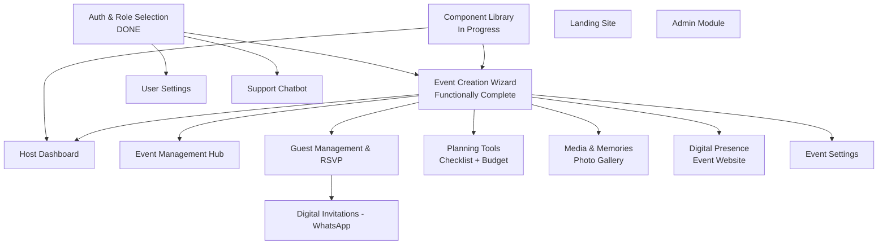

# F3 — Evenzi Product Roadmap

**Document type:** Foundation Reference
**Version:** 1.1
**Date:** April 2026
**Audience:** Core team, stakeholders

---

## 1. Vision Statement

Evenzi will be India's most loved event planning platform — the single place where hosts create, manage, and celebrate every milestone, and where guests, vendors, and memories come together.

The product was born from firsthand experience: the founder lived through the coordination chaos of planning an event and built Evenzi to be the tool they wished had existed.

---

## 2. Guiding Principles

**1. Host-Centric Design**
Every feature is designed from the host's perspective first. If it doesn't make the host's life easier, we don't build it.

**2. Mobile-First, WhatsApp-Native**
India's primary communication channel is WhatsApp, and most users are on mobile. Features are designed for touch screens, low-bandwidth networks, and WhatsApp-first invitation flows.

**3. Progressive Complexity**
A first-time host can create an event in minutes. An experienced host can unlock advanced tools without the platform feeling overwhelming.

**4. Build to Validate, Not to Impress**
We ship the smallest thing that proves value. Features earn their place based on user feedback, not assumptions.

**5. Trust Through Simplicity**
A self-funded startup earns trust by being reliable, fast, and straightforward — not by adding feature bloat.

---

## 3. Phase Overview

```
Phase 1 — MVP (Apr–Sep 2026)
  Host-only, end-to-end event flow
  Weddings, birthdays, corporate
  Delivered as a PWA (installable from browser — no App Store required)

Phase 2 — Growth (Oct 2026–Mar 2027)
  Guest experience expansion
  Vendor collaboration (professional event managers)
  Analytics + multi-language

Phase 3 — Scale (Apr 2027+)
  Full two-sided vendor ecosystem
  Booking + payments
  Native mobile app (iOS + Android)
```

| Phase | Goal | Timeline | Key Milestone |
|-------|------|----------|---------------|
| Phase 1 — MVP | Complete host-only event flow | Apr–Sep 2026 | First real wedding on Evenzi |
| Phase 2 — Growth | Expand guest UX + introduce vendor collaboration | Oct 2026–Mar 2027 | First vendor-managed event |
| Phase 3 — Scale | Full vendor ecosystem, native mobile app, payments | Apr 2027+ | 10,000 events hosted |

---

## 4. Phase 1 — MVP (Current)

### Goal
Deliver a complete, polished, end-to-end event planning flow for a single host managing a single event type (wedding/birthday/corporate). No vendor role. No marketplace. No real-time features. Just one host, their event, their guests.

Evenzi is delivered as a **Progressive Web App (PWA)** — installable directly from the browser on Android and iOS without going through an App Store. This gives a near-native experience with faster iteration cycles.

### Success Criteria
- A host can sign up, create an event, invite guests via WhatsApp, collect RSVPs, manage a budget, and publish a public event website — without leaving Evenzi.
- The platform is live on Vercel with no deployment errors.
- At least one real wedding has been planned end-to-end on Evenzi.
- Core flows work reliably on mobile (Android + iOS) on average Indian network speeds (4G/LTE).

---

### Sprint 1 (Active — April 2026)

| Task | Priority | Status | Notes |
|------|----------|--------|-------|
| Fix Vercel Deployment | P0 | Blocked (pre-existing) | Deploy pipeline broken; must fix before any release |
| Reusable Component Library | P0 | In Progress | 28 subtasks; design system foundation for all other modules |
| Auth & Role Selection | P0 | **Done** | Phone OTP + Google OAuth + Role Selection page complete |

---

### Sprint 2+ — Remaining Features

| Module | Description | Priority | Status | Depends On |
|--------|-------------|----------|--------|------------|
| Celebratory Curator (Event Creation Wizard) | 5-step wizard to create an event: name, date, type, venue, cover image | P0 | Functionally complete (UI polish pending) | Auth |
| Host Dashboard | Central hub showing all host events, quick stats, navigation | P0 | Shell exists — needs real data + full design | Event CRUD |
| Event Management Hub | Per-event control panel: overview, settings, quick links to all sub-features | P0 | Not Started | Event CRUD |
| Guest Management & RSVP | Add/import guests, manage RSVP status, guest list view | P1 | Not Started | Event CRUD |
| Digital Invitations (WhatsApp) | Generate and send WhatsApp invitation links to guests | P1 | Not Started | Guest Management |
| Planning Tools (Checklist + Budget) | Pre-built checklist templates + expense tracking with budget summary | P2 | Not Started | Event CRUD |
| Media & Memories (Photo Gallery) | Host-uploaded photo gallery per event | P2 | Not Started | Event CRUD |
| Digital Presence (Event Website) | Public-facing event page with details, RSVP link, gallery | P2 | Not Started | Event CRUD |
| Event Settings | Per-event privacy, visibility, date/venue edits | P1 | Not Started | Event CRUD |
| User Settings | Profile management, notification preferences, account deletion | P1 | Not Started | Auth |
| Support Chatbot | FAQ chatbot + admin escalation + support ticket flow | P1 | Planned (Figma-blocked for UI; backend can start) | Auth |
| Landing / Marketing Site | Public homepage, feature highlights, pricing, sign-up CTA | P2 | Not Started | None (standalone) |
| Admin Module | Developer panel: user management, FAQ editor, platform monitoring | P2 | Not Started | None (standalone) |

---

## 5. Phase 2 — Growth (Oct 2026–Mar 2027)

### Goal
Expand the guest experience beyond passive RSVP, introduce vendor collaboration (professional event managers who co-manage events at host invitation), and broaden the platform's reach with multi-language support and advanced invitation channels.

### Features

| Feature | Description | Timeline |
|---------|-------------|----------|
| Vendor Role (Collaboration) | Professional event managers get their own Evenzi account. Hosts invite vendors to co-manage events. Vendors submit budget quotations; hosts retain final approval on all decisions. Vendors are not a discovery directory — they collaborate at host invitation. | Q3 2026 |
| Event Magazine / Photo Book | Post-event printed photo book orderable through Evenzi. Fulfilled via third-party print partner (TBD). Transaction revenue per order. Future extension: event-specific merchandise (T-shirts, frames, etc.). | Q3 2026 |
| Guest-Aware Chatbot | Chatbot that can answer event-specific questions for guests (not just FAQ) | Q3 2026 |
| Real-Time RSVP Updates | Live RSVP count updates on host dashboard without page refresh | Q3 2026 |
| Analytics Dashboard | RSVP trends, guest demographics, engagement stats for hosts | Q4 2026 |
| Advanced WhatsApp Invitations | RSVP directly via WhatsApp bot reply; automated reminders | Q4 2026 |
| Email Invitation Channel | Send invitations via email as an alternative to WhatsApp | Q4 2026 |
| Multi-Language Support (Hindi) | Full UI localization in Hindi; English remains default | Q4 2026 |
| AI Photo Finder | Face-recognition-based photo discovery for guests in the event gallery | Q1 2027 |

---

## 6. Phase 3 — Scale (Apr 2027+)

### Goal
Build a full vendor ecosystem where hosts book and pay vendors directly through Evenzi, extend the platform to a native mobile app, and expand event discovery so Evenzi becomes the default starting point for event planning in India.

### Features

| Feature | Description |
|---------|-------------|
| Full Vendor Ecosystem | Vendor profiles with portfolio, decoration palettes, venue options, service packages, and availability calendar. Vendors have higher-capacity plans with dedicated features. |
| Booking System | Hosts request bookings; vendors confirm/decline |
| Payments & Escrow | In-app payment with escrow protection for hosts and vendors |
| Event Discovery | Public event directory; SEO-optimized event pages |
| Seating Arrangements | Drag-and-drop seating chart builder |
| Custom Event Websites | Host-editable event pages with templates, custom domains |
| Native Mobile App (iOS + Android) | Full native apps; push notifications; camera-first photo upload. PWA serves as the interim solution through Phase 2. |
| Meal Preferences | Collect dietary restrictions and meal choices during RSVP |

---

## 7. Feature Dependency Map



---

## 8. Competitive Advantage & Defensibility

Evenzi's moats are built over time through four compounding advantages:

1. **Network effects** — As more events are planned on Evenzi, more guests experience the platform passively. A meaningful fraction become future hosts. The platform grows through the events themselves.

2. **Vendor relationships** — Professional event managers who use Evenzi to manage client events become locked into the platform's workflow. Their client base brings repeat hosts.

3. **Brand** — In Indian weddings and celebrations, trust and aesthetics matter. A platform that feels premium and reliable becomes the default recommendation in social circles.

4. **WhatsApp integration depth** — Deep integration with India's primary communication channel (invitation delivery, RSVP flows, bot replies) creates switching costs that a generic web platform cannot easily replicate.

---

## 9. Release Strategy

### Feature Flags
All new features ship behind a feature flag (environment variable or Supabase config toggle). This allows:
- Staged rollout to internal testers before general availability
- Instant disable of a feature without a deployment
- A/B testing on future growth features

### Staged Rollout
1. **Internal** — Abhijith + Dheeraj test the feature end-to-end
2. **Closed Beta** — 5–10 real event hosts from personal network
3. **Soft Launch** — Feature available to all signed-up users
4. **General Availability** — Promoted on landing page and social channels

### Feedback Loops
- Every shipped feature includes a lightweight in-app feedback prompt (thumbs up/down)
- Support chatbot tickets are reviewed weekly for recurring pain points
- ClickUp backlog is updated after every closed-beta round based on findings

### Versioning
- Semantic versioning for internal tracking: `v0.x` for MVP Phase 1, `v1.0` at Phase 1 completion, `v2.0` at Phase 2 completion
- No public changelog until v1.0

---

## 10. What We Are NOT Building (MVP Scope Exclusions)

These items are explicitly out of scope for MVP Phase 1. They are noted here to prevent scope creep and to give the team a clear "no" answer when these topics arise.

| Item | Reason for Deferral |
|------|---------------------|
| Vendor Role | Professional event manager collaboration requires its own product surface and account type; Phase 2 scope |
| AI Photo Finder | Requires ML infrastructure; Phase 2 scope |
| Real-Time Features (live RSVP) | WebSocket/Supabase Realtime adds complexity; Phase 2 scope |
| Event Discovery / Search | Public indexing requires moderation + SEO infrastructure; Phase 3 scope |
| Analytics Dashboard | No meaningful data to analyze until user base exists; Phase 2 scope |
| Guest Photo Upload | Moderation + storage complexity; Phase 2 scope |
| Seating Arrangements | Niche advanced feature; Phase 3 scope |
| Meal Preferences | Collected during RSVP — deferred with full RSVP expansion; Phase 3 scope |
| Custom Domains | DNS management complexity; Phase 3 scope |
| Email Invitations | WhatsApp is primary channel for India; Phase 2 scope |
| Multi-Language (Hindi) | Requires full i18n infrastructure; Phase 2 scope |
| Native Mobile App (iOS/Android) | PWA-first for MVP; native app is Phase 3 |
| Payments / Escrow | Requires RBI compliance + payment gateway integration; Phase 3 scope |
| Booking System | Depends on full vendor role; Phase 3 scope |
| Event Magazine / Photo Book | Print fulfillment partnership needed; Phase 2 scope |
