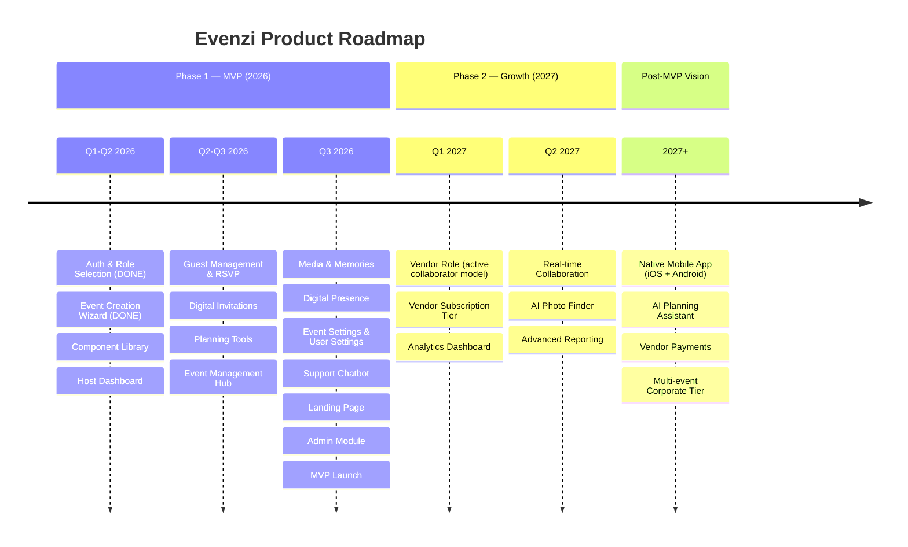

# Evenzi — Project Overview

**Last updated:** April 2026 | **Version:** 0.1 (MVP Phase 1 in progress)

---

## 1. What is Evenzi?

Evenzi is a wedding and event planning platform built for India — a single, beautifully designed workspace where event hosts can create their event, build their guest list, send digital invitations, track RSVPs, manage their budget, share photos, and publish a public event website. Instead of juggling spreadsheets, WhatsApp groups, and scattered notes, hosts get everything they need in one place, from the moment they say "we're getting married" to the last memory uploaded after the celebration.

We are building for a market that plans some of the world's most elaborate celebrations — and deserves tools that match that ambition.

### The Founder's Story

Abhijith built Evenzi from personal experience. He planned an event, felt the chaos of WhatsApp groups and spreadsheets at first hand, and built the solution he wished had existed. Evenzi is not a product designed at a distance — it comes from living the problem.

---

## 2. The Problem We Solve

Planning a wedding or major event in India is genuinely hard work. It involves hundreds of guests, multiple vendors, complex family dynamics, tight timelines, and budgets that can run into lakhs or crores. Yet the tools most hosts reach for are:

- **WhatsApp** — for invitations, RSVPs, and coordination (no structure, no tracking)
- **Excel / Google Sheets** — for guest lists and budgets (fragile, manual, not shareable)
- **Paper or verbal invitations** — beautiful, but slow and hard to track
- **Word of mouth** — for vendor discovery and coordination

The result is that the host — usually the family members most central to the occasion — ends up spending enormous mental energy on logistics that could be automated, tracked, and organized. Things fall through the cracks: guests who weren't invited by mistake, RSVPs that never came back, a budget that quietly overran, photos scattered across ten different phones.

There is no purpose-built, affordable, end-to-end event management product designed for the Indian market. International tools exist (Zola, The Knot) but they are built for Western wedding conventions, pricing, and workflows — they do not account for multi-day Indian weddings, joint-family decision making, WhatsApp as the primary communication channel, or the sheer scale of Indian guest lists (200–2000 attendees is normal).

**The gap:** A well-designed, India-first digital platform for event hosts.

---

## 3. Our Solution

Evenzi closes that gap. It is a subscription-based SaaS platform where a host logs in, creates an event, and immediately has access to:

- A guided event creation wizard that sets up the event in minutes
- A central dashboard showing the live status of everything
- A guest management system with RSVP tracking
- Digital invitation delivery via WhatsApp (and other channels)
- Budget and checklist planning tools
- A photo gallery for sharing memories before and after the event
- A public event website guests can visit for details
- A support chatbot for quick help
- A printed event photo book / event magazine, orderable after the celebration

Every module is designed to reduce cognitive load and replace manual coordination with structured, trackable workflows. Hosts spend less time chasing people and more time celebrating.

---

## 4. Who It's For

### Host (MVP Focus)
The person organising the event — typically the bride, groom, a parent, or a designated family member. They create the event, manage the guest list, send invitations, track RSVPs, manage budget, and control all platform settings. The entire MVP is built for this role.

**Example:** Priya is planning her wedding for November. She creates the event on Evenzi, adds 450 guests, sends WhatsApp invitations directly from the platform, watches RSVPs come in on her dashboard, tracks the catering budget in real time, and shares a public event website with guests who need venue directions. After the celebration, she orders a printed photo book of the event through Evenzi.

### Guest
Anyone invited to an event. Guests receive an invitation (via WhatsApp or link), visit a public RSVP page, confirm attendance and meal preferences, and can view event details. No account required for basic RSVP. The RSVP page is designed to be dead-simple: a maximum of 2 taps or clicks to submit.

### Vendor (Phase 2 — Active Collaborator Model)
Vendors on Evenzi are **not** a directory listing. They are active collaborators in event planning. In Phase 2, event management professionals will have their own Evenzi accounts with higher-capacity plans. A host invites a vendor to collaborate on a specific event. The vendor then manages logistics, proposes venue options, decoration palettes, and other arrangements. The budget module operates as a **quotation system** — the vendor sends quotes and the host approves them. Vendors can be followed by hosts who trust their work, creating a social layer that drives discovery. This is a Phase 2+ feature.

### Admin (Planned)
Internal Evenzi team members who monitor platform health, manage user accounts, review flagged content, and handle escalations. An Admin Module is planned for MVP but not yet started.

---

## 5. The Product — All 14 Modules

| # | Module | Description | Status |
|---|--------|-------------|--------|
| 1 | Auth & Role Selection | Phone OTP and Google OAuth login. Post-login role selection (Host / Guest). | **Complete** |
| 2 | Celebratory Curator (Event Wizard) | A 4-step guided wizard for creating a new event — name, type, date, venue, and cover details. | **Functionally Complete** |
| 3 | Host Dashboard | Central hub showing all active events, key stats (guest count, RSVP status, upcoming tasks), and quick actions. | **In Progress** (shell exists, needs real data) |
| 4 | Event Management Hub | Per-event navigation hub — the central screen from which a host accesses all features for a specific event. | **Planned** |
| 5 | Guest Management & RSVP | Add and manage guests, track RSVPs, segment guests by group, and view a public RSVP page for each event. | **Planned** |
| 6 | Digital Invitations | Send beautifully designed digital invitations to guests via WhatsApp, with delivery tracking. | **Planned** |
| 7 | Planning Tools | Two tools: a customisable event checklist and a budget tracker for managing expenses and vendor payments. | **Planned** |
| 8 | Media & Memories | A photo gallery where the host and guests can upload and share event photos, organised by event. | **Planned** |
| 9 | Digital Presence | A public event website generated from a template — guests can view event details, schedule, venue map, and RSVP. | **Planned** |
| 10 | Event Settings | Per-event configuration — visibility, RSVP cutoff date, custom fields, notification preferences. | **Planned** |
| 11 | User Settings | Account and profile management — name, profile photo, contact details, notification preferences, linked accounts. | **Planned** |
| 12 | Support Chatbot | In-app chatbot for FAQ self-service, account help, and escalation to human support. Spec is complete; awaiting Figma design. | **Planned** |
| 13 | Landing / Marketing Site | The public-facing acquisition website — what visitors see before they sign up. Messaging, pricing, social proof. | **Planned** |
| 14 | Admin Module | Internal developer/admin panel for monitoring platform health, managing users, and reviewing flagged content. | **Planned** |

### Post-Event Value

The celebration doesn't have to end when the event does. After the event:

- The **public event website stays live** for a period based on the host's subscription plan
- Hosts can order an **Event Magazine / Photo Book** — a printed keepsake of the celebration, fulfilled through a third-party print partner (fulfilment method TBD). This is a physical memento: curated photos, event details, memories — delivered to the door.
- **Anniversary reminders** are planned — Evenzi remembers the date so you don't have to

---

## 6. Business Model

Evenzi will operate on a **subscription model with a free tier**, designed to let hosts try the platform before committing. The positioning is intentional: **luxury feel, free to start.** For wealthy hosts, Evenzi is a premium showcase — not a cost concern. For everyone else, the free tier removes the barrier entirely. The same quality experience is available across all price points; paid tiers unlock capacity and features, not quality.

### Why subscription?

Event planning is a high-intent, time-bound activity. A host planning a wedding will spend 6–18 months preparing. A subscription model captures that recurring value and creates predictable revenue for Evenzi. Unlike one-time purchase or per-event pricing, a subscription encourages hosts to keep using the platform for every event they plan — birthdays, anniversaries, corporate events — not just their wedding.

### Planned structure

| Tier | Description |
|------|-------------|
| **Free** | Limited access — enough to create one event and experience the product. Time-limited event website and photo storage. Designed to convert to paid. |
| **Paid Tiers** | Expanded guest limits, premium invitation templates, longer data retention, priority support, and advanced features. Tiered pricing TBD. |
| **Feature Add-ons** | Optional paid features on top of any subscription tier — e.g., custom event domain, premium photo storage, WhatsApp broadcast credits. |

### Freemium Conversion Triggers

The free-to-paid conversion is driven by four walls (specific numbers TBD):

- **Storage limit** — photo storage is capped on the free tier
- **Feature gates** — certain features are paid-only
- **Data retention** — event website and photos expire after a defined period on the free tier; paid plans extend this
- **Event count** — free tier supports a limited number of events

### Revenue Streams

| Stream | Model |
|--------|-------|
| Subscription (Host) | Monthly / annual recurring revenue |
| Vendor subscriptions (Phase 2) | Separate higher-capacity plans for event management professionals |
| Event Magazine / Photo Book | Transaction revenue per order — print fulfilled by third-party partner |
| Feature add-ons | One-time or recurring optional paid features |
| Post-MVP: Vendor marketplace | Commission or listing fee for bookings (under evaluation) |

**Note:** Specific pricing, tier names, and feature split between tiers are not yet finalised. This will be determined based on user research and competitive analysis before the MVP goes live.

---

## 7. Why Evenzi Will Win — The Moats

### 1. Network Effects
Every event creates a growth loop. Guests become hosts. Hosts invite vendors. Vendors bring their own client networks. The platform becomes more valuable as more people use it.

### 2. Vendor Relationships
When the Phase 2 vendor model launches, Evenzi will build an exclusive or preferred vendor network. Hosts follow vendors they trust. A vendor's reputation on the platform becomes a competitive asset — driving both vendor retention and host acquisition.

### 3. Brand
Evenzi is building to become the trusted name for Indian celebrations. Brand is a moat: once a platform is associated with the most important day of someone's life, it is very hard to displace.

### 4. WhatsApp Integration Depth
Deep WhatsApp-native flows — invitation sending, RSVP collection, reminders — are technically non-trivial and require Indian user trust. Replicating the integration depth takes time. We are building this now, at the start of the market.

---

## 8. Where We Are Today

**April 2026 — MVP Phase 1 actively in progress.**

### What's built
- Full authentication system: Phone OTP (India, +91) and Google OAuth, with session management and route protection
- Event Creation Wizard (Celebratory Curator): 4-step guided flow, 65 tests passing
- Host Dashboard shell: page exists, needs to connect to live data
- Support Chatbot: full spec complete, awaiting Figma design
- ClickUp workspace fully configured for sprint planning

### What's next (Sprint 1 active)
- Complete the Reusable Component Library (foundational UI components all modules will share)
- Fix the Vercel deployment error (pre-existing, P0 blocker)
- Implement Host Dashboard with live Supabase data

### After that (Sprint backlog)
Event Management Hub → Guest Management → Digital Invitations → Planning Tools → Media & Memories → Digital Presence → Event Settings → User Settings → Support Chatbot → Landing Page → Admin Module

Full MVP target: ~267 subtasks across 11 features remaining.

---

## 9. Technology

Evenzi is built on a modern, proven stack chosen for speed of development, reliability at scale, and low operational overhead for a small team.

| Layer | Choice | Why |
|-------|--------|-----|
| **Frontend** | Next.js 14 (React) | Industry-standard, excellent performance, built-in routing and server components |
| **Styling** | Tailwind CSS | Fast, consistent UI development without writing custom CSS |
| **Database** | Supabase (PostgreSQL) | Managed Postgres with built-in auth, real-time, and file storage — eliminates entire backend infrastructure |
| **Auth** | Supabase Auth | Handles Phone OTP and Google OAuth out of the box, with session management |
| **Deployment** | Vercel | Automatic preview deployments, global CDN, zero-config Next.js hosting |
| **Language** | TypeScript | Type-safe code catches bugs before they reach production |

### Platform Delivery

Evenzi is a **Progressive Web App (PWA)** — installable on any Android or iOS device directly from the browser, with no App Store required. This removes the friction of an app download for new users and gives hosts a home-screen experience without the distribution overhead of native app stores.

A native mobile app (iOS + Android) is planned for Phase 2.

This stack means a two-person team can build, test, and deploy features quickly without managing servers, databases, or authentication infrastructure from scratch. It scales from 10 users to 100,000 users without architectural changes.

---

## 10. The Market

India's wedding industry represents **₹4 lakh crore in annual spend** — one of the largest celebration economies in the world. That number covers everything: venues, food, jewellery, clothing, photography, decoration. The addressable market for a digital planning SaaS is a fraction of that total spend, but even a small slice of the planning and coordination layer represents a massive opportunity. With approximately 10 million weddings per year and a growing middle class comfortable with software subscriptions, the timing is right.

The opportunity is not just weddings — birthdays, anniversaries, corporate events, engagement parties. Evenzi's platform applies to any large celebration, extending the addressable market further.

**Competitors** address adjacent problems: WedMeGood and WeddingWire India focus on vendor discovery and booking, not the host's end-to-end workflow. No one owns the planning and coordination layer for Indian hosts. That is the gap Evenzi fills.

---

## 11. The Roadmap

### Milestone summary

| Phase | Target | Key Deliverable |
|-------|--------|-----------------|
| Phase 1 — MVP | Q3 2026 | Full host-side event flow live, public launch |
| Phase 2 — Growth | Q1–Q2 2027 | Vendor active-collaborator model, analytics, real-time features |
| Post-MVP Vision | 2027+ | Native mobile app, AI assistant, corporate tier |

---

## 12. Why Now

Several converging trends make April 2026 the right moment to build Evenzi:

**1. India's digital infrastructure has matured.**
UPI, WhatsApp, and Aadhaar-backed digital identity mean that even tier-2 and tier-3 city users are comfortable with digital payments and mobile-first products. The infrastructure that makes Evenzi work — smartphone penetration, cheap data, digital payments — is now ubiquitous.

**2. The Indian wedding market is enormous and underserved.**
India's wedding industry represents ₹4 lakh crore in annual spend. Despite this scale, there is no dominant digital platform for event management. WedMeGood and other players address vendor discovery, but no one owns the host's end-to-end workflow.

**3. Post-COVID, digital-first event management is normalised.**
The pandemic normalised QR-code invitations, digital RSVPs, and virtual event participation. Hosts are now receptive to digital tools in ways they weren't in 2019.

**4. AI-assisted development makes a small team viable.**
Claude Code and modern AI tooling allow Abhijith and Dheeraj to build at a pace previously requiring 5–10 engineers. The product can move fast without burning capital on a large engineering team.

**5. Subscription SaaS in India has crossed the monetisation barrier.**
Indian consumers and businesses are now comfortable paying for software subscriptions — Notion, Canva, Figma, and Zoho have proven the model. Evenzi enters a market that is ready to pay for value.

---

## 13. Key Documents

| Document | Description | Path |
|----------|-------------|------|
| Project Overview (this doc) | What Evenzi is, where it stands, where it's going | `docs/foundation/project-overview.md` |
| Business Requirements Document | Formal BRD: objectives, scope, functional requirements, KPIs | `docs/foundation/brd.md` |
| Brand Guidelines | Visual identity, typography, colour palette, tone of voice | `docs/BRAND-GUIDELINES.md` |
| Onboarding Guide | Developer onboarding: environment setup, codebase tour | `docs/ONBOARDING.md` |
| ClickUp Templates | Task templates for sprint planning | `docs/clickup/TEMPLATES.md` |
| Support Chatbot Feature Spec | Full spec for the Support Chatbot module | `docs/features/chatbot/` |
| Agent & Pipeline Reference | AI agent knowledge base and pipeline definitions | `ai/agents/`, `ai/pipelines/` |
| CLAUDE.md | Claude Code project guide — coding conventions, architecture | `CLAUDE.md` |

---

*Evenzi is being built by Abhijith (Founder/Product Owner) and Dheeraj (Lead Engineer), with AI development assistance from Claude Code. All decisions about product direction, architecture, and priorities are made by Abhijith.*
