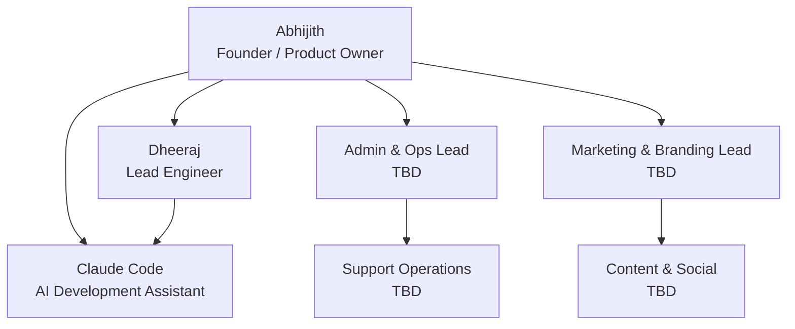
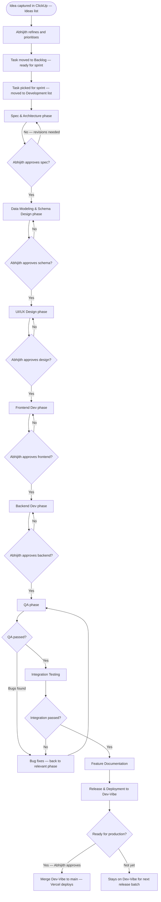

# F6 — Team Structure & Roles

**Document:** F6  
**Version:** 1.0  
**Date:** April 2026  
**Status:** Active  

---

## 1. Overview

Evenzi is a self-funded startup in MVP Phase 1 (April 2026). The core team is lean by design: a Founder/Product Owner, a Lead Engineer, and an AI Development Assistant. Two functional teams — Admin & Ops and Marketing & Branding — are planned but not yet staffed.

**Team size:** 3 active (2 humans + 1 AI), 2 teams TBD.

**How we work:**
- Asynchronous-first. Work is tracked in ClickUp. Decisions are documented.
- All feature work goes through an approval-gated workflow: Spec → Plan → Build → Review → QA → Deploy.
- Abhijith approves every phase before work advances. No feature ships without sign-off.
- Claude Code accelerates implementation but does not make product or architecture decisions unilaterally.

---

## 2. Org Chart



**Reporting structure:** All roles report to Abhijith. Claude Code supports Dheeraj on engineering execution and reports to both Abhijith (for scope) and Dheeraj (for technical direction).

---

## 3. Role Profiles

### 3.1 Founder / Product Owner

| Field | Detail |
|-------|--------|
| **Role** | Founder / Product Owner |
| **Person** | Abhijith |
| **Status** | Active |

**What they own:**
- Product vision, roadmap, and prioritisation
- Feature specs and acceptance criteria
- All approval gates — nothing advances without sign-off
- Business decisions: pricing, partnerships, go-to-market
- ClickUp workspace: Product space (top-level oversight)

**Day-to-day responsibilities:**
- Review and approve specs, plans, and completed work at each phase gate
- Write or review ClickUp task descriptions and acceptance criteria
- Conduct final QA sign-off before deployment
- Coordinate between engineering, ops, and marketing as teams grow
- Communicate with early users and gather feedback

**Tools:**
- ClickUp (task management, approval gates)
- Google Stitch (design reference)
- Figma (detailed design — where available)
- GitHub (code review — high-level)
- Vercel (deployment monitoring)

**Works most closely with:** Dheeraj (daily engineering alignment), Claude Code (feature spec and review sessions)

---

### 3.2 Lead Engineer

| Field | Detail |
|-------|--------|
| **Role** | Lead Engineer |
| **Person** | Dheeraj |
| **Status** | Active |

**What they own:**
- End-to-end engineering: frontend, backend, database, DevOps
- Technical architecture decisions
- Code quality, performance, and security standards
- Supabase schema design and migrations
- Vercel deployment pipeline
- Test coverage (Vitest)

**Day-to-day responsibilities:**
- Implement features from approved plans using Next.js 14 (App Router), TypeScript, Tailwind CSS, Supabase
- Direct Claude Code on implementation tasks — parallelise where possible
- Review all Claude Code output before it is committed
- Write and run tests (`npm run test:run`)
- Manage branches: feature branches off `Dev-Vibe`, merge back to `Dev-Vibe`, `main` for production
- Run `npm run sys-check` at session start to validate environment
- Escalate any decisions that affect scope or product direction to Abhijith

**Tools:**
- GitHub / Git (version control, worktrees for parallel work)
- ClickUp (task status updates)
- Supabase dashboard (DB management)
- Vercel dashboard (deployment, logs)
- VS Code / Cursor (IDE)
- Claude Code (AI pair programming)

**Works most closely with:** Claude Code (daily), Abhijith (spec and approval gates)

---

### 3.3 AI Development Assistant

| Field | Detail |
|-------|--------|
| **Role** | AI Development Assistant |
| **Person** | Claude Code (Anthropic) |
| **Status** | Active |

**What they own:**
- Implementation acceleration within approved plans
- Code generation, refactoring, and debugging support
- Knowledge base maintenance (`ai/agents/`, `ai/pipelines/`)
- Foundation documentation authoring
- Parallel subagent execution for independent tasks

**Day-to-day responsibilities:**
- Read approved specs and plans before writing any code
- Follow the superpowers workflow: brainstorm → write-plan → subagent-driven-development → code-review
- Parallelise independent tasks using the `dispatching-parallel-agents` skill
- Surface blockers and ambiguities to Dheeraj or Abhijith before proceeding
- Maintain `CLAUDE.md` and session memory files
- Run end-of-session workflow: update docs, commit, push to `Dev-Vibe`, clear worktree

**Tools:**
- All tools available in the Claude Code CLI
- ClickUp MCP (task read/write)
- Supabase MCP (schema, migrations)
- GitHub (git operations via bash)
- Vitest (test execution)

**Constraints:**
- Does not make unilateral product or architecture decisions
- Does not push to `main` branch directly
- Does not approve its own work — all output is reviewed by Dheeraj or Abhijith
- Does not commit changes mid-session; all git work deferred to end-of-session workflow

**Works most closely with:** Dheeraj (technical direction), Abhijith (scope and approval)

---

### 3.4 Admin & Ops Lead (TBD)

| Field | Detail |
|-------|--------|
| **Role** | Admin & Ops Lead |
| **Person** | TBD |
| **Status** | Planned — not yet hired |

**What they will own:**
- Platform operations: user support, onboarding, account issues
- FAQ knowledge base — content creation, maintenance, publication
- Support ticket triage and resolution
- Internal operations: policies, SOPs, vendor relationships
- ClickUp space: Admin & Ops

**Day-to-day responsibilities (when hired):**
- Monitor support tickets escalated from the chatbot
- Respond to user queries by email within SLA
- Add and update FAQ articles in the Evenzi admin console (`/admin/faq`)
- Maintain internal SOPs in ClickUp (Admin & Ops space)
- Report platform issues to Dheeraj
- Assist Abhijith with operational decisions

**Tools (planned):**
- Evenzi Admin Console (`/admin/*`)
- ClickUp (Admin & Ops space)
- Email (support@evenzii.com)
- Resend (for outbound support emails)

**Works most closely with:** Abhijith (direction), Dheeraj (platform issue escalation), future support team members

---

### 3.5 Marketing & Branding Lead (TBD)

| Field | Detail |
|-------|--------|
| **Role** | Marketing & Branding Lead |
| **Person** | TBD |
| **Status** | Planned — not yet hired |

**What they will own:**
- Brand identity: visual guidelines, tone of voice, naming
- Marketing website content and landing page copy
- Social media presence and content calendar
- User acquisition strategy and campaigns
- ClickUp space: Marketing & Branding

**Day-to-day responsibilities (when hired):**
- Develop and maintain brand guidelines
- Write and publish landing page copy and blog content
- Plan and execute social media campaigns (Instagram, WhatsApp, LinkedIn)
- Manage user acquisition funnels and track conversion
- Collaborate with Dheeraj on landing page implementation
- Report marketing performance to Abhijith

**Tools (planned):**
- ClickUp (Marketing & Branding space)
- Google Stitch / Figma (design reference)
- Analytics (TBD — Google Analytics or Plausible)
- Social media management tools (TBD)

**Works most closely with:** Abhijith (strategy), Dheeraj (landing page implementation)

---

## 4. ClickUp Space Ownership

| Space | Owner | What Lives There | Who Uses It |
|-------|-------|-----------------|-------------|
| **Product** | Abhijith | Feature tasks, bug reports, sprint planning, engineering backlog. Sub-lists: Frontend, Backend, Database, DevOps, Design, QA & Bugs, Architecture & Configuration, Documentation, Ideas, Backlog. | Abhijith, Dheeraj, Claude Code |
| **Admin & Ops** | Admin & Ops Lead (TBD) | Support SOPs, ticket templates, FAQ drafts, onboarding playbooks, operational policies | Admin & Ops Lead, Abhijith |
| **Marketing & Branding** | Marketing & Branding Lead (TBD) | Brand guidelines, content calendar, campaign tasks, launch plan, acquisition experiments | Marketing & Branding Lead, Abhijith |

**Task tags in use (Product space):**

`mvp-phase-1`, `feature`, `component`, `phase:spec`, `phase:data-model`, `phase:ui-ux`, `phase:frontend`, `phase:backend`, `phase:qa`, `phase:integration`, `phase:docs`, `phase:release`, `approval-gate`, `claude-code`

---

## 5. Development Workflow

How a feature moves from idea to production:



**Branching rules:**
- All feature work starts from `Dev-Vibe`
- Feature branches: `feature/<name>` or Claude Code worktrees `claude/<name>`
- Merges to `Dev-Vibe` after QA
- `main` is Vercel-production only — merges from `Dev-Vibe` when ready to ship
- `Dev-Runner` and `Dev-AMC` are parked branches — do not merge without explicit decision

---

## 6. Communication & Collaboration

### Decision-Making

| Decision Type | Who Decides | Process |
|--------------|-------------|---------|
| Product features and prioritisation | Abhijith | Sole decision-maker |
| Architecture and tech choices | Dheeraj | With Abhijith's awareness |
| Implementation approach within a plan | Dheeraj + Claude Code | Engineering call |
| Scope changes mid-feature | Abhijith | Must be consulted — no silent scope creep |
| Deployment to production | Abhijith | Final sign-off required |

### Approval Gates

Every feature phase requires Abhijith's explicit approval before the next phase begins. This is non-negotiable in MVP Phase 1.

**Phases requiring approval:**
1. Spec & Architecture
2. Data Modeling & Schema Design
3. UI/UX Design
4. Frontend Dev complete
5. Backend Dev complete
6. QA passed
7. Integration Testing passed
8. Documentation complete
9. Production deployment

**How approval is given:** Abhijith comments on the ClickUp task or verbally confirms in the Claude Code session. Claude Code or Dheeraj records the approval in the task before proceeding.

### Engineering and Product Alignment

- **Session start:** Dheeraj or Claude Code runs `npm run sys-check` and pulls current ClickUp task status at the start of each work session.
- **Session end:** Claude Code updates ClickUp task statuses, commits all work, pushes to `Dev-Vibe`, and writes a session report.
- **Blockers:** Any blocker (missing spec, ambiguous requirement, failing test) is surfaced immediately in ClickUp as a comment — not silently worked around.
- **No surprises rule:** If scope needs to change, Claude Code or Dheeraj flags it to Abhijith before proceeding. Unilateral scope expansion is not permitted.

---

## 7. RACI Matrix

**Key:** R = Responsible (does the work), A = Accountable (final sign-off), C = Consulted (input sought), I = Informed (kept in the loop)

| Activity | Abhijith | Dheeraj | Claude Code | Admin & Ops | Marketing & Branding |
|----------|----------|---------|-------------|-------------|----------------------|
| Feature spec writing | A | C | R | — | — |
| Data modeling & schema design | A | R/A | R | — | — |
| UI/UX design | A | C | C | — | — |
| Frontend development | A | R/A | R | — | — |
| Backend development | A | R/A | R | — | — |
| Code review | A | R | C | — | — |
| QA & testing | A | R | R | — | — |
| Production deployment | A/R | R | I | — | — |
| FAQ content management | I | — | — | R/A | — |
| Support ticket response | I | I | — | R/A | — |
| Marketing content | A | I | — | — | R |
| Brand guidelines | A | I | — | — | R/A |
| ClickUp task management | A | R | R | R (ops space) | R (mktg space) |
| Documentation | A | C | R | — | — |

**Notes:**
- Admin & Ops and Marketing & Branding are TBD and have limited RACI entries until hired.
- Claude Code is always Responsible on tasks it executes, but Dheeraj or Abhijith is Accountable.
- "—" means not involved in this activity during MVP Phase 1.

---

## 8. Onboarding Checklist

This checklist applies to any new team member joining Evenzi. Complete all steps before beginning work.

### Step 1: Read the Foundation Documents

| Document | Path | What it covers |
|----------|------|---------------|
| CLAUDE.md | `/CLAUDE.md` | Project overview, tech stack, commands, architecture, conventions |
| Project Overview | `docs/PROJECT.md` | High-level product and business context |
| Onboarding Guide | `docs/ONBOARDING.md` | Developer setup, first steps |
| User Flows | `docs/foundation/user-flows.md` | All major user journeys and Mermaid diagrams |
| Team Structure | `docs/foundation/team-structure.md` | This document — roles, RACI, workflow |
| Brand Guidelines | `docs/BRAND-GUIDELINES.md` | Visual identity, tone of voice |

### Step 2: Get Access

Request access to the following tools from Abhijith:

| Tool | Purpose | Access type |
|------|---------|------------|
| **GitHub** | Source code | Collaborator on repo |
| **Supabase** | Database, auth | Project member (project ID: `smjkbmkxweevqpvygabe`) |
| **ClickUp** | Task management | Workspace member |
| **Vercel** | Deployment | Team member |
| **Google Stitch** | Design reference | View access (project ID: `3859360114226566614`) |
| **Figma** | Detailed design | View access (where files exist) |

### Step 3: Set Up Local Development

```bash
# Clone the repo
git clone <repo-url>
cd Evenzi

# Checkout Dev-Vibe (working main)
git checkout Dev-Vibe

# Install dependencies
npm install

# Set up environment variables
cp .env.example .env.local
# Fill in values from Abhijith / Supabase / ClickUp dashboards

# Validate environment
npm run sys-check

# Start development server
npm run dev
```

### Step 4: Review the Agent Knowledge Base

The `ai/agents/` directory contains enriched agent definitions used by Claude Code. These are also useful reading for understanding how the team approaches different disciplines:

| Agent file | What it covers |
|-----------|---------------|
| `frontend_engineer.md` | UI/UX principles, design patterns, anti-patterns |
| `backend_engineer.md` | API design, Supabase patterns |
| `security_expert.md` | Security vulnerabilities, Next.js security |
| `code_reviewer.md` | Code review standards, confidence scoring |
| `test_engineer.md` | All forms of testing — planning (AC → test cases), execution (unit/component/integration/E2E/a11y/perf), maintenance (triage + backfill); sad-path catalogue |
| `tech_lead.md` | Architecture decisions, trade-offs |

### Step 5: First Task

1. Pull latest ClickUp task list for your role's space
2. Ask Abhijith which task to pick up first
3. Run `npm run sys-check` before starting
4. Follow the development workflow in Section 5 above
5. Do not advance past any phase without Abhijith's approval
