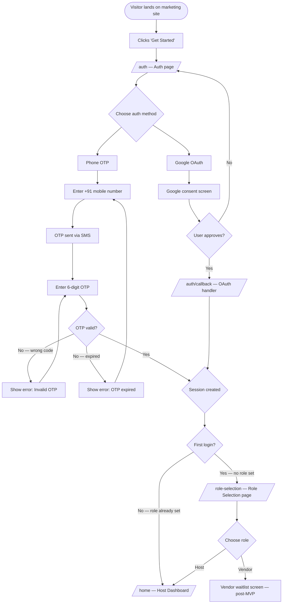
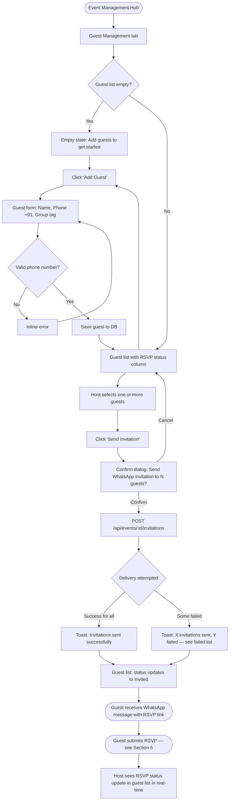
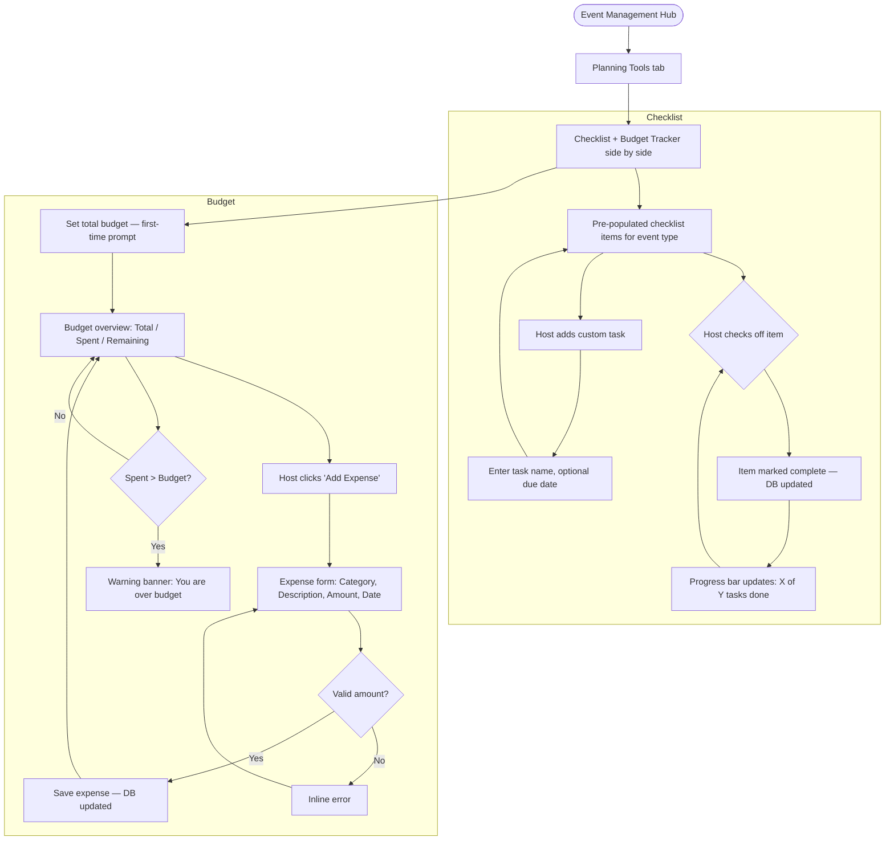
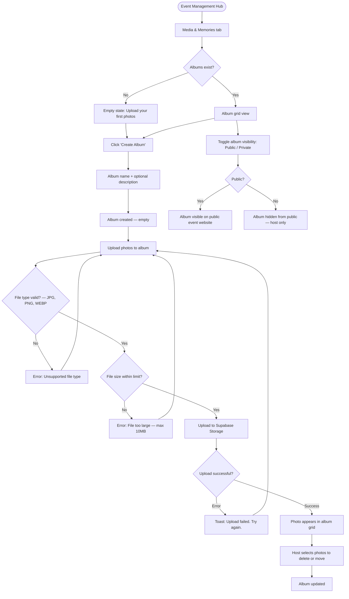
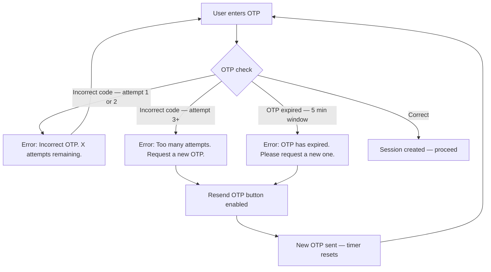
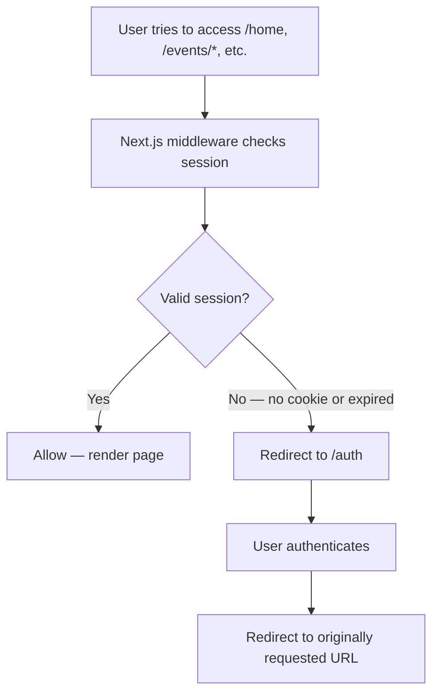
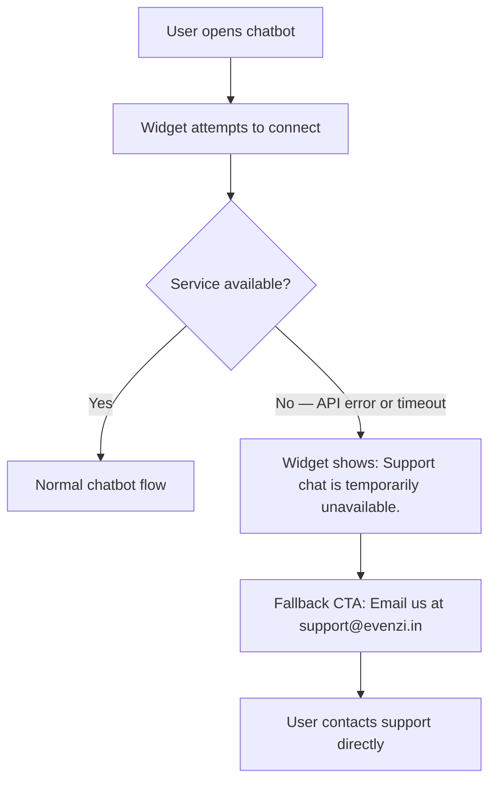
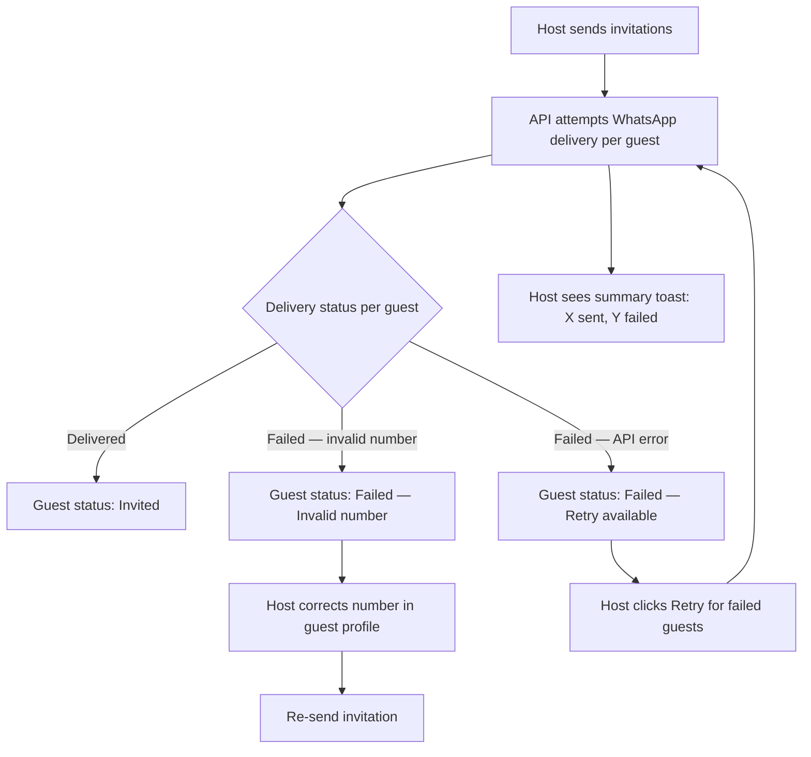
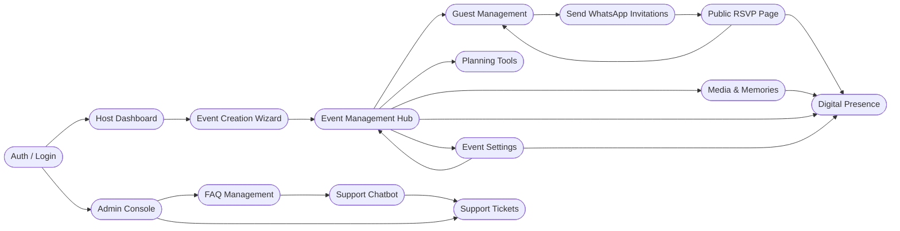

# F5 — User Flows

**Document:** F5  
**Version:** 1.0  
**Date:** April 2026  
**Status:** Active  

---

## 1. Overview

This document maps every major user journey through the Evenzi platform. It covers the Host, Guest, and Admin roles as they exist in MVP Phase 1.

**How to use this document:**

- Each section describes a flow in plain language, then illustrates it with a Mermaid flowchart.
- Flows show the happy path (primary success scenario) and key error/alternative branches.
- Engineers use these flows to determine which pages, API routes, and state transitions are required.
- Product and QA use them as the basis for acceptance criteria and test cases.

**Roles covered:**

| Role | Who | Account Required |
|------|-----|-----------------|
| Host | Event planner (wedding couple, family organizer, corporate coordinator) | Yes — Phone OTP or Google OAuth |
| Guest | Invited attendee | No — public RSVP page only |
| Admin | Evenzi team member | Yes — admin-scoped login |

**Out of scope (post-MVP):** Vendor role, real-time notifications, event discovery, analytics dashboard.

---

## 2. New Visitor & Sign-Up Flow

### Description

A new visitor lands on the Evenzi marketing site, decides to get started, and completes authentication. On first login they are directed to Role Selection. On subsequent logins they go straight to the Host Dashboard.

**Auth methods supported:**
- **Phone OTP** — Enter mobile number (+91), receive SMS OTP, verify. Session created.
- **Google OAuth** — Click "Continue with Google", complete Google consent, callback handled, session created.

**First-time vs. returning:**
- First login: no `user_role` in profile → redirect to `/role-selection`
- Returning login: role already set → redirect to `/home` (Host Dashboard)

### Flowchart



---

## 3. Host: Event Creation Flow (Celebratory Curator)

### Description

After reaching the Host Dashboard, a host creates a new event through the Celebratory Curator — a 4-step wizard. The wizard collects event type, basic details, sub-events, then presents a review screen before saving. On success the host lands on the Event Management Hub for their new event.

**Wizard steps:**

| Step | Name | Key fields |
|------|------|-----------|
| 1 | Event Type | Select from: Wedding, Birthday, Corporate, Engagement, Anniversary, Other |
| 2 | Basic Details | Event name, date, venue name, venue address, description, cover image (upload) |
| 3 | Sub-Events | For weddings: Mehendi, Sangeet, Ceremony, Reception. Each sub-event has name, date/time, venue. Host can add/remove. |
| 4 | Review & Confirm | Read-only summary. Host can navigate back to any step. |

**Validation:** Each step validates required fields before allowing progression. Errors display inline.

### Flowchart

```mermaid
flowchart TD
    A([Host Dashboard]) --> B{Events exist?}
    B -->|Yes| B1[See event cards]
    B -->|No| B2[Empty state with 'Create your first event' CTA]
    B1 --> C[Click 'Create Event']
    B2 --> C

    C --> D[/events/new — Step 1: Event Type/]
    D --> D1{Event type selected?}
    D1 -->|No| D2[Inline error: Please select event type]
    D2 --> D
    D1 -->|Yes| E[Step 2: Basic Details]

    E --> E1{Required fields complete?}
    E1 -->|No| E2[Inline field errors]
    E2 --> E
    E1 -->|Yes| F[Step 3: Sub-Events]

    F --> F1[Pre-populated sub-events based on event type]
    F1 --> F2{Host adds / removes sub-events}
    F2 --> F3{At least one sub-event?}
    F3 -->|No, warning shown| F3
    F3 -->|Yes| G[Step 4: Review & Confirm]

    G --> G1{Host satisfied?}
    G1 -->|Edit Step 1| D
    G1 -->|Edit Step 2| E
    G1 -->|Edit Step 3| F
    G1 -->|Confirm| H[POST /api/events — Save event]

    H --> H1{Save successful?}
    H1 -->|Error| H2[Toast: Failed to save. Please try again.]
    H2 --> G
    H1 -->|Success| I[Success screen — Event created!]
    I --> J[/events/:id — Event Management Hub]
```

---

## 4. Host: Guest Management & Invitation Flow

### Description

From the Event Management Hub, the host manages their guest list and sends WhatsApp invitations. Guests do not need an Evenzi account — they receive a link and RSVP via a public page.

**Key actions:**
- Add individual guest (name, phone number, relationship/group tag)
- Import guests in bulk (CSV — post-MVP)
- Select guests and send WhatsApp invitation with unique RSVP link
- View RSVP status per guest (Pending / Yes / No / Maybe)

### Flowchart



---

## 5. Guest: RSVP Flow

### Description

The guest receives a WhatsApp message containing a personalised RSVP link. They tap the link, see the event details and RSVP form, and submit their response. No login or account creation is required. After submitting, they land on a confirmation screen and can navigate to the event's public website.

### Flowchart

```mermaid
flowchart TD
    A([Guest receives WhatsApp message]) --> B[Tap RSVP link]
    B --> C{Link valid?}
    C -->|No — expired or invalid token| D[Error page: This link is no longer valid]
    C -->|Yes| E[/rsvp/:token — Public RSVP page]

    E --> F[See event details: name, date, venue, sub-events]
    F --> G[RSVP form: Yes / No / Maybe + optional message]
    G --> H{Guest submits}
    H -->|No selection| I[Inline error: Please select a response]
    I --> G
    H -->|Selected| J[POST /api/rsvp/:token]

    J --> J1{Submission successful?}
    J1 -->|Error| J2[Toast: Something went wrong. Please try again.]
    J2 --> G
    J1 -->|Success| K[Confirmation screen: Thank you for your response!]

    K --> L[CTA: View Event Website]
    L --> M[/events/:id/website — Public event website]
    M --> N[Guest can view event details, photo gallery if published]

    K --> O[Guest returns to RSVP link later]
    O --> E
    E --> P{Already RSVP'd?}
    P -->|Yes| Q[Show existing response with option to change]
    Q --> G
    P -->|No| G
```

---

## 6. Host: Planning Tools Flow

### Description

The Planning Tools section provides two instruments: a task checklist and a budget tracker. The checklist is pre-populated with items relevant to the event type (e.g., a wedding checklist includes venue booking, catering, photography). The budget tracker lets the host log expenses and see a running total against a set budget.

### Flowchart



---

## 7. Host: Media & Memories Flow

### Description

The Media & Memories section lets the host upload photos, organize them into albums, and share them via the public event website. In MVP Phase 1, albums are created manually and the gallery is visible to anyone with the event website link.

### Flowchart



---

## 8. Host: View & Manage Event Flow

### Description

After events exist, the Host Dashboard shows event cards. Clicking any card opens the Event Management Hub — the central navigation for all event-level features. From there the host can reach every sub-feature.

### Flowchart

```mermaid
flowchart TD
    A([Login]) --> B[/home — Host Dashboard/]
    B --> C{Events exist?}
    C -->|No| D[Empty state + Create Event CTA]
    C -->|Yes| E[Event cards: name, date, RSVP summary]

    E --> F[Click event card]
    F --> G[/events/:id — Event Management Hub]

    G --> H{Select section}
    H -->|Guests| I[Guest Management]
    H -->|Planning| J[Planning Tools]
    H -->|Media| K[Media & Memories]
    H -->|Website| L[Digital Presence / Event Website Preview]
    H -->|Settings| M[Event Settings]

    M --> M1{Edit what?}
    M1 -->|Event details| M2[Edit name, date, venue, description]
    M1 -->|Template| M3[Change website template]
    M1 -->|Visibility| M4[Public / Private toggle]
    M1 -->|Delete event| M5[Confirm deletion dialog]
    M5 -->|Confirm| M6[Event deleted — back to Dashboard]
    M5 -->|Cancel| M

    G --> N[User Settings — top nav]
    N --> N1[Profile: name, email, phone]
    N --> N2[Notification preferences]
    N --> N3[Account: change password, logout]
```

---

## 9. Admin: FAQ & Support Flow

### Description

The Admin role manages the FAQ knowledge base that powers the support chatbot, and reviews escalated support tickets. The chatbot is a separate surface (planned, Figma-blocked for frontend) but the admin backend flows are documented here for completeness.

**Admin login:** Admin users authenticate via the standard auth flow but are routed to `/admin/*` based on their role.

### Flowchart

```mermaid
flowchart TD
    subgraph User-Facing Chatbot
        A([Host on any page]) --> B[Opens Support Chatbot widget]
        B --> C[Types question]
        C --> D[Chatbot searches FAQ knowledge base]
        D --> E{FAQ match found?}
        E -->|Yes — high confidence| F[Bot returns answer]
        E -->|No / low confidence| G[Bot says: I couldn't find an answer. Connect you to support?]
        G --> H{User wants escalation?}
        H -->|No| B
        H -->|Yes| I[Escalation: create support ticket in DB]
        I --> J[User sees: Ticket submitted. Team will respond by email.]
    end

    subgraph Admin Support Console
        I --> K[Admin dashboard: /admin/support/tickets]
        K --> L[Admin reviews escalated conversation]
        L --> M{Resolution?}
        M -->|Respond by email| N[Admin sends email reply to user]
        M -->|Add to FAQ| O[Admin creates or updates FAQ article]
        O --> P[/admin/faq — FAQ Management]
        M -->|Close ticket| Q[Ticket marked resolved]
    end

    subgraph Admin FAQ Management
        P --> R{Action}
        R -->|Create| S[New article: title, body, category, status draft/published]
        R -->|Edit| T[Edit existing article]
        R -->|Publish/Unpublish| U[Toggle article status]
        R -->|Delete| V[Confirm delete dialog]
        S --> W[Save — article in FAQ KB]
        T --> W
        W --> D
    end
```

---

## 10. Error & Edge Case Flows

### 10.1 OTP Failure



### 10.2 Unauthenticated Route Access



### 10.3 AI Chatbot Unavailable



### 10.4 WhatsApp Delivery Failure



---

## 11. Cross-Feature Interaction Map

This diagram shows how the major features connect to each other and share data.



**Key data flows:**

| Source | Data | Consumer |
|--------|------|----------|
| Event Creation | Event record, sub-events | Event Management Hub, all sub-features |
| Guest Management | Guest list, phone numbers | WhatsApp Invitation sender |
| RSVP Page | RSVP responses | Guest Management RSVP stats |
| Media & Memories | Published album photos | Public Event Website |
| Event Settings | Visibility, template choice | Public Event Website |
| FAQ Management | FAQ articles | Support Chatbot knowledge base |
| Support Chatbot | Escalated transcripts | Support Tickets queue |
