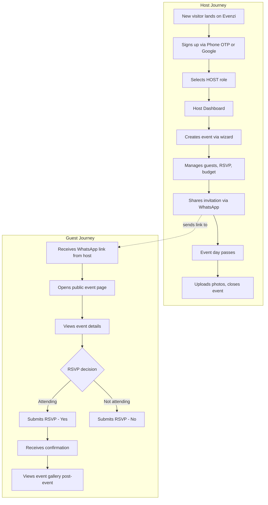
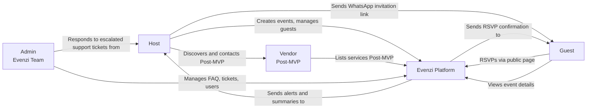

# F4 — Evenzi User Types & Scope

**Document type:** Foundation Reference
**Version:** 1.0
**Date:** April 2026
**Audience:** Core team, product, engineering

---

## 1. Overview

Evenzi is built around four distinct user types. Each has a different relationship with the platform, different capabilities, and different authentication requirements.

| User Type | Role | Auth Required | MVP Status |
|-----------|------|--------------|------------|
| **Host** | Creates and manages events | Yes (Phone OTP or Google OAuth) | Active — primary user |
| **Guest** | Views event details, submits RSVP | No | Active — public pages only |
| **Vendor** | Offers services to hosts | Yes (separate vendor auth) | Deferred to Phase 2 |
| **Admin** | Operates and monitors the platform | Yes (internal access) | Basic — Evenzi team only |

### Why These Four

- **Host** is the product's paying customer and primary design target. Every MVP feature is built for the host.
- **Guest** participates passively. They receive an invitation, RSVP, and view event details — no account required. Reducing friction for guests is critical because hosts are judged by how easy it is for their guests.
- **Vendor** represents the marketplace half of the platform. Deferred until hosts are well-served because a marketplace without buyers (established host base) has no value.
- **Admin** is the Evenzi team itself. The admin role exists to manage platform health, FAQ content, and support escalations — not to be an end-user product.

---

## 2. Host (Primary User)

### Who They Are

The host is the person responsible for planning and running an event. In the Indian context, this is typically:

- **Wedding:** Bride or groom, parents of the couple, or a trusted family member coordinating logistics
- **Birthday:** The birthday person or their partner/parent
- **Corporate:** Office manager, EA, or event coordinator at a company
- **Age range:** 22–50 years old
- **Device:** Primarily Android smartphone; some iOS; occasional desktop for detailed planning tasks
- **Digital comfort:** Moderate to high — comfortable with WhatsApp, Google, and app-based tools
- **Language:** English primary; Hindi support planned for Phase 2

### What They Need Evenzi For

- A single place to manage everything about an event instead of juggling spreadsheets, WhatsApp groups, and notes
- Quick way to collect guest RSVPs without asking each person manually
- Budget tracking so overspending doesn't sneak up mid-planning
- A shareable, beautiful event page they can send to guests
- Photo gallery to collect and share memories after the event

### Capability List

#### MVP Capabilities (Phase 1)

| Capability | Feature | Status |
|------------|---------|--------|
| Sign up / log in | Auth & Role Selection | Done |
| Create an event (name, date, type, venue, cover image) | Celebratory Curator (5-step wizard) | Functionally complete |
| View all their events | Host Dashboard | Shell — needs data |
| Edit and manage a single event | Event Management Hub | Not started |
| Add, import, and manage guests | Guest Management | Not started |
| Collect RSVPs from guests | Guest Management + RSVP | Not started |
| Send WhatsApp invitation links | Digital Invitations | Not started |
| Track expenses and budget | Planning Tools | Not started |
| Manage a pre-built event checklist | Planning Tools | Not started |
| Upload and organize event photos | Media & Memories | Not started |
| Publish a public event website | Digital Presence | Not started |
| Configure event privacy and visibility | Event Settings | Not started |
| Manage their own profile and preferences | User Settings | Not started |
| Get FAQ support via chatbot | Support Chatbot | Planned |

#### Post-MVP Capabilities (Phase 2+)

| Capability | Phase |
|------------|-------|
| Discover and browse vendors | Phase 2 |
| Book vendors directly through Evenzi | Phase 3 |
| Receive real-time RSVP notifications | Phase 2 |
| View event analytics (RSVP trends, engagement) | Phase 2 |
| Send email invitations | Phase 2 |
| Use AI to find tagged photos of specific guests | Phase 2 |
| Build a fully custom event website with templates | Phase 3 |
| Set up a custom domain for the event website | Phase 3 |
| Manage seating arrangements | Phase 3 |
| Collect meal preferences from guests | Phase 3 |

### Limitations in MVP

- Cannot book or pay vendors through the platform
- Cannot send email invitations (WhatsApp only)
- Cannot use Hindi UI (English only)
- Cannot receive real-time push notifications
- Cannot invite or manage co-planners / co-hosts
- Cannot upload video (photos only)
- No AI-powered features in MVP

### Authentication
- **Phone OTP** (primary) — +91 India region, 6-digit OTP via SMS
- **Google OAuth** (alternative) — links to Google account

### Data Ownership

The host owns the following data within their account:

- Events they created (all metadata, settings, status)
- Guest lists and RSVP data associated with their events
- Photos uploaded to their event galleries
- Expenses and budget entries
- Checklist items and completion state
- Event website content

---

## 3. Guest

### Who They Are

The guest is a person invited to an event by a host. They interact with Evenzi through a public-facing, event-specific page — no account creation required.

- **Who they are:** Friends, family, colleagues, or acquaintances of the host
- **Age range:** 15–70+ years old (wide range — must be accessible)
- **Device:** Primarily mobile (Android), often on WhatsApp
- **Digital comfort:** Variable — the guest experience must require zero onboarding

### What They Interact With

In MVP, guests interact only with public pages delivered via a shareable link. There is no guest dashboard, no login, and no account.

| Interaction | How |
|-------------|-----|
| Receive invitation | WhatsApp link shared by host |
| View event details | Public event page (date, venue, dress code, etc.) |
| Submit RSVP | Simple form on public page (attending / not attending + name + contact) |
| View event photo gallery | Public gallery page (host-controlled visibility) |

### Capability List

#### MVP (Phase 1)

| Capability | Available |
|------------|-----------|
| View event details via public link | Yes |
| Submit RSVP (attending / not attending) | Yes |
| View event photo gallery | Yes (if host makes it public) |
| View event website | Yes (if host publishes it) |
| Create an account | No |
| Log in | No |
| Upload photos | No |
| Message the host | No |

#### Post-MVP (Phase 2+)

| Capability | Phase |
|------------|-------|
| RSVP directly via WhatsApp bot reply | Phase 2 |
| Guest-aware chatbot (ask event-specific questions) | Phase 2 |
| Upload personal photos to event gallery | Phase 2 |
| Receive automated RSVP reminder via WhatsApp | Phase 2 |
| Use AI Photo Finder to discover photos of themselves | Phase 2 |

### No Account Required in MVP

This is a deliberate design decision. Requiring guests to sign up creates friction that reduces RSVP completion rates. The guest experience is designed to be frictionless: one link, one page, one form.

---

## 4. Vendor (Post-MVP)

### Who They Are

Vendors are service providers in the Indian wedding and events ecosystem:

- Photographers and videographers
- Caterers and food vendors
- Decorators and florists
- Venues and banquet halls
- Musicians, DJs, and performers
- Makeup artists and stylists
- Wedding planners (as subcontractors)

### Future Capability List (Phase 2+)

| Capability | Phase |
|------------|-------|
| Create a vendor profile with services and pricing | Phase 2 |
| List portfolio (photos, past events) | Phase 2 |
| Be discovered by hosts via search/browse | Phase 2 |
| Receive and respond to booking inquiries | Phase 3 |
| Accept payments through Evenzi | Phase 3 |
| Manage availability calendar | Phase 3 |
| Receive reviews from hosts | Phase 3 |

### Why Deferred

Building a vendor role in parallel with the host MVP would multiply the product surface, the engineering effort, and the QA scope by more than two — because:

1. Vendors need a completely separate product flow (profile creation, portfolio management, inquiry handling, calendar availability)
2. Marketplace value requires a host base first — vendors have no reason to join a platform with no hosts
3. Discovery, search, and booking require moderation and trust infrastructure that doesn't exist yet
4. Payments require regulatory compliance (RBI guidelines, payment gateway integration) that is not MVP scope

The vendor role will begin in Phase 2 with a basic listing (no bookings), and graduate to full booking and payments in Phase 3.

### How Vendors Connect to Hosts

In Phase 2, hosts discover vendors through a browse/search interface. Vendors appear as cards with portfolio images, service categories, and location. Hosts send an inquiry message. In Phase 3, hosts book and pay directly through Evenzi.

---

## 5. Admin (Evenzi Team)

### Who They Are

Admins are members of the Evenzi team — Abhijith and Dheeraj in the early stage, expanding to ops and support staff as the platform grows.

### Current Capabilities (MVP)

| Capability | How |
|------------|-----|
| Manage FAQ content | Admin Module (FAQ editor) |
| Review and respond to support tickets | Admin Module (support queue) |
| Monitor registered users | Admin Module (user list) |
| Access Supabase directly for data queries | Supabase dashboard |
| Deploy and monitor the application | Vercel dashboard |

### Future Capabilities (Phase 2+)

| Capability | Phase |
|------------|-------|
| View platform-wide analytics (events created, RSVP rates, retention) | Phase 2 |
| Content moderation (photo review, event flagging) | Phase 2 |
| Manage billing and subscription tiers | Phase 3 |
| Impersonate user for support debugging | Phase 3 |
| Manage vendor verifications and approvals | Phase 2 |

### Admin Authentication

Admin users authenticate via Supabase Auth and are identified by a role flag in the database. The Admin Module is not accessible to host or guest accounts.

---

## 6. Permissions Matrix

The following table shows which actions are available to each user type. "Post-MVP" indicates the action is planned but not available in Phase 1.

| Feature / Action | Host | Guest | Vendor | Admin |
|------------------|------|-------|--------|-------|
| Sign up / create account | Yes | No | Post-MVP | Internal only |
| Log in | Yes | No | Post-MVP | Yes |
| Create an event | Yes | No | No | No |
| View own event list (dashboard) | Yes | No | No | No |
| Edit event details | Yes | No | No | No |
| Delete event | Yes | No | No | No |
| View public event page | Yes | Yes | Yes | Yes |
| Submit RSVP | No (host) | Yes | No | No |
| View guest list | Yes | No | No | Admin only |
| Add / import guests | Yes | No | No | No |
| Send WhatsApp invitations | Yes | No | No | No |
| Track budget / expenses | Yes | No | No | No |
| Manage checklist | Yes | No | No | No |
| Upload photos (host) | Yes | No | No | No |
| Upload photos (guest) | No | Post-MVP | No | No |
| View event gallery | Yes | Yes (if public) | No | No |
| Publish event website | Yes | No | No | No |
| Edit event settings | Yes | No | No | No |
| Edit user settings / profile | Yes | No | Post-MVP | Yes |
| Access support chatbot | Yes | Post-MVP | Post-MVP | No (uses admin panel) |
| Manage FAQ content | No | No | No | Yes |
| Review support tickets | No | No | No | Yes |
| View platform analytics | No | No | No | Post-MVP |
| Create vendor profile | No | No | Post-MVP | No |
| Browse/discover vendors | Post-MVP | No | No | No |
| Book vendor | Post-MVP | No | No | No |

---

## 7. User Lifecycle Diagram

---

## 8. Role Interaction Map

This diagram shows how each user type interacts with others and with the Evenzi platform.

---

## 9. India-Specific Considerations

### WhatsApp as the Primary Channel

India has approximately 500 million WhatsApp users. For the target demographic of event hosts and their guests, WhatsApp is more reliable than email as a communication channel. This shapes several product decisions:

- **Invitation delivery:** WhatsApp-first (not email). Guests receive a simple link in a WhatsApp message.
- **RSVP flow:** Optimized for mobile browsers opened directly from WhatsApp — no redirects, no app-install prompts.
- **Phase 2:** WhatsApp bot integration allows guests to RSVP by replying to a message, without opening a browser.

### Phone Number as Identity

For the Indian market, phone number is the most universal identifier:
- Users are more likely to know and trust phone-number-based login than email/password
- Phone OTP is friction-free for users already accustomed to OTP-based banking and e-commerce
- All auth flows use +91 (India) prefix as default
- Google OAuth is provided as an alternative for users who prefer it

### Network and Device Assumptions

- **Network:** Design for 4G (LTE) reliability; avoid large payloads, lazy-load images, minimize JavaScript bundle size
- **Device:** Android-first (Android accounts for ~96% of smartphone market in India)
- **Storage:** Limit default photo upload size; compress images server-side before storage
- **Data cost awareness:** Heavy media features (photo galleries, video) are opt-in, not auto-loading

### Language

- MVP is English-only
- Hindi localization is planned for Phase 2 because a significant portion of the target demographic is more comfortable in Hindi for detailed tasks like budget management and checklist planning
- Date and time formats follow Indian conventions (DD/MM/YYYY, 12-hour with AM/PM)
- Currency is INR (Indian Rupee, ₹) for all budget and pricing features
